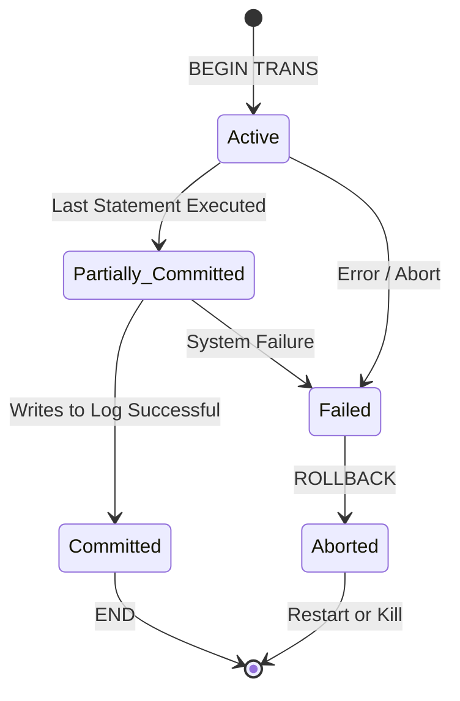

# ACID Properties & Transaction States

## 1. What is a Transaction?
A logical unit of work (LUW). It is a sequence of SQL operations treated as a single entity.

## 2. The ACID Rules
Every DBMS transaction *must* guarantee these four properties:

### **A - Atomicity**
*   **Concept:** "All or Nothing".
*   **Explanation:** Either all operations in the transaction succeed, or none of them happen.
*   **Failure handling:** If an error occurs halfway, the DB performs a **ROLLBACK** to undo partial changes.

### **C - Consistency**
*   **Concept:** "Valid Data Only".
*   **Explanation:** A transaction must transform the database from one valid state to another valid state. It must obey all **Integrity Constraints** (Foreign Keys, Check constraints, etc.).
*   **Example:** In a bank transfer, `Sum(Accounts)` must be the same before and after the transaction. Money cannot disappear.

### **I - Isolation**
*   **Concept:** "Private Execution".
*   **Explanation:** The intermediate state of a transaction is invisible to other transactions.
*   **Implementation:** Achieved via **Locking** (See [[02_Concurrency_Control_and_Isolation]]).

### **D - Durability**
*   **Concept:** "Written in Stone".
*   **Explanation:** Once a user receives a "Success" (COMMIT) message, the data is permanently saved, even if the power fails 1 millisecond later.
*   **Implementation:** Achieved via **Write-Ahead Logging (WAL)**.

---

## 3. Transaction States Diagram
Understanding the lifecycle of a transaction is key for debugging.

> [!NOTE] Key Distinction
> *   **Partially Committed:** The instructions are done, but the data might still be only in RAM (not safe yet).
> *   **Committed:** The Log has been written to disk. Durability is guaranteed.
