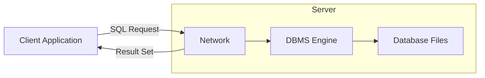
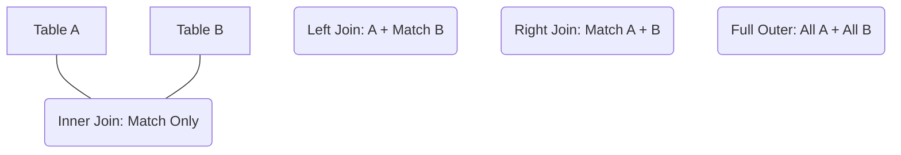

---

## 📄 01_DBMS_Architecture_and_Models.md

### 🔗 Sources
*   *Based on Images: 2, 3*

### 1. The Relational Model & DBMS Fundamentals
A **Database Management System (DBMS/SGBD)** is a software layer that allows users to define, create, maintain, and control access to the database. It acts as an intermediary between the user/application and the physical data.

#### The Relational Model
Data is organized into **Tables** (also called Relations).
*   **Tuples (Rows):** Represent a single entity/record. **Critically**, the order of rows is not significant.
*   **Attributes (Columns):** Represent properties of the entity.
*   **Atomicity:** Each intersection of a row and column must hold a single, atomic value (no lists or arrays inside a cell).
*   **Uniqueness:** No two rows can be identical. This is usually enforced by a **Primary Key**.

#### SQL Language Categories
SQL is not one language, but a suite of commands:
1.  **DDL (Data Definition Language / LDD):** Defines the "skeleton" of the database.
    *   `CREATE` (Table, View), `ALTER` (Modify structure), `DROP` (Delete structure).
2.  **DML (Data Manipulation Language / LMD):** Manages the "flesh" (data) inside the skeleton.
    *   `INSERT`, `UPDATE`, `DELETE`, `SELECT`.
3.  **DCL (Data Control Language / LCD):** Manages access and permissions.
    *   `GRANT` (Give permission), `REVOKE` (Remove permission).

---

### 2. ACID Properties: The Pillars of Reliability
For a relational database to be reliable, it adheres to **ACID**:

| Property | Definition | Why it matters |
| :--- | :--- | :--- |
| **A - Atomicity** | "All or Nothing." A transaction is an indivisible unit. | If you transfer money, the debit and credit must *both* happen, or *neither* happens. |
| **C - Consistency** | The database must move from one valid state to another valid state. | Data must satisfy all integrity constraints (Foreign Keys, NOT NULL) after the transaction. |
| **I - Isolation** | Concurrent transactions should not interfere with each other. | If two people try to book the last seat on a flight, the system handles them sequentially (conceptually). |
| **D - Durability** | Once committed, changes are permanent, even if the power fails. | Data is written to non-volatile storage (disk) and survives crashes. |

---

### 3. Specialized Database Types (NoSQL & Others)
When Relational DBMS (RDBMS) limits performance or flexibility, we use alternative models.

#### NoSQL ("Not Only SQL")
Designed for unstructured data, horizontal scaling, and flexibility.

1.  **Key-Value (Clé-Valeur):**
    *   **Mechanism:** A simple hash map. You provide a key, you get a blob of data.
    *   **Use Case:** Caching (Redis), Session management.
2.  **Document Store:**
    *   **Mechanism:** Stores data as JSON or XML documents. Schema is flexible (schema-less).
    *   **Use Case:** Content management, catalogs (MongoDB).
3.  **Wide-Column (Colonnes Larges):**
    *   **Mechanism:** Stores data in columns rather than rows. Optimized for writing huge amounts of data.
    *   **Use Case:** Big Data analytics (Cassandra, HBase).
4.  **Graph:**
    *   **Mechanism:** Nodes (entities) and Edges (relationships).
    *   **Use Case:** Social networks, Recommendation engines (Neo4j).

#### Other Architectures
*   **Hierarchical:** Tree structure (1 parent -> N children). Very fast for navigation but rigid (cannot easily model N-to-N relationships).
*   **Network:** Graph-like, handles N-to-N, but complex to maintain pointers.
*   **Object-Oriented:** Stores objects directly (inheritance, polymorphism). Good for complex data models in programming.
*   **Real-Time / Time-Series:** Optimized for timestamped data (IoT sensors, financial stock tickers). Features extremely fast insertion.

---

### 4. System Architectures



*   **Client-Server:** Standard 2-tier architecture. Centralized maintenance and security.
*   **Distributed Architecture:** Data or processing is spread across multiple physical sites (machines).
    *   **Motivation:** Load balancing, Fault tolerance (Resilience), Data proximity (users in Europe access the European server).
    *   **Types:**
        *   *Fragmented:* Data is split (A-M on Server 1, N-Z on Server 2).
        *   *Replicated:* Full copy of data on all servers (High availability, but syncing is hard).
        *   *Hybrid:* Mix of both.

---

## 📄 02_Transactions_and_Recovery.md

### 🔗 Sources
*   *Based on Images: 1, 4*

### 1. The Transaction Lifecycle
A transaction is a sequence of operations treated as a single unit.

**Standard Cycle:**
1.  **`START TRANSACTION` (or `BEGIN`):** Marks the start.
2.  **Execution:** SQL queries run.
3.  **`COMMIT`:** Saves all changes permanently (Validates).
4.  **`ROLLBACK`:** Cancels all changes since `BEGIN` (used if an error occurs).

> [!TIP] Auto-Commit
> By default, MySQL is in `autocommit` mode (every single line is a transaction). To use multi-line transactions, you must explicitly `START TRANSACTION`.

---

### 2. Concurrency Control & Isolation
When multiple users access data simultaneously, "race conditions" create anomalies.

#### The 4 Concurrency Problems
1.  **Dirty Read:** Transaction A reads data that Transaction B has changed but *not yet committed*. If B rolls back, A has "dirty" (invalid) data.
2.  **Non-Repeatable Read:** Transaction A reads a row. Transaction B updates that row and commits. Transaction A reads the row *again* and gets a different value.
3.  **Phantom Read:** Transaction A reads a set of rows (e.g., `WHERE age > 20`). Transaction B *inserts* a new row that matches that condition. Transaction A runs the query again and sees a "phantom" row appearing out of nowhere.
4.  **Deadlock:** Two transactions block each other.
    *   *Scenario:* A waits for B to release a lock, B waits for A.
    *   *Solution:* The DBMS detects the cycle and kills one transaction (Rollback).

#### Isolation Levels (SQL Standard)
You can set the level using: `SET TRANSACTION ISOLATION LEVEL [LEVEL];`

| Isolation Level | Dirty Read? | Non-Repeatable Read? | Phantom Read? | Locking Strategy |
| :--- | :---: | :---: | :---: | :--- |
| **READ UNCOMMITTED** | ⚠️ Yes | ⚠️ Yes | ⚠️ Yes | No shared locks. Fastest but dangerous. |
| **READ COMMITTED** | ❌ No | ⚠️ Yes | ⚠️ Yes | Locks rows only while reading. (Default in many DBs). |
| **REPEATABLE READ** | ❌ No | ❌ No | ⚠️ Yes | Locks rows found in the first read until commit. (MySQL Default). |
| **SERIALIZABLE** | ❌ No | ❌ No | ❌ No | Locks the entire range/table. Safest but slowest. |

---

### 3. Recovery Mechanisms (Crash Survival)
How does the database ensure **Durability** (the 'D' in ACID) if the server crashes?

#### The Write-Ahead Log (WAL) Principle
**Rule:** The database *must* write the change to the **Log File** (on disk) *before* it writes the change to the actual data file.

**Recovery Process (After a Crash):**
1.  **Detection:** The DB restarts and detects an improper shutdown.
2.  **Analysis:** Reads the Log from the last checkpoint.
3.  **REDO (Roll Forward):** Replays transactions that were **Committed** in the log but hadn't been written to the data file yet.
4.  **UNDO (Roll Back):** Reverses transactions that were **Active (Incomplete)** when the crash happened.

#### Checkpoints
A mechanism to keep the log file size manageable.
*   The DBMS freezes briefly, writes all "dirty pages" (modified data in RAM) to the disk.
*   It marks a "Checkpoint" in the log.
*   **Benefit:** Recovery only needs to scan from the last checkpoint, not the beginning of time.

#### Failure Types
1.  **Transaction Failure:** Logical error (divide by zero) or deadlock. -> *Solved by Rollback.*
2.  **System Crash:** Power loss, OS freeze. RAM is lost. -> *Solved by WAL (Redo/Undo).*
3.  **Disk Failure:** Physical damage to hard drive. -> *Solved by Backups & Replication.*
4.  **Catastrophe:** Fire, flood. -> *Solved by Off-site Backups.*

---

## 📄 03_Advanced_Querying_Joins_Subqueries.md

### 🔗 Sources
*   *Based on Images: 8, 12*

### 1. SQL Joins (Jointures)
Joins combine data from multiple tables.



*   **INNER JOIN:** Returns rows *only* when there is a match in both tables.
*   **LEFT JOIN (Left Outer):** Returns *all* rows from the Left table, and matched rows from the Right. If no match, Right columns are `NULL`.
*   **RIGHT JOIN:** Opposite of Left Join.
*   **FULL OUTER JOIN:** Returns rows if there is a match in *either* table (Union of Left and Right). *Note: MySQL does not support this directly; use `UNION`.*
*   **CROSS JOIN:** Cartesian Product. Matches every row of A with every row of B.
    *   *Result Size:* Size(A) * Size(B).
*   **SELF JOIN:** Joining a table to itself.
    *   *Example:* An `Employees` table has a `ManagerID`. You join `Employees e1` with `Employees e2` where `e1.ManagerID = e2.ID` to get the manager's name.

> [!TIP] Best Practices
> 1.  **Always use Aliases:** `FROM customers AS c` makes queries readable.
> 2.  **Explicit Joins:** Use `JOIN ... ON` syntax, avoid the old style `FROM tableA, tableB WHERE ...` (implicit cross join).
> 3.  **Filter Early:** Filtering in the `ON` clause is often more efficient than in the `WHERE` clause for Outer Joins.

---

### 2. Subqueries & Aggregation

#### Operators
*   **`IN`:** Checks if value exists in a list. `WHERE id IN (1, 2, 3)`.
*   **`NOT IN`:** Warning: If the list contains a `NULL`, `NOT IN` returns nothing (Unknown).
*   **`ANY` / `SOME`:** Comparison with *at least one* value in the list. `WHERE price > ANY (SELECT price...)`.
*   **`ALL`:** Comparison with *every* value in the list. `WHERE price > ALL (SELECT price...)`.

#### Correlated Subqueries vs. EXISTS
*   **Standard Subquery:** Inner query runs once, returns a list, outer query uses it.
*   **Correlated Subquery:** The inner query references a column from the outer query (`outer.id`).
    *   *Mechanism:* The inner query runs **once for every row** of the outer query. This can be slow.
*   **`EXISTS`:** Used often with correlated subqueries.
    *   Returns `TRUE` as soon as it finds *one* match. It does not scan the whole table.
    *   *Pro Tip:* `SELECT 1` is conventionally used in `EXISTS` (e.g., `WHERE EXISTS (SELECT 1 FROM...)`) because the actual data returned doesn't matter, only the existence of a row.

#### Aggregates
Functions that calculate values on a set of lines:
*   `COUNT(*)`: Counts rows.
*   `COUNT(column)`: Counts non-null values in that column.
*   `SUM()`, `AVG()`, `MIN()`, `MAX()`.

---

## 📄 04_Views_and_Virtual_Tables.md

### 🔗 Sources
*   *Based on Images: 5, 11 (Top Right)*

### 1. Definition and Usage
A **View (Vue)** is a virtual table. It is a saved SQL query, not a physical store of data.

**Syntax:**
```sql
CREATE VIEW View_Name AS
SELECT col1, col2 
FROM table 
WHERE condition;
```

**Benefits:**
1.  **Security:** Restrict user access to specific columns (hide passwords/salaries).
2.  **Simplicity:** encapsulate complex Joins so users just do `SELECT * FROM simple_view`.

### 2. Updating Views (Crucial Concept)
Can you `INSERT` or `UPDATE` a view?
*   **YES:** If the view is a direct window onto a single table (1:1 mapping).
*   **NO:** If the view contains:
    *   Aggregates (`SUM`, `COUNT`).
    *   `GROUP BY` or `HAVING`.
    *   `DISTINCT`.
    *   `UNION`.
    *   Joins (in most cases, depending on DBMS strictness).

#### `WITH CHECK OPTION`
If you create a view that filters data (e.g., `WHERE age > 18`), and you insert a user with `age = 10` through that view:
*   **Without Option:** The insertion succeeds, but the row immediately disappears from the view (phantom insert).
*   **`WITH CHECK OPTION`:** The DBMS rejects the insert because the data violates the view's `WHERE` clause.

### 3. Aggregation Logic (`GROUP BY`)
*   **`GROUP BY`:** Collapses multiple rows into one based on a column.
*   **`HAVING`:** Filters the *groups* after aggregation.
    *   *Rule:* You cannot use `WHERE` on an aggregate (e.g., `WHERE COUNT(*) > 5` is illegal). You must use `HAVING COUNT(*) > 5`.

> [!NOTE] Handling Nulls
> *   `COALESCE(val1, val2)`: Returns the first non-null value. Standard SQL.
> *   `IFNULL(val1, default)`: MySQL specific.

---

## 📄 05_Stored_Procedures_and_Functions.md

### 🔗 Sources
*   *Based on Images: 6, 11*

### 1. Stored Procedures
A block of code saved in the database that can encapsulate business logic.

**Parameters:**
1.  **`IN`:** Pass data **into** the procedure. (Default).
2.  **`OUT`:** The procedure sends data **back** to the caller.
3.  **`INOUT`:** The variable is passed in, modified, and sent back.

**Syntax:**
```sql
DELIMITER //  -- Change delimiter so ; doesn't end the creation early

CREATE PROCEDURE ProcessOrder (IN orderId INT, OUT total DECIMAL(10,2))
BEGIN
    SELECT SUM(price) INTO total 
    FROM order_items 
    WHERE order_id = orderId;
END //

DELIMITER ;
```

**Calling it:**
```sql
CALL ProcessOrder(101, @myTotal);
SELECT @myTotal;
```

---

### 2. SQL Functions (UDF)
Unlike procedures, functions **must** return a single value and can be used inline in SQL (`SELECT MyFunc(col)...`).

**Deterministic vs. Non-Deterministic:**
*   **DETERMINISTIC:** Same Input = Same Output. (e.g., `SQRT(4)` is always 2).
*   **NOT DETERMINISTIC:** Output varies. (e.g., `NOW()` changes every second, `RAND()` changes every call).

#### The Binary Log Problem (Replication)
If you use **Non-Deterministic** functions in an `INSERT`/`UPDATE`, and that query is replicated to a Slave server:
*   The Master might generate `RAND() = 0.5`.
*   The Slave might generate `RAND() = 0.9`.
*   **Result:** Data inconsistency.

**Solution:**
1.  Mark functions as `DETERMINISTIC` if they are.
2.  If you must use non-deterministic logic, enable `SET GLOBAL log_bin_trust_function_creators = 1;` in MySQL to bypass the safety check (use with caution).

---

## 📄 06_Triggers_and_Events.md

### 🔗 Sources
*   *Based on Image: 10*

### 1. Definition
A **Trigger** is a named database object that is associated with a table, and that activates when a particular event occurs for the table.

### 2. Structure & Timing
*   **Timing:**
    *   `BEFORE`: Activates before the data hits the disk. Great for **Validation** (checking constraints) or formatting data.
    *   `AFTER`: Activates after the change is successful. Great for **Logging** (Audit trails) or updating stats in other tables.
*   **Events:** `INSERT`, `UPDATE`, `DELETE`.

### 3. Context Variables (`NEW` and `OLD`)
Inside the trigger, you have access to the data rows:

| Event | `OLD` (Previous Value) | `NEW` (Proposed Value) |
| :--- | :--- | :--- |
| **INSERT** | `NULL` (Didn't exist) | Available |
| **UPDATE** | Available | Available |
| **DELETE** | Available | `NULL` (Gone) |

**Example (Audit Trigger):**
```sql
CREATE TRIGGER Before_Update_Employee
BEFORE UPDATE ON employees
FOR EACH ROW
BEGIN
    IF NEW.salary < 0 THEN
        SIGNAL SQLSTATE '45000' SET MESSAGE_TEXT = 'Salary cannot be negative';
    END IF;
    
    -- Log change
    INSERT INTO salary_history (emp_id, old_sal, new_sal)
    VALUES (OLD.id, OLD.salary, NEW.salary);
END;
```

---

## 📄 07_Exception_Handling_and_Debugging.md

### 🔗 Sources
*   *Based on Images: 7, 9*

### 1. Sources of Errors
1.  **Constraint Violations:** Duplicate Primary Key, Foreign Key mismatch.
2.  **Data Errors:** Division by zero, Invalid type conversion.
3.  **Logical/Business Errors:** "Balance insufficient" (defined by your code).

### 2. Declaring Handlers
You can define what the procedure does when an error occurs.

**Syntax:**
```sql
DECLARE [Action] HANDLER FOR [Condition] [Statement];
```

**Actions:**
*   **`CONTINUE`:** Log the error or set a flag, but continue executing the next line of code.
*   **`EXIT`:** Stop the procedure immediately (and perhaps Rollback).

**Conditions:**
*   `SQLWARNING`: Catches warnings (01...).
*   `NOT FOUND`: Catches cursor ends (02...).
*   `SQLEXCEPTION`: Catches errors (>02...).
*   `SQLSTATE 'xxxxx'`: Catches a specific error code.

### 3. Raising Errors (`SIGNAL`)
You can stop execution and throw a custom error to the application.

*   **`SIGNAL`:** Raises a new error.
    ```sql
    SIGNAL SQLSTATE '45000' SET MESSAGE_TEXT = 'Custom Error Message';
    ```
*   **`RESIGNAL`:** Used inside a Handler. It catches an error, does something (like logging), and then throws the error again so the caller knows it failed.

### 4. SQLSTATE Codes
Standardized 5-character codes.
*   `00000`: Success.
*   `01000`: General Warning.
*   `02000`: Not Found (No data).
*   `23000`: Integrity Constraint Violation (Duplicate Key).
*   `45000`: Generic User-Defined Exception (Used for `SIGNAL`).

> [!PRO TIP] Procedure Structure with Handlers
> Always declare handlers at the *top* of your `BEGIN...END` block, after variable declarations but before any logic.

```sql
BEGIN
    DECLARE exit_flag INT DEFAULT 0;
    
    -- 1. Declare Variables
    -- 2. Declare Handlers
    DECLARE CONTINUE HANDLER FOR SQLEXCEPTION SET exit_flag = 1;
    
    -- 3. Start Transaction
    START TRANSACTION;
    
    -- 4. Logic
    UPDATE accounts...;
    
    -- 5. Check Errors
    IF exit_flag = 1 THEN
        ROLLBACK;
        SELECT 'Transaction Failed';
    ELSE
        COMMIT;
        SELECT 'Success';
    END IF;
END;
```