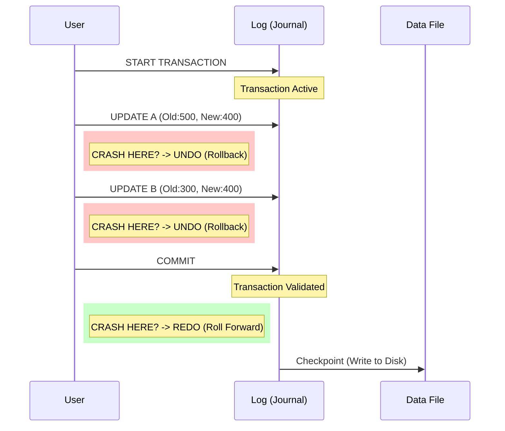

### 1.1 Definition
According to **Source 18 (Slide 47)** and **Source 20 (Section 3.11)**, a transaction is not just a query; it is a **logical unit of work**. It is a sequence of multiple SQL operations (LMD: Insert, Update, Delete) that must be executed as a single, indivisible atom.

*   **Principle:** "Tout ou Rien" (All or Nothing).
*   **Goal:** Move the database from one **Consistent State** to another **Consistent State**.

### 1.2 The ACID Properties
To be valid, a transaction must respect 4 properties (**Source 18, Slide 48**):

| Property | Name | Definition | Contextual Example |
| :--- | :--- | :--- | :--- |
| **A** | **Atomicité** | Indivisibility. Either all operations succeed, or none are applied. | If debit succeeds but credit fails, the debit is cancelled. |
| **C** | **Cohérence** | Integrity preservation. The transaction must respect all constraints (Primary Key, Check, Foreign Key). | Money cannot be created or destroyed, only transferred. |
| **I** | **Isolation** | Independence. Transactions running essentially at the same time must not interfere with each other. | User A cannot see the intermediate changes of User B until B finishes. |
| **D** | **Durabilité** | Persistence. Once validated (`COMMIT`), changes are permanent, even in case of a crash. | If the server loses power 1ms after a commit, the data is still there upon restart. |

---

## Part 2: Syntax and Implementation (The Skeleton)

Based on **Source 20 (Page 12)** and **Source 18 (Slide 50)**, the standard structure in your course is a linear script where you explicitly control the start and end.

### 2.1 The Standard Skeleton
You must disable `autocommit` to take control manually.

```sql
-- 1. Initialization
SET AUTOCOMMIT = 0; -- Disable automatic saving
START TRANSACTION;  -- Or simply BEGIN;

-- 2. The Work (LMD Operations)
-- Modification 1
UPDATE Comptes SET solde = solde - 100 WHERE id = 1;

-- Modification 2
UPDATE Comptes SET solde = solde + 100 WHERE id = 2;

-- 3. Validation / Cancellation
-- At this specific point, you choose ONE path:

-- PATH A: Success (Save everything)
COMMIT;

-- PATH B: Failure/Error (Cancel everything)
-- ROLLBACK;
```

### 2.2 Savepoints (Advanced Control)
**Source 20 (Section 3.11.4)** introduces `SAVEPOINT` to allow partial rollbacks within a long transaction.

```sql
BEGIN;
INSERT INTO Logs VALUES (...);
SAVEPOINT Step1;

UPDATE Comptes SET ...;
-- If this update is wrong, we can go back to Step1 without losing the INSERT
ROLLBACK TO SAVEPOINT Step1;

COMMIT;
```

---

## Part 3: Crash Recovery (Récupération)

This is the most critical part of understanding **Durability** and **Atomicity**. The system uses a **Log (Journal)** mechanism (**Source 18, Slide 73**).

### 3.1 The Log (Journalisation)
Before modifying the actual data files on the disk, the SGBD writes the operation to a sequential Log file. This is called **WAL (Write-Ahead Logging)**.

### 3.2 Recovery Logic: UNDO vs REDO
When the database restarts after a crash, it reads the Log:

1.  **UNDO (Annuler):** If the log shows a transaction started (`BEGIN`) but finds **NO** `COMMIT` tag before the crash.
    *   *Action:* The system reverses all changes made by this transaction.
2.  **REDO (Rejouer):** If the log shows a `BEGIN` and a `COMMIT` tag.
    *   *Action:* The system re-applies the changes to ensure they are physically written to the data files.

### 3.3 Crash Scenarios (Visualized)



---

## Part 4: Concurrency & Isolation

When multiple users access data simultaneously, specific problems occur (**Source 18, Slide 51-70**).

### 4.1 The Problems
1.  **Dirty Read (Lecture Sale):** Reading data modified by another transaction that has not yet committed. If the other transaction rolls back, you hold invalid data.
2.  **Non-Repeatable Read:** You read a row, someone else updates it and commits. You read it again and get a different value.
3.  **Phantom Read:** You run a query (e.g., `WHERE age > 18`). Someone inserts a new person. You run the query again and get more rows.
4.  **Lost Update:** Two people read the same value (100), both add 10, both write 110. One update is overwritten.

### 4.2 The Solutions (Isolation Levels)
**Source 18 (Slide 70)** defines the hierarchy:

| Level | Dirty Read? | Non-Repeatable? | Phantom Read? | Safety | Performance |
| :--- | :---: | :---: | :---: | :--- | :--- |
| **READ UNCOMMITTED** | ✅ Yes | ✅ Yes | ✅ Yes | Lowest | Highest |
| **READ COMMITTED** | ❌ No | ✅ Yes | ✅ Yes | Medium | High |
| **REPEATABLE READ** | ❌ No | ❌ No | ✅ Yes | High | Medium |
| **SERIALIZABLE** | ❌ No | ❌ No | ❌ No | Highest | Lowest |

---

## Part 5: Solved Exercises (Detailed Explanations)

### Exercise 1: ACID Concepts
**Source:** TD n°5 - Exercice 1

**Q1. Define the 4 properties.**
*   *Solution:* See Table in Section 1.2 above.

**Q2. Real-life example (Non-IT).**
*   *Scenario:* Buying a Soda from a Vending Machine.
*   **Atomicity:** You insert coins, and the machine gives the soda. If the machine jams, it **must** return your coins. It cannot keep coins without giving soda.
*   **Consistency:** The machine's inventory count decreases by 1, and the cash box increases by the price. The total value remains balanced.
*   **Isolation:** If two people press buttons on two adjacent machines at the exact same millisecond, the internal power supply handles them separately.
*   **Durability:** Once the soda falls (transaction complete), it is yours. Even if the power cuts out immediately after, you still have the soda.

**Q3. Why banking needs strict Atomicity and Durability?**
*   *Reasoning:*
    *   **Atomicity:** If money leaves Account A but never arrives in Account B due to a crash, money is destroyed. If it arrives in B but isn't removed from A, money is created. Both are illegal in banking.
    *   **Durability:** If a deposit is confirmed (`COMMIT`), the client walks away. If a server crash 5 minutes later erases that deposit, the bank loses credibility and legal standing.

---

### Exercise 2: Basic SQL Transaction & Crash
**Source:** TD n°5 - Exercice 2

**Context:** Table `Comptes(id, titulaire, solde)`. Ali (id=1, 500), Sara (id=2, 300). Transfer 100 from Ali to Sara.

**Q1. Commands to transfer 100 DA.**
```sql
START TRANSACTION;
UPDATE Comptes SET solde = solde - 100 WHERE id = 1;
UPDATE Comptes SET solde = solde + 100 WHERE id = 2;
COMMIT;
```

**Q2. Crash after Debit (Ali) but before Credit (Sara).**
*   *State:* Ali = 400 (in memory/log), Sara = 300.
*   *Event:* Power failure.
*   *Recovery:* The system restarts. It reads the Log. It finds the `UPDATE` for Ali but **no** `COMMIT` record.
*   *Action:* **UNDO**. The system rolls back the change to Ali.
*   *Final State:* Ali = 500, Sara = 300. (The transfer effectively never happened).

**Q3. How must the SGBD react to maintain consistency?**
*   *Solution:* It must enforce the **Atomicity** property using the **WAL (Write-Ahead Logging)** protocol. By ensuring changes are logged before being applied, it guarantees that incomplete sets of operations are fully reversed (Rolled Back).

---

### Exercise 3: Concurrency Problems
**Source:** TD n°5 - Exercice 3

**Context:** `Produits(id, stock)`. T1 removes 10 from stock. T2 reads stock.

**Q1. Illustrate Dirty Read.**
*   *Scenario:*
    1.  T1: `UPDATE Produits SET stock = stock - 10 WHERE id=1;` (Stock goes 100 -> 90).
    2.  T2: `SELECT stock FROM Produits WHERE id=1;` (**Reads 90**).
    3.  T1: `ROLLBACK;` (Stock goes back to 100).
    4.  **Result:** T2 thinks stock is 90, but it is actually 100. T2 processed invalid data.

**Q2. Illustrate Lost Update.**
*   *Scenario:*
    1.  T1: Reads stock (100).
    2.  T2: Reads stock (100).
    3.  T1: Updates stock to 90 (`100 - 10`) and Commits.
    4.  T2: Updates stock to 95 (`100 - 5`) and Commits.
    5.  **Result:** The final stock is 95. T1's subtraction of 10 was completely overwritten and lost. Correct math should be 85.

**Q3. Solution?**
*   *Solution:* Use **Pessimistic Locking** (Verrouillage) or set the Isolation Level to **REPEATABLE READ** or **SERIALIZABLE**. In SQL: `SELECT ... FOR UPDATE` keeps a lock on the row until the transaction ends.

---

### Exercise 5: Log Recovery Analysis
**Source:** TD n°5 - Exercice 5

**Log Content:**
1.  T1: UPDATE ... id=1 (-200)
2.  T2: UPDATE ... id=2 (+200)
3.  COMMIT T1
4.  **CRASH** (Before COMMIT T2)

**Q1. Explain SGBD action (REDO/UNDO).**
*   **Transaction T1:** The log contains `COMMIT T1`.
    *   *Action:* **REDO**. The system ensures the -200 change on id=1 is applied to the disk.
*   **Transaction T2:** The log contains updates but **no** `COMMIT T2`.
    *   *Action:* **UNDO**. The system reverses the +200 change on id=2.

**Q2. Final State.**
*   Account 1: Decreased by 200 (Saved).
*   Account 2: Unchanged (Rolled back).
*   *Note:* This implies T1 and T2 were independent transactions. If they were part of one transfer, this would be a consistency error in application design (they should have been in one transaction).

---

### Exercise 6: Case Study (Inscriptions)
**Source:** TD n°5 - Exercice 6

**Process:**
1.  Debit Student Account.
2.  Insert into `Inscriptions` table.
3.  Decrease `Places_Disponibles` in `Cours` table.

**Q1. Model as transaction.**
```sql
START TRANSACTION;
UPDATE Compte_Etudiant SET solde = solde - frais WHERE id = X;
INSERT INTO Inscriptions VALUES (X, Y, Date);
UPDATE Cours SET places = places - 1 WHERE id = Y;
COMMIT;
```

**Q2. Crash after Step 2 (before updating places).**
*   *Situation:* Money taken, student registered in `Inscriptions`, but `Cours` table still shows the old number of places. `COMMIT` was not reached.
*   *Result:* **Automatic Rollback**. The money returns to the student account, and the line in `Inscriptions` is removed.

**Q3. What must the system guarantee?**
*   *Solution:* **Consistency (Cohérence)**. The sum of enrolled students must match the reduction in available places. The system guarantees this via **Atomicity** (all 3 steps happen, or none happen) and **Isolation** (no one else takes the last seat while this is processing).

---

### Exercise: Cursor Locking (Pilots)
**Source:** TD N°4 - Exercice 6 & Source 20 (Procedural)

**Context:** We need to update flight hours for pilots based on their company, but we are doing it row-by-row using a cursor.

**Challenge:** While our cursor is reading the table, other users might try to modify the pilots. We need to prevent this.

**Solution Code (from Correction):**
```sql
DELIMITER $
CREATE PROCEDURE Gestion_Pilotes()
BEGIN
    DECLARE done INT DEFAULT 0;
    -- Variables to hold cursor data
    DECLARE v_brevet VARCHAR(6);
    DECLARE v_comp VARCHAR(4);
    
    -- IMPORTANT: "FOR UPDATE" locks the rows as we select them
    DECLARE cur_pilote CURSOR FOR 
        SELECT brevet, comp FROM Pilote FOR UPDATE;
    
    DECLARE CONTINUE HANDLER FOR NOT FOUND SET done = 1;

    -- Start Transaction explicitly (Good practice with locking)
    START TRANSACTION; -- or SET AUTOCOMMIT=0
    
    OPEN cur_pilote;

    read_loop: LOOP
        FETCH cur_pilote INTO v_brevet, v_comp;
        IF done THEN LEAVE read_loop; END IF;

        -- Business Logic
        IF v_comp = 'AF' THEN
            UPDATE Pilote SET nbHVol = nbHVol + 100 WHERE brevet = v_brevet;
        ELSEIF v_comp = 'SING' THEN
            UPDATE Pilote SET nbHVol = nbHVol - 100 WHERE brevet = v_brevet;
        ELSE
            DELETE FROM Pilote WHERE brevet = v_brevet;
        END IF;
    END LOOP;

    CLOSE cur_pilote;
    
    -- Commit releases the locks and saves changes
    COMMIT;
END $
DELIMITER ;
```

**Explanation:**
1.  **`FOR UPDATE` Clause:** Inside the `DECLARE CURSOR`, this tells the database "I intend to modify these rows". The database places a **Lock** on the rows selected.
2.  **Concurrency:** If another transaction tries to `UPDATE` or `DELETE` these pilots while the loop is running, it will be forced to **wait** until this procedure issues a `COMMIT`.
3.  **Consistency:** This prevents "Lost Updates" or "Non-Repeatable Reads" during the batch processing.
