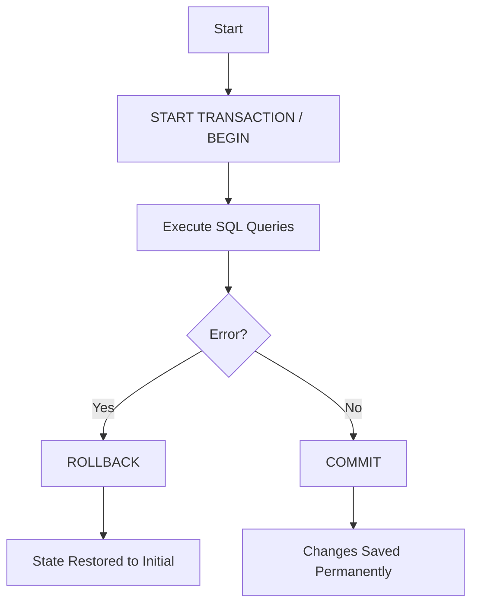

Based on your provided documents, specifically **"Source_18_Chapitre 1 Partie 2- Gestion de l'intégrité.pdf"** (Slides 49-50) and **"Source_20_SQL PROCEDURAL.pdf"** (Section 3.11), here is the standard skeleton and syntax for a database transaction.

### The Transaction Skeleton

A transaction groups multiple SQL operations into a single atomic unit. The standard syntax follows this 4-step structure:

```sql
-- 1. Start the Transaction
START TRANSACTION; -- Or simply BEGIN;

-- 2. Execute SQL Operations (The "Work")
UPDATE accounts SET balance = balance - 100 WHERE id = 1;
UPDATE accounts SET balance = balance + 100 WHERE id = 2;

-- 3. Check for Errors (Logic usually handled in application code or Stored Proc)
-- If everything is correct:
COMMIT;

-- 4. If an error occurs:
-- ROLLBACK;
```

---

### Detailed Explanations of the Syntax

Based on **Source_18 (Slide 49)** and **Source_20 (Section 3.11)**, here is the breakdown of the commands:

#### 1. Initialization
*   **Command:** `START TRANSACTION` or `BEGIN`
*   **Context:** This command explicitly marks the beginning of a transaction.
*   **Note:** In MySQL (as noted in **Source_20**), executing `START TRANSACTION` implicitly commits any current transaction before starting a new one.

#### 2. Operations (LMD)
*   **Commands:** `INSERT`, `UPDATE`, `DELETE`, `SELECT`
*   **Context:** These are the modifications you want to perform. At this stage, changes are **not yet permanent**. They are visible only to the current session (Isolation).

#### 3. Validation (Success)
*   **Command:** `COMMIT`
*   **Context:** Validates all changes made since `START TRANSACTION`.
*   **Effect:** The data is physically written to the database (Durability) and becomes visible to other users.

#### 4. Cancellation (Failure)
*   **Command:** `ROLLBACK`
*   **Context:** Cancels all changes made since `START TRANSACTION`.
*   **Effect:** The database returns to the exact state it was in before the transaction started (Atomicity).

---

### Transaction Flow Diagram

Here is a visual representation of the transaction lifecycle based on **Source_18 Slide 49**:



---

### Concrete Example (Bank Transfer)

Based on **Source_16 (TD n°5, Exercice 2)** and **Source_18 (Slide 50)**, here is how a standard transfer transaction is written:

**Scenario:** Transfer 100 DA from Account 1 (Ali) to Account 2 (Sara).

```sql
-- 1. Start
START TRANSACTION;

-- 2. Debit Ali (Account 1)
UPDATE Comptes 
SET solde = solde - 100 
WHERE id = 1;

-- 3. Credit Sara (Account 2)
UPDATE Comptes 
SET solde = solde + 100 
WHERE id = 2;

-- 4. Validate
COMMIT;
```

### Advanced Control: Savepoints
**Source_20 (Section 3.11.4)** mentions an advanced feature for partial rollbacks:

*   **Skeleton with Savepoints:**
    ```sql
    BEGIN;
    UPDATE ...;
    SAVEPOINT step1; -- Create a marker
    
    UPDATE ...;
    -- If something goes wrong here, you can go back to step1 without losing the first update
    ROLLBACK TO SAVEPOINT step1; 
    
    COMMIT;
    ```

### Important Setting: Auto-Commit
**Source_20** highlights that by default, databases (like MySQL) are in `autocommit` mode.
*   To use transactions effectively, you can disable this globally for the session:
    ```sql
    SET AUTOCOMMIT = 0;
    ```
    When this is set to 0, you **must** issue a `COMMIT` to save your changes; otherwise, they will be lost when you disconnect.