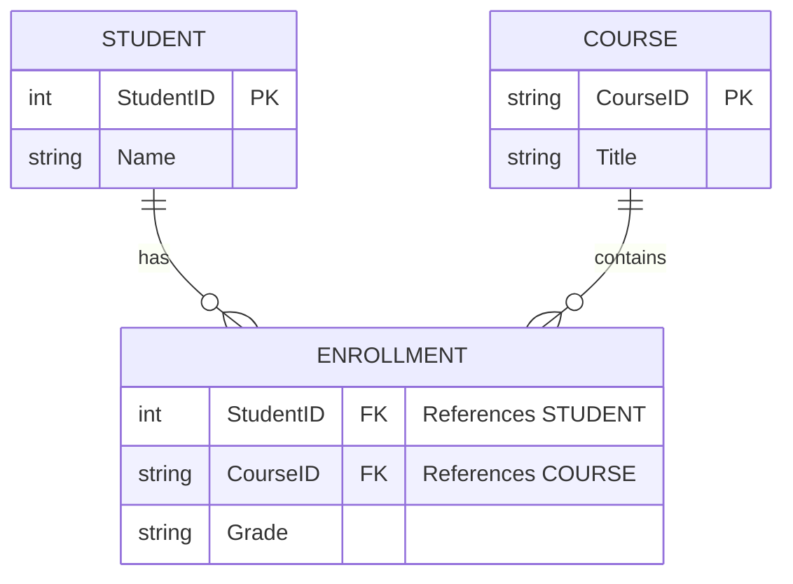

# Relational Model Fundamentals

## 1. Overview

The **Relational Model**, proposed by E.F. Codd in 1970, is the theoretical foundation of modern SQL databases. It is based on **Set Theory** and **First-Order Predicate Logic**.

> [!INFO] Why this matters
> Understanding the strict mathematical model helps you understand why SQL behaves the way it does, especially regarding **NULLs**, **Duplicates**, and **Joins**.

## 2. Core Terminology

In the context of the course, we often switch between "Formal" (Algebra) and "Practical" (SQL) terms. You must know both.

| Formal Term (Algebra) | Practical Term (SQL) | Definition                                                                           |
| :-------------------- | :------------------- | :----------------------------------------------------------------------------------- |
| **Relation**          | Table                | A set of tuples. Mathematically, it is a subset of the Cartesian product of domains. |
| **Tuple**             | Row / Record         | A single entry in the relation. Represents an entity or relationship.                |
| **Attribute**         | Column / Field       | A property of the relation (e.g., `Age`, `Name`).                                    |
| **Domain**            | Data Type            | The set of allowable values for an attribute (e.g., `Integer`, `VARCHAR`, `Date`).   |
| **Cardinality**       | Row Count            | The number of tuples in a relation ($N$).                                            |
| **Degree/Arity**      | Column Count         | The number of attributes in a relation.                                              |

## 3. The "Set" vs. "Bag" Distinction

This is a crucial concept for **TD 2**.

- **Relational Algebra (Theory):** Relations are **Sets**.
  - **No Duplicates:** $ \{A, B, A\} $ is strictly reduced to $ \{A, B\} $.
  - **Unordered:** The order of rows does not matter.
- **SQL (Practice):** Tables are **Bags** (Multisets).
  - **Duplicates Allowed:** You can have two identical rows unless constraints prevent it.
  - **Order:** Order is not guaranteed unless you use `ORDER BY`.

> [!TIP] Exam Tip
> If an exam question asks for the **Algebraic** result of a projection ($\pi$), you must mentally remove duplicates.
> If it asks for the **SQL** result, duplicates remain unless the query uses `SELECT DISTINCT`.

## 4. Keys and Constraints

Constraints ensure data validity and consistency.

### A. Superkey

A set of one or more attributes that, taken collectively, allows us to identify a tuple uniquely.

- _Example:_ In a Student table, `{ID, Name}` is a superkey because `ID` is unique, so the combination is also unique.

### B. Primary Key (PK)

The **minimal** Superkey. It is the "main" identifier.

- **Constraint:** A PK cannot be `NULL` and must be unique.
- _Example:_ `ID` is the PK. `Name` is likely not (people share names).

### C. Foreign Key (FK)

An attribute in Table A that references the Primary Key of Table B.

- **Purpose:** Enforces **Referential Integrity**.
- **Rule:** A value in the FK column must either be `NULL` or exist in the referenced PK column. You cannot have an order for a non-existent customer.

