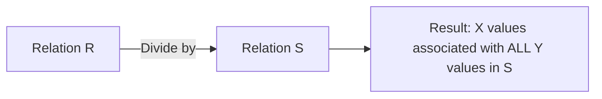

# Relational Algebra Operators

## 1. Introduction

Relational Algebra is a procedural query language. It takes instances of relations as input and yields instances of relations as output. These operators form the basis of **Query Optimization (TD 4)**.

## 2. Unary Operators (Single Table)

These operators work on one relation at a time to "slice" the data.

### Selection ($\sigma$) - Horizontal Slicing

Filters **rows** based on a predicate (condition).

- **Symbol:** $\sigma_{condition}(R)$
- **SQL:** `WHERE` clause.
- **Behavior:** Output has the same columns as $R$, but fewer rows.
- **Commutativity:** $\sigma_A(\sigma_B(R)) \equiv \sigma_B(\sigma_A(R)) \equiv \sigma_{A \land B}(R)$.

### Projection ($\pi$) - Vertical Slicing

Filters **columns** to retrieve specific attributes.

- **Symbol:** $\pi_{col1, col2}(R)$
- **SQL:** `SELECT col1, col2` (implied `DISTINCT` in pure algebra).
- **Behavior:** Output has fewer columns. Duplicates created by removing distinguishing columns are eliminated in Algebra.

### Rename ($\rho$)

Renames relations or attributes. Critical for **Self-Joins**.

- **Symbol:** $\rho_{NewName}(R)$ or $\rho_{New(A,B)}(Old(A,B))$
- **SQL:** `AS NewName`.
- **Use Case:** If you want to find pairs of employees who live in the same city, you join `Employee` with itself. You must rename the second instance to distinguish it (e.g., `Employee` as `E1` and `Employee` as `E2`).

---

## 3. Set Operators (Binary)

These combine two relations ($R$ and $S$).

> [!WARNING] Union Compatibility Rule
> To perform **Union**, **Intersection**, or **Difference**, two requirements must be met:
>
> 1.  **Same Arity:** Both relations must have the same number of columns.
> 2.  **Domain Compatibility:** The $n$-th column of $R$ must have the same data type as the $n$-th column of $S$.

### Union ($R \cup S$)

- **Logic:** Tuples in $R$ **OR** in $S$ (or both).
- **SQL:** `UNION` (removes duplicates), `UNION ALL` (keeps duplicates).

### Intersection ($R \cap S$)

- **Logic:** Tuples in $R$ **AND** in $S$.
- **SQL:** `INTERSECT`.

### Difference ($R - S$)

- **Logic:** Tuples in $R$ but **NOT** in $S$. Order matters! ($R - S \neq S - R$).
- **SQL:** `EXCEPT` or `MINUS`.

---

## 4. Join Operators

The most expensive and powerful operations.

### Cartesian Product ($R \times S$)

- **Logic:** Concatenates every row of $R$ with every row of $S$.
- **Size:** $|R| \times |S|$ rows.
- **Usage:** Rarely used directly because the result is massive. It is usually an intermediate step before filtering.

### Theta Join / Inner Join ($R \bowtie_{condition} S$)

- **Definition:** A Cartesian Product followed by a Selection.
  $$ R \bowtie*\theta S = \sigma*\theta (R \times S) $$
- **Natural Join ($R \bowtie S$):** automatically joins on columns with the same name and removes the duplicate column.

### Division ($R \div S$)

The hardest operator to understand.

- **Question it answers:** "Find entities in $R$ that are associated with **ALL** entities in $S$."
- **Example:** "Find students who have taken **all** Computer Science courses."
- **Logic:**
  1.  $R$ contains (Student, Course).
  2.  $S$ contains (CS_Courses).
  3.  $R \div S$ returns Students who appear in $R$ paired with _every single value_ in $S$.

> [!TIP] Thinking about Division
> Think of it as: **Result = Candidates - (Candidates who missed at least one target)**.
> In SQL, we use Double Negation (`NOT EXISTS ... NOT EXISTS`) because there is no direct `DIVIDE` command.

