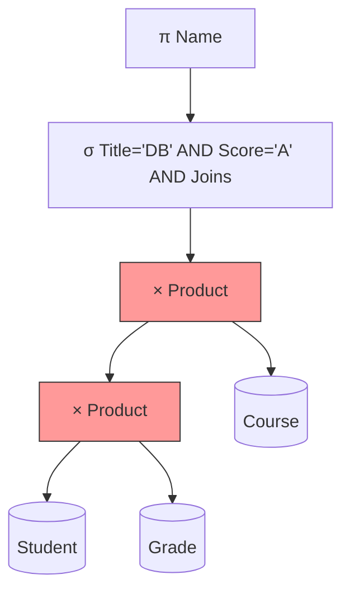
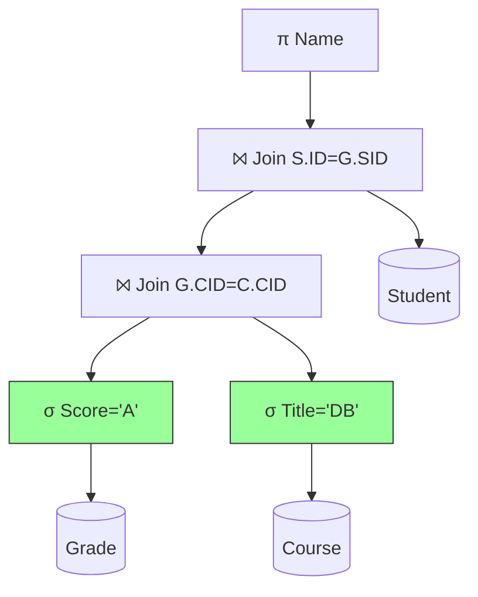

# Query Optimization Heuristics (TD 4)

## 1. The Algebraic Tree

In **TD 4**, you analyze how a database engine executes a query. The SQL is parsed into a tree.

- **Leaf Nodes:** Tables.
- **Root Node:** Final Result.
- **Goal:** Transform a "Canonical" (Standard/Naive) tree into an "Optimized" tree.

## 2. The Golden Rules of Optimization

The database optimizer uses **Heuristics** (rules of thumb) to rewrite the tree. You must memorize these for the exercises.

### Rule 1: Push Selections Down ($\sigma$)

- **Concept:** Filter data as early as possible.
- **Reasoning:**
  - Joins are expensive ($O(N \times M)$).
  - If you filter Table A from 1,000,000 rows to 10 rows _before_ the join, the join becomes instant.
- **Action:** Move $\sigma$ nodes down the tree, placing them directly above the table they filter.

### Rule 2: Push Projections Down ($\pi$)

- **Concept:** Remove unused columns early.
- **Reasoning:**
  - Reading wide rows (many columns) consumes RAM and Disk I/O.
  - If you only need `ID` and `Name`, discard `Address`, `Bio`, and `Photo` immediately.
- **Action:** Place $\pi$ nodes after data access or selections, before joins.

### Rule 3: Reorder Joins

- **Concept:** Join the most restrictive (smallest) tables first.
- **Reasoning:** Keeps intermediate result sets small.
- **Example:** $(Small \bowtie Medium) \bowtie Huge$ is better than $(Huge \bowtie Medium) \bowtie Small$.

---

## 3. Visual Example: Naive vs. Optimized

**Scenario:** Find names of Students who took 'Databases' and got an 'A'.

### A. Canonical Tree (The "Bad" Way)

This tree represents the literal SQL translation:
`FROM Student, Grade, Course WHERE ...`

1.  Cartesian Product of ALL tables (Massive!).
2.  Filter at the very end.

### B. Optimized Tree (The "Good" Way)

This tree applies the heuristics:

1.  **Filter `Course`** to keep only 'Databases' (1 row).
2.  **Filter `Grade`** to keep only 'A'.
3.  **Join** the small results.

> [!NOTE] Comparison
>
> - **Canonical:** Might process millions of rows.
> - **Optimized:** Might process only a few dozen rows.
> - **Result:** The data returned is identical, but the speed difference is massive.
