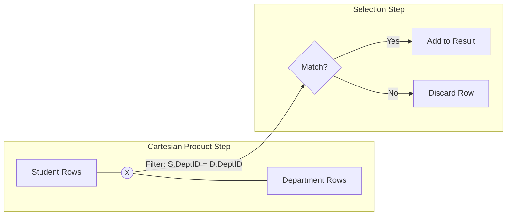

# 1. Relational Algebra: The Join Family ($\bowtie$)

## Overview

In Relational Algebra, the **Join** ($\bowtie$) is the fundamental operator used to connect data residing in two different relations (tables). It allows us to combine related tuples (rows) based on a specific condition.

Mathematically, a Join is a compound operation consisting of two steps:

1.  **Cartesian Product ($R \times S$):** Combining every row of Table R with every row of Table S.
2.  **Selection ($\sigma$):** Filtering the results to keep only the rows that satisfy a specific condition.

$$ R \bowtie*{condition} S = \sigma*{condition} (R \times S) $$

---

## Types of Joins in Algebra

### 1. Theta Join ($\bowtie_{\theta}$)

This is the most general form of a join. It connects two tables based on an arbitrary comparison condition (denoted as $\theta$).

- **Condition:** Can use operators like $<, >, \le, \ge, \neq$.
- **Example:** Join students with courses where the student's grade is greater than the course passing mark.
- **Notation:** $R \bowtie_{R.a > S.b} S$

### 2. Equi-Join ($\bowtie_{=}$)

This is a specific type of Theta Join where the condition is strictly **Equality ($=$)**. This is the most common join used in databases.

- **Condition:** $R.column = S.column$
- **SQL Equivalent:** `INNER JOIN ... ON ... = ...`

### 3. Natural Join ($\bowtie$)

The Natural Join is a variation of the Equi-Join with two strict rules:

1.  **Automatic Matching:** It automatically joins on all columns that share the **same name** in both tables.
2.  **Schema Simplification:** It removes duplicate columns from the result (the common column appears only once).

> [!WARNING] Danger in Real-world SQL
> While useful in algebra, **Natural Join** is rarely used in production SQL. If you accidentally add a column named "Notes" to both tables later, the Natural Join will suddenly try to match on "Notes" as well, effectively breaking your query.

### 4. Outer Joins ($\bowtie_L, \bowtie_R, \bowtie_{Full}$)

Unlike the standard (Inner) joins which discard rows that do not match, Outer Joins preserve unmatched rows by padding the missing data with `NULL`.

|      Symbol      | Name                 | Logic                                                                            |
| :--------------: | :------------------- | :------------------------------------------------------------------------------- |
|   $\bowtie_L$    | **Left Outer Join**  | Keeps all rows from the Left table ($R$). If $S$ has no match, fill with NULL.   |
|   $\bowtie_R$    | **Right Outer Join** | Keeps all rows from the Right table ($S$). If $R$ has no match, fill with NULL.  |
| $\bowtie_{Full}$ | **Full Outer Join**  | Keeps all rows from both $R$ and $S$, filling NULLs wherever a match is missing. |

---

## Visualizing the Logic

Consider `Student` (ID, Name, DeptID) and `Department` (DeptID, DeptName).

### Algebraic Example

**Goal:** Find the names of students and their department names.

**Expression:**
$$ \pi*{Name, DeptName} (Student \bowtie*{Student.DeptID = Department.DeptID} Department) $$

1.  **Input:** Student Table, Department Table.
2.  **Process:** Match rows where IDs are equal.
3.  **Output:** A new relation containing combined columns.
