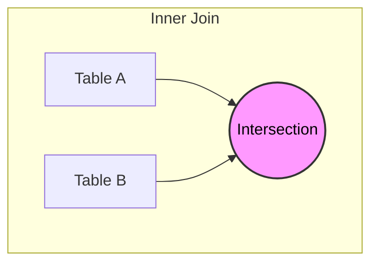

# 2. SQL Inner Join Deep Dive

## Definition

The **INNER JOIN** is the default join in SQL. It returns a result table containing **only the rows where a match is found in BOTH tables**.

> [!TIP] The "Match or Die" Rule
> If a row in Table A does not have a corresponding match in Table B based on the `ON` condition, that row is **removed** from the result set.

### Syntax

```sql
SELECT columns
FROM Table_A
INNER JOIN Table_B
    ON Table_A.Key = Table_B.Key;
```

_Note: The keyword `INNER` is optional. Writing just `JOIN` implies an Inner Join._

---

## Order of Tables

A common misconception is that the order of tables matters in an Inner Join.
**Logically, the order does NOT matter.**

The following two queries produce the **exact same result**:

1. `FROM Student INNER JOIN Department`
2. `FROM Department INNER JOIN Student`

_Background:_ The database optimizer may change the execution order internally for performance, but the data returned to you is identical.

---

## Detailed Examples

### Example 1: The "Filtering" Effect

Imagine a scenario with Students and Departments.

**Table: Student**

| SID | Name | DeptID |
| :--- | :--- | :--- |
| 1 | Sara | 10 |
| 2 | Amin | 20 |
| 3 | **Leila** | **99** |

**Table: Department**

| DeptID | DName |
| :--- | :--- |
| 10 | CS |
| 20 | Math |

**Query:**

```sql
SELECT S.Name, D.DName
FROM Student S
INNER JOIN Department D
    ON S.DeptID = D.DeptID;
```

**Result:**

| Name | DName |
| :--- | :--- |
| Sara | CS |
| Amin | Math |

**Analysis:**

- **Sara** matches Dept 10. (Kept)
- **Amin** matches Dept 20. (Kept)
- **Leila** has DeptID 99. Dept 99 does **not exist** in the Department table. Therefore, **Leila disappears**.

### Example 2: Multi-Table Chain

Inner Joins can be chained to connect multiple tables. A row must exist in **all** tables to survive the chain.

**Scenario:** Student $\to$ Exam $\to$ Classroom

```sql
SELECT S.Name, E.Score, C.RoomNumber
FROM Student S
INNER JOIN Exam E
    ON S.SID = E.SID
INNER JOIN Classroom C
    ON E.ClassroomID = C.CID;
```

**Reasoning:**

1.  First, we match the Student to their Exam. If a student didn't take an exam, they are dropped.
2.  Next, we match that Exam to a Classroom. If the exam record has a NULL classroom or invalid ID, the row is dropped.
3.  **Result:** Only students who took an exam _and_ that exam was in a valid room appear.

---

## Visual Representation (Set Theory)



The Inner Join represents the **Intersection** of two sets.
