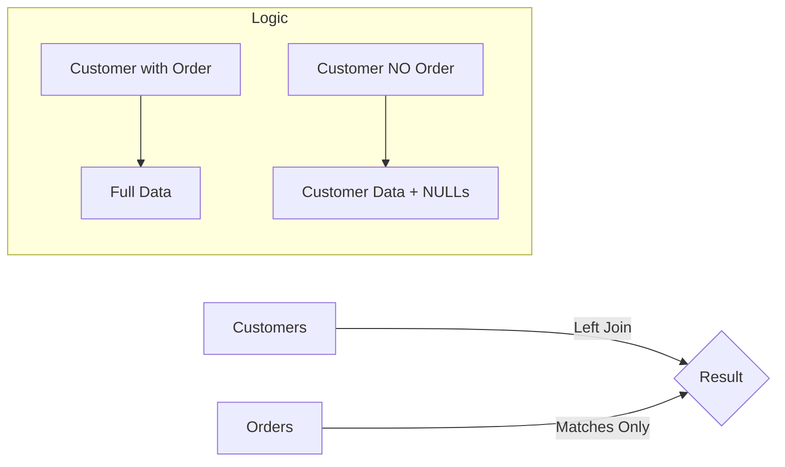

# 3. SQL Outer Joins Explained

## The Problem with Inner Joins

As seen in the Inner Join notes, if data is missing on one side (e.g., a Student with no Department, or a Customer with no Orders), the data disappears completely.
**Outer Joins** solve this by ensuring we keep the data from one (or both) sides, even if no match exists.

---

## 1. Left Outer Join (`LEFT JOIN`)

**Definition:** Returns **ALL** rows from the Left table, and the matched rows from the Right table.

- **If match found:** Data is combined normally.
- **If NO match:** The columns from the Right table are filled with `NULL`.

### Syntax

```sql
SELECT C.Name, O.OrderID
FROM Customers C        -- LEFT TABLE (Keep all of these)
LEFT JOIN Orders O      -- RIGHT TABLE (Optional details)
    ON C.ID = O.CustomerID;
```

### Visual Logic



### Use Case Example

"Show me a list of all employees and their projects. Include employees who are currently 'on the bench' (not assigned to a project)."

**Result:**

| Employee | Project |
| :--- | :--- |
| Alice | App Dev |
| Bob | Website |
| **Charlie** | **NULL** |

_Charlie is kept in the list thanks to the LEFT JOIN._

---

## 2. Right Outer Join (`RIGHT JOIN`)

**Definition:** The exact mirror image of a Left Join. It returns **ALL** rows from the Right table.

- **Logic:** `Table A RIGHT JOIN Table B` is equivalent to `Table B LEFT JOIN Table A`.

**Recommendation:** Most developers stick to `LEFT JOIN` for consistency and readability (reading left-to-right). Use `RIGHT JOIN` only when it significantly simplifies the query structure.

---

## 3. Full Outer Join (`FULL JOIN`)

**Definition:** Returns **ALL** rows from both tables.

1.  If $A$ and $B$ match: Show combined data.
2.  If $A$ exists but not $B$: Show $A$ + NULLs.
3.  If $B$ exists but not $A$: Show $B$ + NULLs.

> [!ERROR] MySQL Limitation
> MySQL **does not** support the `FULL OUTER JOIN` keyword.
> To achieve this in MySQL, you must combine a Left Join and a Right Join using `UNION`.

**MySQL Workaround:**

```sql
SELECT * FROM A LEFT JOIN B ON A.id = B.id
UNION
SELECT * FROM A RIGHT JOIN B ON A.id = B.id;
```

---

## Summary Cheat Sheet

| Join Type | Left Table Rows | Right Table Rows | Unmatched Become |
| :-------- | :-------------- | :--------------- | :--------------- |
| **INNER** | Matched Only    | Matched Only     | Removed          |
| **LEFT**  | **All**         | Matched Only     | NULL (on right)  |
| **RIGHT** | Matched Only    | **All**          | NULL (on left)   |
| **FULL**  | **All**         | **All**          | NULL (on either) |
