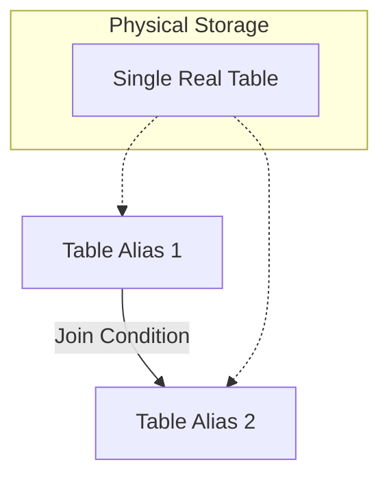

# 4. Auto-Join (Self-Join)

## What is an Auto-Join?

An **Auto-Join** (or Self-Join) is not a specific SQL keyword (like `INNER` or `OUTER`). Instead, it is a **technique** where a table is joined with **itself**.

This is used to compare rows within the same table or to handle hierarchical data stored in a single table.

## The Golden Rule: Aliasing

Since you are using the same table twice, SQL cannot distinguish between the first instance and the second instance.
**You MUST use Aliases** (e.g., `T1` and `T2`) to give the table two temporary identities.

---

## Scenario 1: Finding "Same As" Relations

**Goal:** Find pairs of employees who share the same Job Title.

**Table: Employee**

| ID | Name | Job |
| :--- | :--- | :--- |
| 1 | Sara | Engineer |
| 2 | Malik | Manager |
| 3 | Amina | Engineer |

**Concept:**
Imagine we create two copies of the Employee table: `E1` and `E2`.

1.  `E1` picks an employee (e.g., Sara).
2.  `E2` scans for others with `E2.Job = E1.Job`.

**Query:**

```sql
SELECT E1.Name AS Person_A, E2.Name AS Person_B
FROM Employee E1, Employee E2
WHERE E1.Job = E2.Job      -- Same Job
  AND E1.ID <> E2.ID;      -- Prevent matching Sara with herself
```

---

## Scenario 2: Hierarchies (Manager/Employee)

This is the most common interview use case.
Structure: The `Employee` table has a column `ManagerID`, which refers to the `EmployeeID` of another person in the _same_ table.

**Table: Employee**

| EmpID | Name | ManagerID |
| :--- | :--- | :--- |
| 10 | The Boss | NULL |
| 20 | Subordinate | 10 |

**Goal:** List employees alongside the name of their manager.

**Query:**

```sql
SELECT Worker.Name AS Employee_Name,
       Boss.Name AS Manager_Name
FROM Employee Worker
INNER JOIN Employee Boss
    ON Worker.ManagerID = Boss.EmpID;
```

**Breakdown:**

- `Worker` represents the row of the employee we are listing.
- `Boss` represents the row of the person managing them.
- The link is: `Worker`'s ManagerID $\to$ `Boss`'s EmpID.

---

## Scenario 3: Sequential Data

**Goal:** Find flights departing from the same city as Flight 'F09'.

1.  Use Alias `F1` to find Flight 'F09' and get its city.
2.  Use Alias `F2` to find all flights matching that city.

```sql
SELECT F2.code
FROM Flight F1, Flight F2
WHERE F1.code = 'F09'           -- F1 locks onto the specific flight
AND F1.departure = F2.departure; -- F2 finds the matches
```

## Visual Diagram


