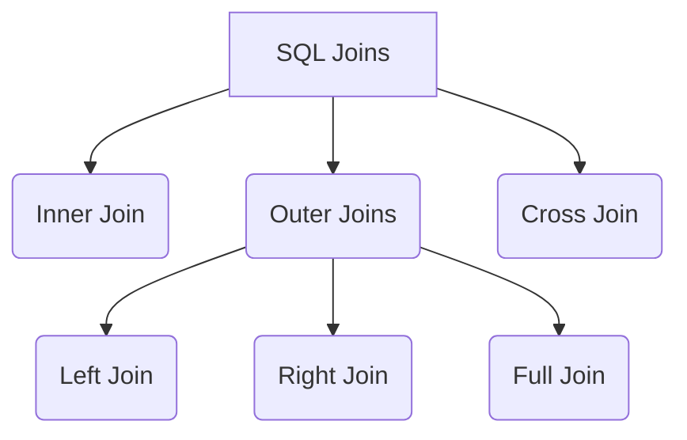

# 2. Master Guide to SQL Joins

This note covers every join type, syntax variations, and common pitfalls.

## 1. The Hierarchy of Joins



## 2. Detailed Syntax and Logic

Assume we have two tables: `Students` (S) and `Departments` (D). They link via `DID`.

### A. Inner Join (The Standard)

Only returns rows where there is a match in **both** tables.

```sql
SELECT * FROM Students S
INNER JOIN Departments D ON S.DID = D.DID;
```

> [!TIP]
> The keyword `INNER` is optional. Writing just `JOIN` implies `INNER JOIN`.

### B. Left Join (Preserve the Left)

Returns **all** rows from the Left table (`Students`). If a student has no department, the Department columns will be `NULL`.

```sql
SELECT * FROM Students S
LEFT JOIN Departments D ON S.DID = D.DID;
```

- **Use case:** Find all students, even those who haven't declared a major yet.

### C. Right Join (Preserve the Right)

Returns **all** rows from the Right table (`Departments`). If a department has no students, the Student columns will be `NULL`.

```sql
SELECT * FROM Students S
RIGHT JOIN Departments D ON S.DID = D.DID;
```

- **Equivalence:** `A RIGHT JOIN B` is exactly the same as `B LEFT JOIN A`.

### D. Full Outer Join (Preserve Everything)

Returns all rows from both tables. Matches where possible; fills with NULLs where not.

- **Note:** MySQL **does not** support this command.
- **Workaround:** You must `UNION` a Left Join and a Right Join.

```sql
/* MySQL Simulation of FULL JOIN */
SELECT * FROM Students LEFT JOIN Departments ON S.DID = D.DID
UNION
SELECT * FROM Students RIGHT JOIN Departments ON S.DID = D.DID;
```

---

## 3. The Dangerous Joins: Cross and Natural

### A. Cross Join (Cartesian Product)

Multiplies every row in Table A by every row in Table B.

- If Table A has 100 rows and Table B has 100 rows, result = 10,000 rows.
- **Syntax 1 (Explicit):** `SELECT * FROM Students CROSS JOIN Departments;`
- **Syntax 2 (Old Style):** `SELECT * FROM Students, Departments;`

**Why does `SELECT * FROM Students, Departments` work?**
In SQL-89 standard, listing tables with commas creates a Cross Join. If you add a `WHERE` clause (`WHERE S.DID = D.DID`), it becomes an Inner Join.

**Why does `SELECT * FROM Students JOIN Departments` FAIL?**
In modern SQL (ANSI-92), the `JOIN` keyword **requires** an `ON` condition. Without `ON`, it is a syntax error.

### B. Natural Join

Automatically joins tables by looking for columns with the **same name**.

```sql
SELECT * FROM Students NATURAL JOIN Departments;
```

> [!WARNING] Never use this in production
> If you have a column named `Comment` in both tables that isn't related to the join logic, `NATURAL JOIN` will try to match on it, causing data loss. Always be explicit with `ON`.

---

## 4. Visualizing Join Coverage

| Join Type |     Left Table Data     | Matches | Right Table Data |
| :-------- | :---------------------: | :-----: | :--------------: |
| **INNER** |                         |   ✅    |                  |
| **LEFT**  |           ✅            |   ✅    |                  |
| **RIGHT** |                         |   ✅    |        ✅        |
| **FULL**  |           ✅            |   ✅    |        ✅        |
| **CROSS** | (Multiplies Everything) |         |                  |
