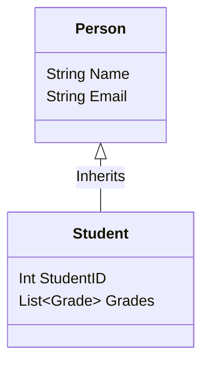
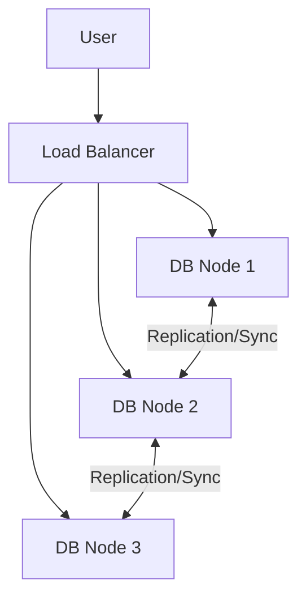

# Database Classifications

## 1. Object-Oriented Databases (OODB)
Integrates OOP concepts (C++, Java) directly into storage.
*   **Features:** Inheritance, Polymorphism, Encapsulation.
*   **Advantage:** Eliminates "Impedance Mismatch" (no need for ORM like Hibernate).
*   **Use Case:** CAD, Engineering simulations, Complex nested data.
*   **Examples:** ObjectDB, db4o.

## 2. NoSQL ("Not Only SQL")
Designed for horizontal scalability and unstructured data.

| Type | Description | Use Case | Example |
| :--- | :--- | :--- | :--- |
| **Key-Value** | Simple Hash Map. Fastest. | Session caching, Shopping carts | Redis, DynamoDB |
| **Document** | Stores JSON/BSON. Flexible schema. | Content Management, Catalogs | MongoDB |
| **Column-Family** | Stores columns separately. High write speed. | Big Data Analysis | Cassandra, HBase |
| **Graph** | Nodes and Edges. | Social Networks, Fraud Detection | Neo4j |

## 3. Specialized Databases
*   **Multimedia DB:** optimized for BLOBs (Images, Audio). Supports content-based retrieval.
*   **Time-Series DB:** Optimized for timestamped data (IoT sensors, Server logs). Example: InfluxDB.

# Database Architectures

## 1. Client-Server Architecture
The standard centralized model.
*   **Client:** Sends queries (SQL) and displays results.
*   **Server:** Stores data, processes queries, manages transactions.
*   **Pros:** Easy to manage, centralized security.
*   **Cons:** Single Point of Failure (SPOF). Performance bottleneck if users increase.

## 2. Distributed Architecture
Data is spread across multiple nodes (computers).

### Strategies
1.  **Replication:**
    *   *Concept:* Copy the same data to multiple servers.
    *   *Pros:* High Availability (if Node A fails, Node B works). Read performance is high.
    *   *Cons:* Write consistency is hard (Syncing data takes time).
2.  **Fragmentation (Sharding):**
    *   *Concept:* Split the table. Rows 1-100 on Server A, 101-200 on Server B.
    *   *Pros:* Write performance (Parallel processing).
    *   *Cons:* Complex queries (Joins across servers are slow).

