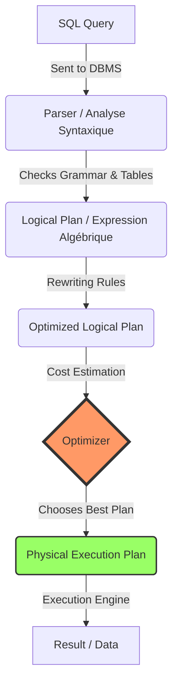

# 1. Query Processing Architecture

## Overview

When you write a SQL query, you are writing **Declarative Code**. You tell the database _what_ you want (e.g., "Give me the names of clients who live in Paris"), but you do not tell it _how_ to get it (e.g., "Open file A, read line 1, check if city is Paris...").

The **Query Optimizer** is the brain of the SGBD (DBMS) that translates your "What" into the most efficient "How".

## The Lifecycle of a Query

The process of executing a SQL query follows a specific pipeline.

### The Stages Explained

1.  **Parser (Analyse Syntaxique & Sémantique):**
    - **Syntax:** Is the SQL written correctly? (e.g., is "SELEC" misspelled?).
    - **Semantics:** Do these tables and columns actually exist? Does the user have permission to see them?
    - _Output:_ A parse tree.

2.  **Logical Plan (Traduction Algébrique):**
    - The query is converted into **Relational Algebra**.
    - Example: `SELECT * FROM T WHERE A=5` becomes $\sigma_{A=5}(T)$.
    - This is an **Initial Logical Plan** (often the "naive" or unoptimized version).

3.  **Optimization (The Critical Step):**
    - The database generates many equivalent plans (different ways to do the same thing).
    - It uses **Heuristics** (rules of thumb, e.g., "filter early") and **Cost Estimation** (math based on table size) to pick the winner.

4.  **Physical Plan:**
    - The logical steps are mapped to specific algorithms (e.g., "Use Index Scan" vs "Use Table Scan", "Use Hash Join" vs "Nested Loop").

---

> [!TIP] Student Tip
> In exams, you are often asked to transform a SQL query into a "Canonical Tree" (the raw translation) and then an "Optimized Tree". The canonical tree usually looks exactly like the structure of the SQL query (Select at top, From at bottom), which is often inefficient.
