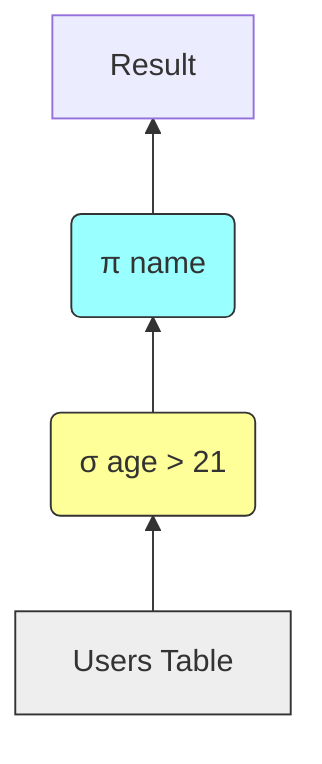

# 2. Relational Algebra & Logical Plans

To optimize queries, you must understand the symbols used to represent them in a tree structure. This is the "language" of the optimizer.

## Core Operators

| Operator              |      Symbol      | SQL Equivalent      | Description                                                                       |
| :-------------------- | :--------------: | :------------------ | :-------------------------------------------------------------------------------- |
| **Selection**         | $\sigma$ (Sigma) | `WHERE`             | Filters rows based on a condition. Keeps the schema (columns) same, reduces rows. |
| **Projection**        |    $\pi$ (Pi)    | `SELECT`            | Filters columns. Keeps the number of rows same (unless distinct), reduces width.  |
| **Join**              |    $\bowtie$     | `JOIN`              | Combines two tables based on a condition.                                         |
| **Cartesian Product** |     $\times$     | `CROSS JOIN` or `,` | Combines every row of Table A with every row of Table B. **Very Expensive.**      |

## The Tree Representation

A query is represented as a tree where data flows from the bottom (leaves) to the top (root).

### Example

**Query:** `SELECT name FROM Users WHERE age > 21`

1.  **Leaf (`Users`):** The data source.
2.  **Node ($\sigma$):** Selection is applied first (in this plan).
3.  **Root ($\pi$):** Projection is applied last to output only the `name`.

## Algebraic Equivalences (Rewrite Rules)

The optimizer knows that certain operations produce the same result regardless of order. These are the mathematical foundations of optimization.

1.  **Commutativity of Joins:**
    $A \bowtie B \equiv B \bowtie A$
    _It doesn't matter which table is on the left or right._

2.  **Associativity of Joins:**
    $(A \bowtie B) \bowtie C \equiv A \bowtie (B \bowtie C)$
    _It doesn't matter which pair you join first._

3.  **Commutativity of Selection:**
    $\sigma_{c1}(\sigma_{c2}(R)) \equiv \sigma_{c2}(\sigma_{c1}(R))$
    _You can check conditions in any order._

4.  **Cascading of Projections:**
    $\pi_{List1}(\pi_{List2}(R)) \equiv \pi_{List1}(R)$
    _If List1 is a subset of List2, we only need the final projection._

---

> [!WARNING] Important Reminder
> While $A \bowtie B$ is logically the same as $B \bowtie A$, the **performance** might differ physically (e.g., if one table fits in memory and the other doesn't). However, logically, they are equivalent.
