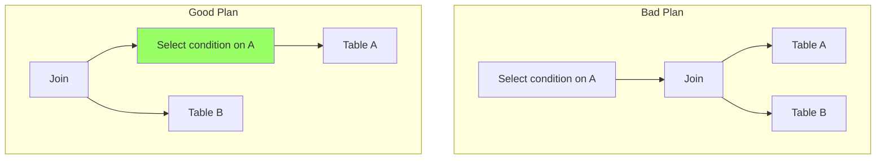

# 4. Optimization Heuristics

Calculating the exact cost of every possible execution plan is impossible (it would take too long). Therefore, databases use **Heuristics**—general rules that almost always result in a better plan.

## The Golden Rules

### 1. Push Selections Down ($\sigma$) - _The Most Important Rule_

**Principle:** Apply filters (`WHERE` clauses) as early as possible (close to the leaves of the tree).
**Why:**

- Reduces the number of rows passed to the next operator.
- Smaller input for Joins = Faster Joins.
- Reduces memory and network usage.

**Visual Transformation:**

### 2. Push Projections Down ($\pi$)

**Principle:** Remove columns you don't need as early as possible.
**Why:**

- Reduces the "width" of the tuples.
- Allows more rows to fit into a memory buffer.
- Reduces I/O bandwidth.
- _Note:_ You must keep the Join Keys even if they aren't in the final output!

### 3. Replace Cartesian Products with Joins

**Principle:** Never do a Cross Join ($\times$) followed by a Selection. Use a Join ($\bowtie$) instead.
**Why:**

- $\times$ produces $N \times M$ rows.
- $\bowtie$ produces usually much fewer rows directly.

### 4. Join Smallest Relations First

**Principle:** If joining tables A, B, and C, and A is filtered to be very small, join A with B first.
**Why:** It keeps intermediate results small throughout the pipeline.

---

> [!TIP] Student Corner: How to optimize an Algebraic Tree
>
> 1.  **Break apart** complex predicates (e.g., `WHERE A=1 AND B=2` becomes two separate selections).
> 2.  **Slide** the selections down the branches of the tree until they hit the base table they refer to.
> 3.  **Slide** projections down, keeping only necessary columns.
> 4.  **Order** joins so the most restrictive ones happen at the bottom.
