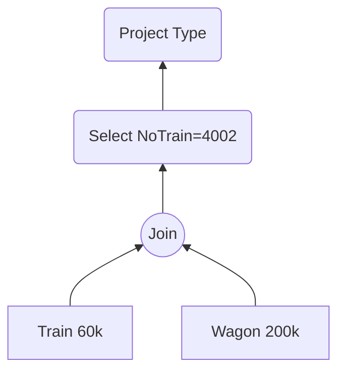
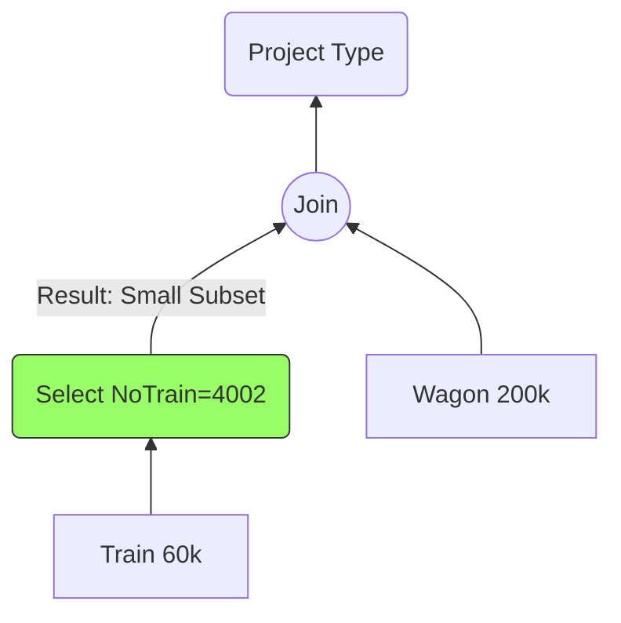

# 6. Exercise Analysis - Trains & Wagons (TD Ex 1)

This exercise demonstrates the concrete application of Heuristic #1 (Push Selections).

## The Context

- **Schema:**
  - `Train(NoTrain, NoWagon)` (Note: The schema in the TD implies a train is a link to wagons).
  - `Wagon(NoWagon, TypeWagon, ...)`
- **Volume:**
  - Trains: 60,000
  - Wagons: 200,000
  - Distinct Trains: 2,000

## The Query

_"Find the type of wagon for Train Number 4002."_

## Tree Comparison

### Tree (a): The "Bad" Tree



- **Analysis:**
  1.  The database builds the **entire** train composition for all 2,000 trains first.
  2.  It creates a massive temporary result containing all wagon assignments.
  3.  Only _then_ does it filter for #4002.
- **Cost:** High memory usage, slow execution.

### Tree (b): The "Good" Tree



- **Analysis:**
  1.  The database filters `Train` immediately.
  2.  If `NoTrain` is indexed, this is instant.
  3.  The Join now has to combine only the small subset (wagons belonging to #4002) with the Wagon table.
- **Cost:** Extremely low.

## Detailed Answers to TD Questions

**Q1. Are the trees equivalent?**
**Yes.** The rule of **Commutativity of Selection and Join** applies here.
$\sigma_P(R \bowtie S) \equiv (\sigma_P(R)) \bowtie S$
Because the condition `NoTrain=4002` only applies to columns in the `Train` table, we can perform it before the join.

**Q2. Which is better?**
Tree (b) is vastly superior. By reducing the cardinality of the `Train` relation _before_ the join, we minimize the number of comparisons and I/O operations required by the Join operator.

**Q3. SQL Query:**

```sql
SELECT W.TypeWagon
FROM Train T
JOIN Wagon W ON T.NoWagon = W.NoWagon
WHERE T.NoTrain = 4002;
```
