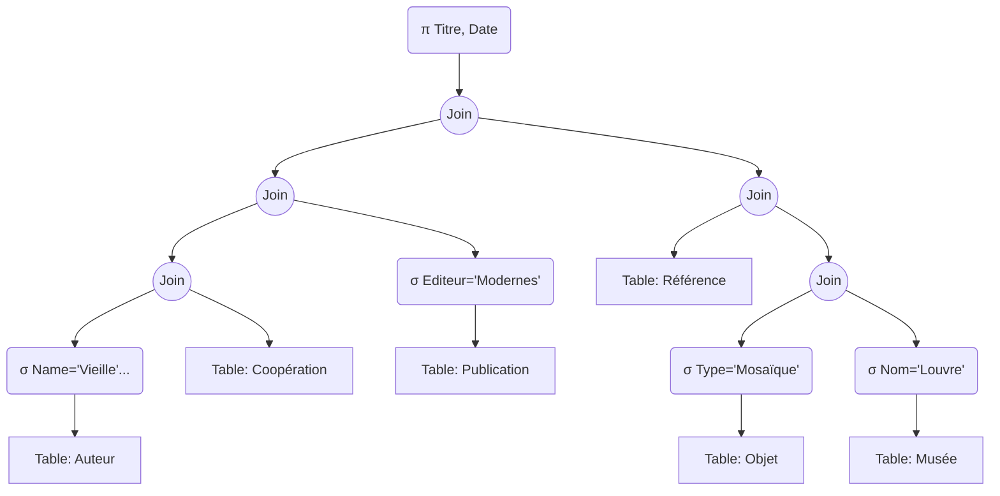

# 7. Exercise Analysis - Archaeology DB (TD Ex 2)

This exercise deals with a complex, multi-table join and demonstrates how to optimize a "Cartesian Product Nightmare."

## The Context

**Schema:**

- `Objet (num-obj, type, num-musée)`
- `Musée (num-musée, nom)`
- `Publication (num-pub, titre, date, éditeur)`
- `Auteur (num-aut, nom, prénom)`
- `Coopération (num-aut, num-pub)`
- `Référence (num-pub, num-obj)`

**Query Goal:**
Find titles and dates of publications by 'Pierre Vieille' (Editor 'Modernes') referencing 'Mosaïque' objects in the 'Louvre'.

## 1. The Naive (Initial) Plan

Usually, a SQL parser initially generates a plan that looks like a direct translation:

1.  **Cartesian Product** of ALL 6 tables ($A \times C \times P \times R \times O \times M$).
2.  **Selection** (Huge WHERE clause with all join conditions AND filter conditions).
3.  **Projection**.

**Why this fails:**
If each table has just 1,000 rows, the Cartesian product size is $1000^6 = 10^{18}$ rows. This query will never finish.

## 2. The Optimized Plan (Step-by-Step Construction)

We apply heuristics to fix this.

### Step A: Push Selections (Filter Leaves)

We apply filters directly to the tables:

- `Auteur`: $\sigma_{Nom='Vieille' \land Prénom='Pierre'}$ (Result: Likely 1 row).
- `Publication`: $\sigma_{Editeur='Modernes'}$
- `Objet`: $\sigma_{Type='Mosaïque'}$
- `Musée`: $\sigma_{Nom='Louvre'}$ (Result: 1 row).

### Step B: Replace Cartesian Products with Joins

We define the join order based on the schema links. We start with the most selective inputs.

1.  **Join Auteur & Coopération:**
    - We have 1 Author ('Pierre Vieille').
    - Join with `Coopération` to find his publications.
    - Result: Small set of `num-pub`.

2.  **Join Result & Publication:**
    - Filter the list of `num-pub` against the filtered `Publication` table (Editor 'Modernes').
    - Result: Only Pierre's books published by Modernes.

3.  **Join Musée & Objet:**
    - We have 1 Museum ('Louvre').
    - Join with `Objet` (filtered by 'Mosaïque').
    - Result: All mosaics in the Louvre.

4.  **Join the Two Paths (via Référence):**
    - Join (Pierre's Books) with `Référence`.
    - Join that result with (Louvre Mosaics).

### Step C: Push Projections

At every step, discard columns like addresses, biographies, or descriptions. Keep only the Join Keys (IDs) and the final requested columns (Titre, Date).

## Final Optimized Tree Structure

> [!IMPORTANT] Key Takeaway
> By breaking the huge join into smaller, filtered pieces, we turned an impossible calculation into a fast one. We started with the specific entities (The Author, The Museum) and worked our way inward.
