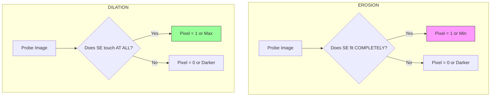

# 2.10 Mathematical Morphology Basics

Mathematical morphology is a powerful framework for image processing based on **set theory**, lattice theory, and topology. Unlike linear filters (like Gaussian) that perform arithmetic operations, morphological operators perform **geometric** operations. They probe an image with a small shape or template called a **Structuring Element (SE)** to define the interaction.

## 1. Core Concept

*   **Logic:** It analyzes the shape and structure of objects.
*   **Input/Output:** Can apply to **Binary Images** (Black/White) and **Grayscale Images** (Intensity topography).
*   **The Analogy:** Think of morphology as moving a probe (the Structuring Element) over a surface (the image).
    *   In a **Binary image**, we check if the probe fits inside the white shapes or touches them.
    *   In a **Grayscale image**, we treat the image brightness as a 3D terrain (peaks and valleys). The probe slides underneath or on top of this terrain.

## 2. The Structuring Element (SE)

The SE is the "kernel" of morphological operations. It is a small matrix (like a convolution mask) that defines the neighborhood of interest.

*   **Characteristics:**
    *   **Shape:** Square, Disk, Cross, Line, etc. The shape of the SE determines the shape of the output result.
    *   **Origin:** Usually the center pixel (0,0).
    *   **Values:** In binary morphology, values are 1 (part of the shape) or 0 (ignore).

**Example (3x3 Box SE):**
```
1 1 1
1 1 1  <-- Center is Origin
1 1 1
```

## 3. Fundamental Operation 1: Erosion ($\Theta$)

Erosion shrinks objects. It "erodes" the boundaries of regions of foreground pixels.

### A. Binary Erosion
*   **Condition:** The output pixel at the origin is **1 (White)** ONLY IF **every pixel** of the Structuring Element overlaps with a white pixel in the input image.
*   **Logic:** "Does the shape **FIT** completely?"
*   **Mathematical Notation:** $A \ominus B = \{z | (B)_z \subseteq A\}$
*   **Visual Effect:**
    *   Objects shrink.
    *   Small isolated points (salt noise) disappear.
    *   Thin connections between objects are broken.

### B. Grayscale Erosion
*   **Operation:** It replaces the center pixel with the **Minimum** value found in the neighborhood defined by the SE.
*   **Formula:** $g(x, y) = \min_{(s,t) \in SE} \{ f(x+s, y+t) \}$
*   **Visual Effect:**
    *   Darkens the image.
    *   Bright features shrink; dark holes enlarge.
    *   Example: A bright wire on a dark background will become thinner or vanish.

## 4. Fundamental Operation 2: Dilation ($\oplus$)

Dilation grows objects. It "dilates" or expands the boundaries of regions of foreground pixels.

### A. Binary Dilation
*   **Condition:** The output pixel at the origin is **1 (White)** IF **at least one pixel** of the Structuring Element overlaps with a white pixel in the input image.
*   **Logic:** "Does the shape **HIT** or touch the object?"
*   **Mathematical Notation:** $A \oplus B = \{z | (\hat{B})_z \cap A \neq \emptyset\}$
*   **Visual Effect:**
    *   Objects expand.
    *   Small holes inside objects (pepper noise) are filled.
    *   Nearby objects merge together.

### B. Grayscale Dilation
*   **Operation:** It replaces the center pixel with the **Maximum** value found in the neighborhood defined by the SE.
*   **Formula:** $g(x, y) = \max_{(s,t) \in SE} \{ f(x+s, y+t) \}$
*   **Visual Effect:**
    *   Brightens the image.
    *   Bright features thicken; dark holes shrink.

## 5. Summary Diagram



---
