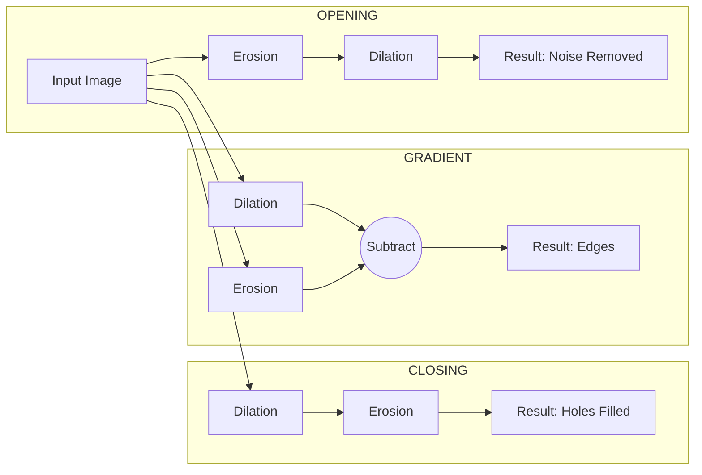

### **2.11 Advanced Morphological Operations.md**

# 2.11 Advanced Morphological Operations

By combining Erosion and Dilation in specific sequences, we create filters that can clean noise, isolate shapes, or detect edges without significantly changing the size of the objects (unlike pure erosion/dilation).

## 1. Opening (Ouverture)

Opening is **Erosion followed by Dilation** using the same Structuring Element.

$$ A \circ B = (A \ominus B) \oplus B $$

*   **Mechanism:**
    1.  **Erode:** Shrinks objects, eliminating small noise (salt) and thin protrusions.
    2.  **Dilate:** Restores the size of the remaining objects.
*   **Key Effect:**
    *   Removes small objects (smaller than the SE) from the foreground.
    *   Smoothes object contours from the **inside**.
    *   Breaks narrow connections (isthmuses) between objects.
*   **Analogy:** Rolling a ball *inside* a shape. It cannot reach into sharp corners or narrow tubes, so those parts are removed.

## 2. Closing (Fermeture)

Closing is **Dilation followed by Erosion** using the same Structuring Element.

$$ A \bullet B = (A \oplus B) \ominus B $$

*   **Mechanism:**
    1.  **Dilate:** Expands objects, filling in small holes and gaps.
    2.  **Erode:** Restores the size of the objects.
*   **Key Effect:**
    *   Fills small holes (pepper) inside the foreground objects.
    *   Smoothes object contours from the **outside**.
    *   Fuses narrow breaks and long thin gulfs.
*   **Analogy:** Rolling a ball *outside* a shape. It bridges gaps that are narrower than the ball.

## 3. The Morphological Gradient

Standard edge detection uses derivatives (Sobel, Laplacian). Morphology offers a non-linear way to detect edges.

*   **Definition:** The difference between the dilated image and the eroded image.
$$ Gradient(A) = (A \oplus B) - (A \ominus B) $$
*   **Why it works:**
    *   Dilation expands the boundary outwards.
    *   Erosion shrinks the boundary inwards.
    *   Subtracting them leaves a "rim" or "outline" of the object.
*   **Application:** Robust edge detection for segmentation, especially in noisy images or textures.

## 4. Skeletonization (Squelettisation)

Skeletonization reduces binary objects to 1-pixel wide lines (skeletons) that preserve the extent and connectivity of the original shape.

### Approaches (Slide 63):
1.  **Topological Thinning (Amincissement):**
    *   Iteratively removes pixels from the boundary of the object.
    *   Constraint: Do not break the connectivity (do not split the object) and do not shorten the ends of lines excessively.
    *   Result: A stick-figure representation.
2.  **Distance Map Extraction:**
    *   Calculates the distance of every pixel inside the object to the nearest boundary pixel.
    *   The "ridges" or local maxima of this distance map correspond to the skeleton (the "middle" of the shape).

## 5. Visual Summary of Advanced Ops

---
