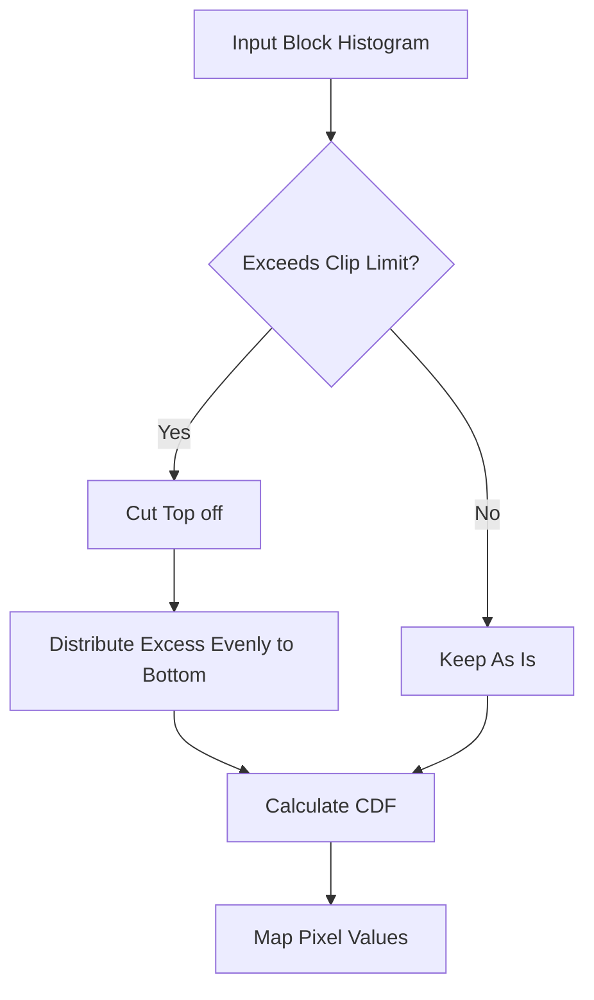

### **2.14 Histogram Equalization Techniques.md**

# 2.14 Histogram Equalization Techniques

While stretching spreads the histogram, **Equalization** attempts to flatten it. The theoretical goal is to transform the image so that every gray level has an equal probability of occurring (Uniform Distribution).

## 1. Global Histogram Equalization (HE)

This technique uses the Cumulative Distribution Function (CDF) of the image as a transfer function (Look-Up Table).

*   **Mechanism:** It merges gray levels that have few pixels and spreads out gray levels that have many pixels.
*   **The Formula:**
    $$ NewLevel(k) = \text{round} \left( \frac{H_c(k)}{TotalPixels} \times 255 \right) $$
*   **Pros:** Simple, fast, and maximizes global contrast.
*   **Cons (Slide 162):**
    1.  **Indiscriminate:** It enhances contrast everywhere, including background noise.
    2.  **No Context:** It ignores spatial information. A small dark object in a bright room might be washed out because the global statistics are dominated by the bright room.

## 2. Adaptive Histogram Equalization (AHE)

To solve the lack of local context, we use AHE.

*   **Logic:**
    1.  Divide the image into a grid of small blocks (tiles), e.g., $8 \times 8$.
    2.  Calculate the histogram for **each block**.
    3.  Equalize each block independently based on its local histogram.
*   **The Problem:** In a perfectly smooth area (like a clear sky), the histogram is a single spike. Equalizing a single spike forces it to spread across the whole spectrum, amplifying tiny amounts of noise into massive artifacts.

## 3. Contrast Limited AHE (CLAHE)

CLAHE is the industry standard (used in medical imaging, underwater vision, etc.) because it fixes the noise amplification of AHE.

### The Workflow (Crucial for Exams - Slide 169)

1.  **Tile Generation:** Split image into blocks.
2.  **Histogram Calculation:** Compute histogram for a block.
3.  **Clipping (The Key Step):**
    *   Set a **Clip Limit** threshold.
    *   Any histogram bar that goes *above* this limit is cut off (clipped).
    *   The pixels from the cut-off part are gathered into a pool of "excess pixels."
4.  **Redistribution:** The "excess pixels" are distributed evenly across all other bins in the histogram. This raises the "floor" of the histogram slightly but prevents huge peaks.
5.  **Equalization:** Perform standard equalization on this modified histogram.
6.  **Bilinear Interpolation:** To prevent visible grid lines between blocks, the final pixel values are interpolated using the functions of neighboring blocks.

### Visual Logic of CLAHE

## 4. Equalization in Color Images

**Warning:** Never apply histogram equalization directly to R, G, and B channels independently.
*   **Why?** It changes the ratio between Red, Green, and Blue, which changes the **Hue** (color). A blue sky could turn purple.
*   **Correct Procedure (Slide 174):**
    1.  Convert RGB image to a Luminance-Chrominance space (like **Lab** or **HSV**).
    2.  Apply CLAHE/HE only to the **L (Luminance)** or **V (Value)** channel.
    3.  Merge back with original color channels.
    4.  Convert back to RGB.

---
