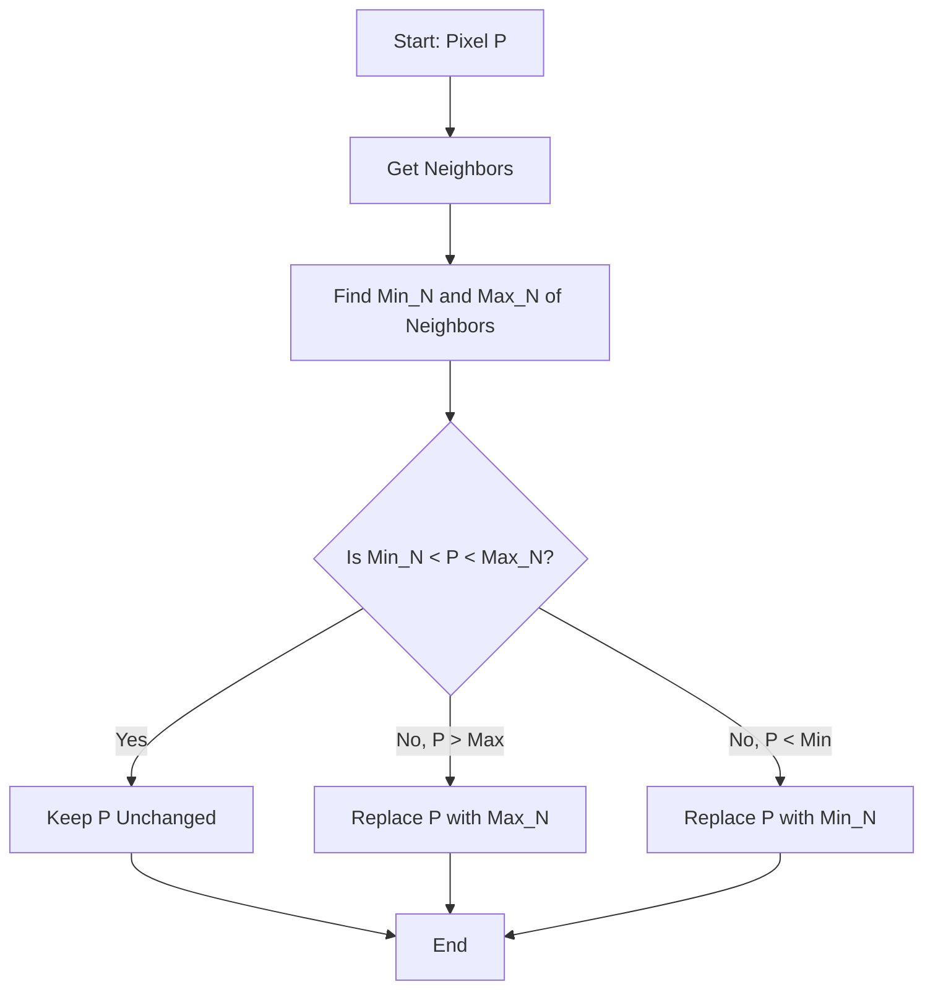

While basic filters like Mean (linear) and Median (non-linear) are standard, advanced non-linear filters offer more sophisticated ways to handle noise while preserving image details. These filters often use logical conditions or adaptive statistics rather than simple fixed mathematical operations.

## 1. Rank-Order Filters (Min, Max, Min-Max)

These filters belong to the same family as the Median filter. They work by sorting the pixel values in a neighborhood and selecting a specific rank.

### A. Max Filter
*   **Operation:** Replaces the center pixel with the **maximum** value in the neighborhood.
*   **Effect:** It brightens the image.
*   **Application:**
    *   Removes "Pepper" noise (black dots), as the black pixel (0) will always be lower than its neighbors and thus eliminated.
    *   Used in **Morphological Dilation** (see *Mathematical Morphology* notes).

### B. Min Filter
*   **Operation:** Replaces the center pixel with the **minimum** value in the neighborhood.
*   **Effect:** It darkens the image.
*   **Application:**
    *   Removes "Salt" noise (white dots), as the white pixel (255) will always be higher than its neighbors.
    *   Used in **Morphological Erosion**.

### C. The Min-Max Filter (Data-Dependent)
This is a more intelligent filter found in your slides (Slide 108). Instead of blindly replacing pixels, it checks if the current pixel fits within the dynamic range of its neighbors.

**The Logic:**
1.  Examine the neighborhood of the central pixel $P$.
2.  Calculate the **Min** and **Max** of the *neighbors* (excluding $P$).
3.  **Test:** Is $Min < P < Max$?
    *   **YES:** The pixel is "normal" (it blends with neighbors). **Keep original value.**
    *   **NO:** The pixel is an outlier (noise). **Replace with the closest boundary (Min or Max).**

**Example from Slides:**
Imagine a neighborhood where neighbors range from 90 to 198.
*   If Center Pixel = 120 $\rightarrow$ Keep 120 (It fits).
*   If Center Pixel = 208 $\rightarrow$ Replace with 198 (It is too bright, clamp it down).

---

## 2. Adaptive Mean Filter

Standard mean filters blur everything equally. An **Adaptive Mean Filter** changes its behavior based on the local statistical characteristics (variance) of the image.

**Formula (Slide 42):**
$$ C[i,j] = \frac{1}{\sum w} \sum_{k=1}^{L} w(|a_k - A[i,j]|) a_k $$

Where:
*   $A[i,j]$ is the central pixel.
*   $a_k$ represents neighbor pixels.
*   $w(x)$ is a weighting function (often a thresholding function).

**Simplified Logic:**
$$ w(x) = \begin{cases} 1 & \text{if } |x| \le t \text{ (threshold)} \\ 0 & \text{otherwise} \end{cases} $$

**Explanation:**
The filter calculates the mean, but it **only includes neighbors that are similar** to the center pixel (difference $\le t$).
*   **If a neighbor is very different (e.g., across an edge):** It is ignored ($w=0$).
*   **Result:** Noise is smoothed out using similar pixels, but edges are not blurred because pixels on the "other side" of the edge are excluded from the average.

