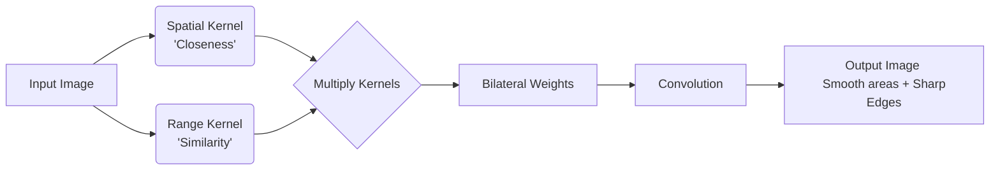

The Bilateral Filter is widely considered the standard for "edge-preserving smoothing." Unlike the Gaussian filter, which blurs based only on space, the Bilateral filter blurs based on **space** AND **intensity**.

## 1. The Concept

*   **Gaussian Filter:** "I will average my neighbors because they are *close* to me."
*   **Bilateral Filter:** "I will average my neighbors ONLY IF they are *close* to me **AND** look *similar* to me."

## 2. The Equation

The filtered value at pixel $p$, denoted $I_{filtered}(p)$, is:

$$ I_{filtered}(p) = \frac{1}{W_p} \sum_{q \in S} I(q) \cdot G_{\sigma_s}(||p - q||) \cdot G_{\sigma_r}(|I(p) - I(q)|) $$

### Decomposition of Terms:
1.  **$I(q)$**: The intensity of the neighbor pixel.
2.  **$G_{\sigma_s}$ (Spatial Weight):** A Gaussian function based on geometric distance. Pixels far away have less weight.
    *   Depends on $||p - q||$ (Distance).
3.  **$G_{\sigma_r}$ (Range/Intensity Weight):** A Gaussian function based on photometric difference. Pixels with very different colors/brightness have less weight.
    *   Depends on $|I(p) - I(q)|$ (Difference in brightness).
4.  **$W_p$**: Normalization factor to ensure weights sum to 1.

## 3. The Parameters ($\sigma$)

Understanding the two sigmas is crucial for exam questions:

| Parameter | Name | Function | Effect of High Value |
| :--- | :--- | :--- | :--- |
| **$\sigma_s$** | Sigma Spatial | Controls the **Size** of the neighborhood. | Behaves like a large Gaussian blur. Pixels far away influence the center. |
| **$\sigma_r$** | Sigma Range | Controls the **Sensitivity** to edges. | **High $\sigma_r$:** The filter ignores intensity differences and becomes a standard Gaussian blur (edges become blurry). **Low $\sigma_r$:** Strict edge preservation; only very similar pixels are averaged. |

## 4. Visual Logic

**Student Note:**
The Bilateral filter is computationally expensive because the kernel changes for *every single pixel* (because the Range component depends on the specific intensity of the center pixel). Deep learning methods often approximate this behavior for speed.

---

