# Part 1: Linear Spatial Filters
*These filters use Math (Weighted Sums) to change pixels.*

## 1. The Mean Filter (Average)

### The Concept
**"The Smear."** It treats every pixel in the neighborhood equally. It adds them all up and divides by the count. It is like smearing wet ink with your thumb.

### Mini Mind Map
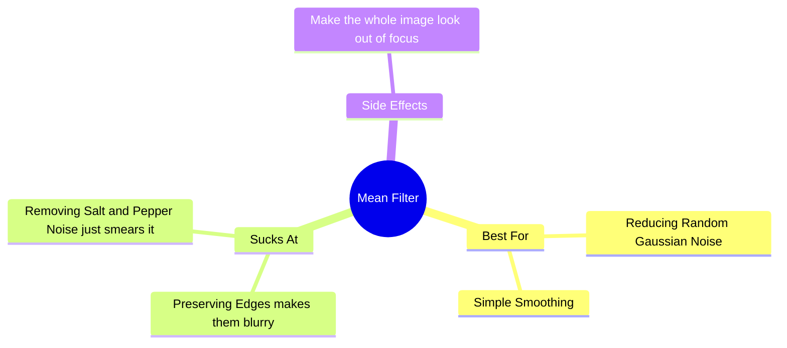

### Logic Diagram
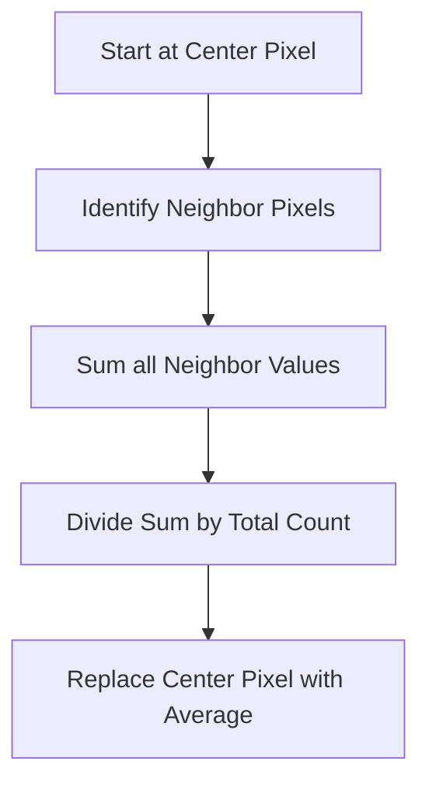

---

## 2. The Gaussian Filter

### The Concept
**"The Natural Blur."** It calculates an average, but it gives more importance to the pixels in the center and less importance to the pixels far away. It follows a "Bell Curve."

### Mini Mind Map
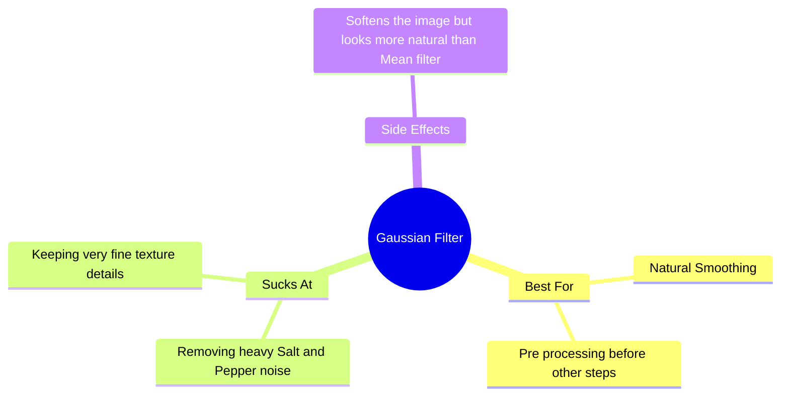

### Logic Diagram
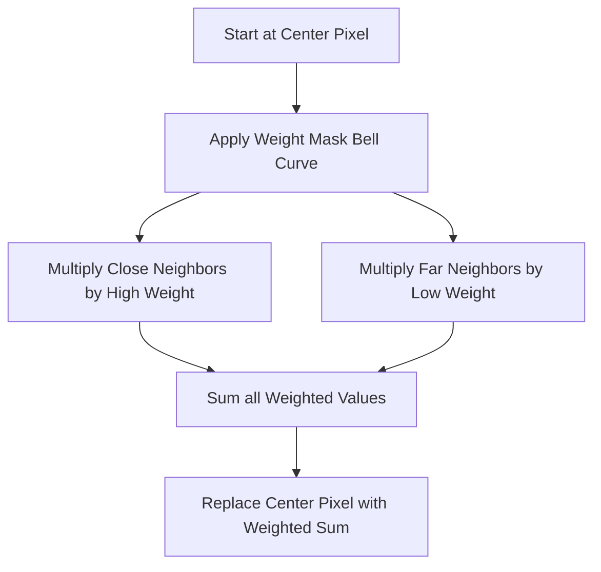

---

## 3. The Laplacian Filter

### The Concept
**"The Edge Detector."** It calculates the difference between a pixel and its neighbors. If the area is flat, it outputs zero (black). If there is a change, it lights up.

### Mini Mind Map
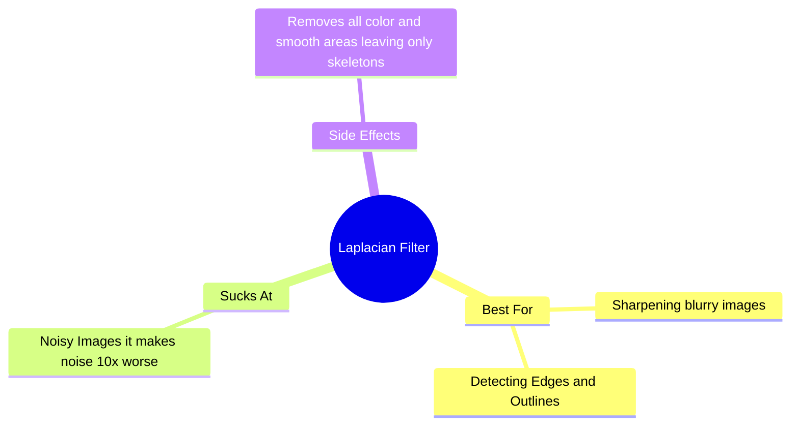

### Logic Diagram
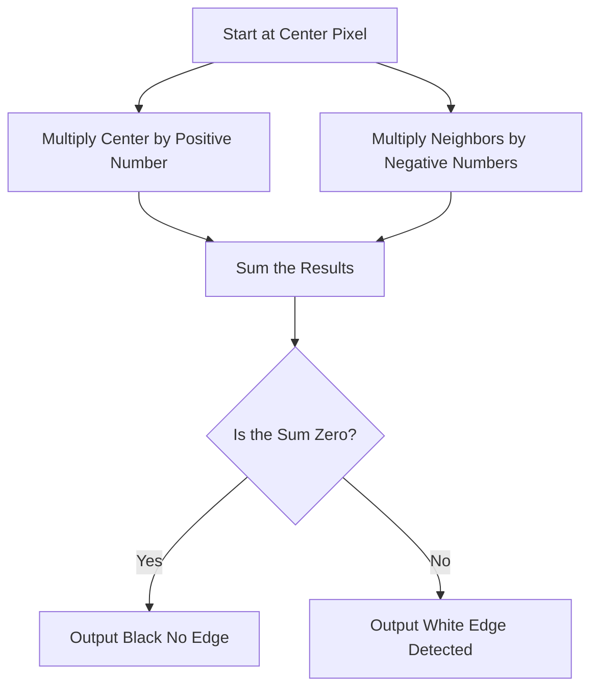

---

# Part 2: Non-Linear Spatial Filters
*These filters use Logic (Sorting/Selection) to change pixels.*

## 4. The Median Filter

### The Concept
**"The Democracy."** It looks at a group of pixels, sorts them from lowest to highest, and picks the one exactly in the middle. It ignores extreme outliers (noise).

### Mini Mind Map
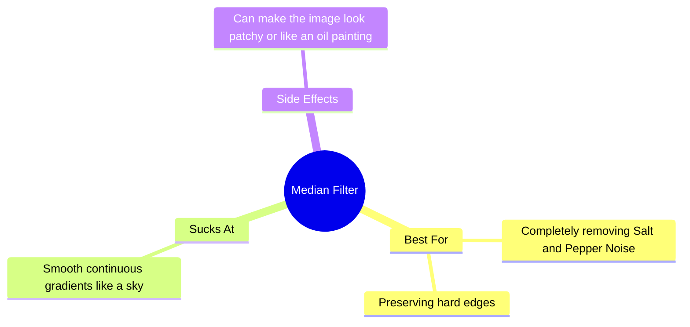

### Logic Diagram
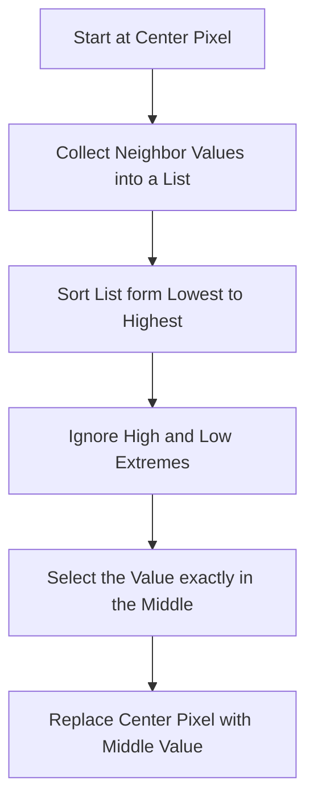

---

## 5. The Nagao Filter

### The Concept
**"The Smart Smoother."** It looks around in 9 different directions to find the "calmest" (lowest variance) area nearby. It copies the average of *that* area, effectively refusing to blur across an edge.

### Mini Mind Map
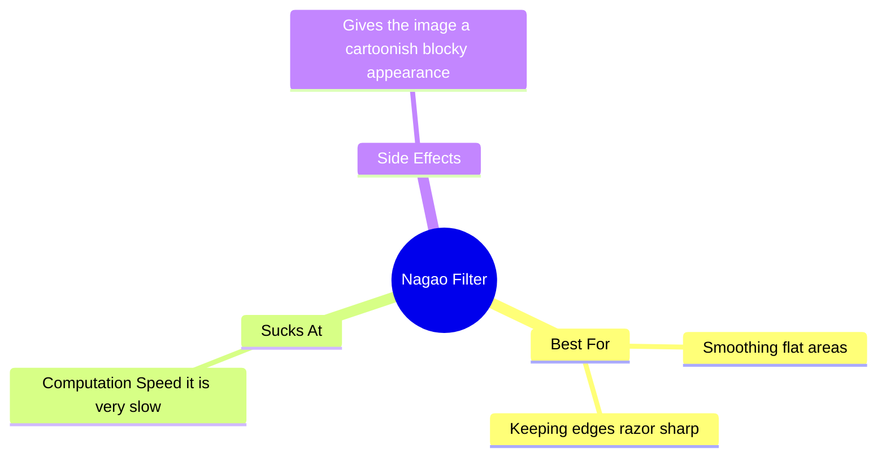

### Logic Diagram
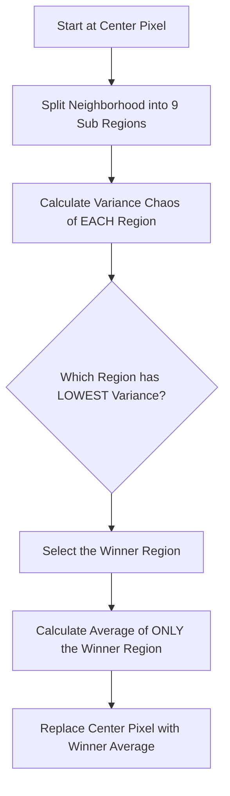

---

# Part 3: Frequency Domain Filters
*These filters convert the image to a spectrum, delete frequencies, and convert it back.*

## 6. Low-Pass Filter (Passe-Bas)

### The Concept
**"The Blur Mask."** In the frequency domain, the center represents smooth shapes. This filter keeps the center (White Box) and deletes the edges (Black).

### Mini Mind Map
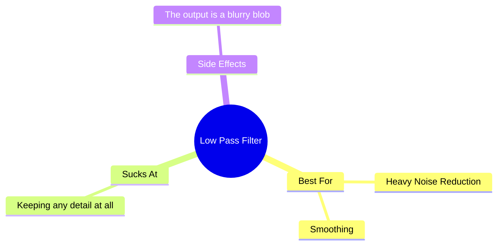

### Logic Diagram
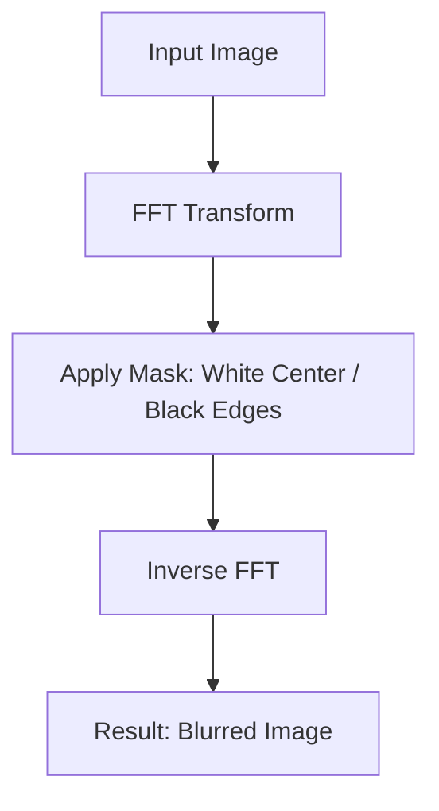

---

## 7. High-Pass Filter (Passe-Haut)

### The Concept
**"The Ghost Mask."** In the frequency domain, the edges represent details. This filter keeps the edges (White) and deletes the center (Black Box).

### Mini Mind Map
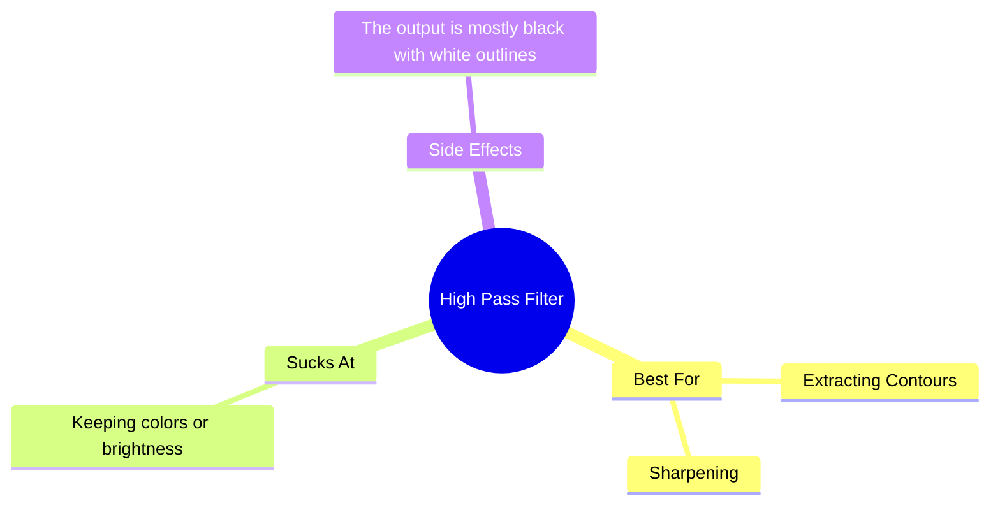

### Logic Diagram
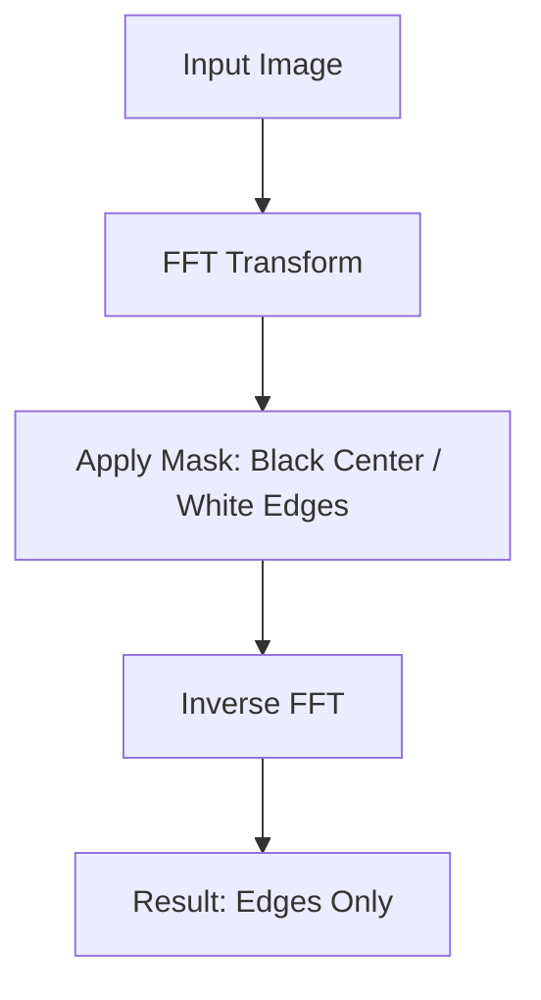

---

## 8. Band-Reject Filter (Coupe-Bande)

### The Concept
**"The Noise Killer."** Sometimes noise is a specific repeating pattern. This filter creates a "Black Frame" (Square Donut) mask to delete just that specific range of frequencies.

### Mini Mind Map
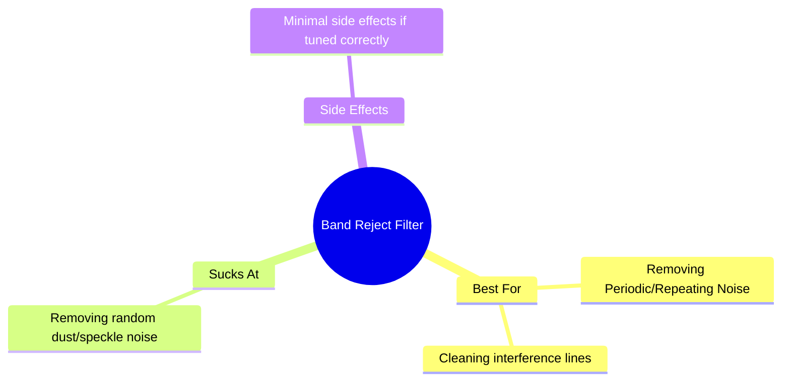

### Logic Diagram
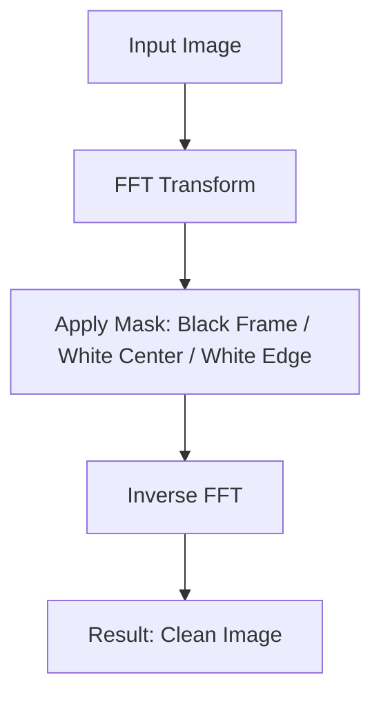

---

# Part 4: The Giant Summary Diagram

This diagram visualizes the decision process for the **Frequency Domain Filters** based on the square masks seen in your slides.

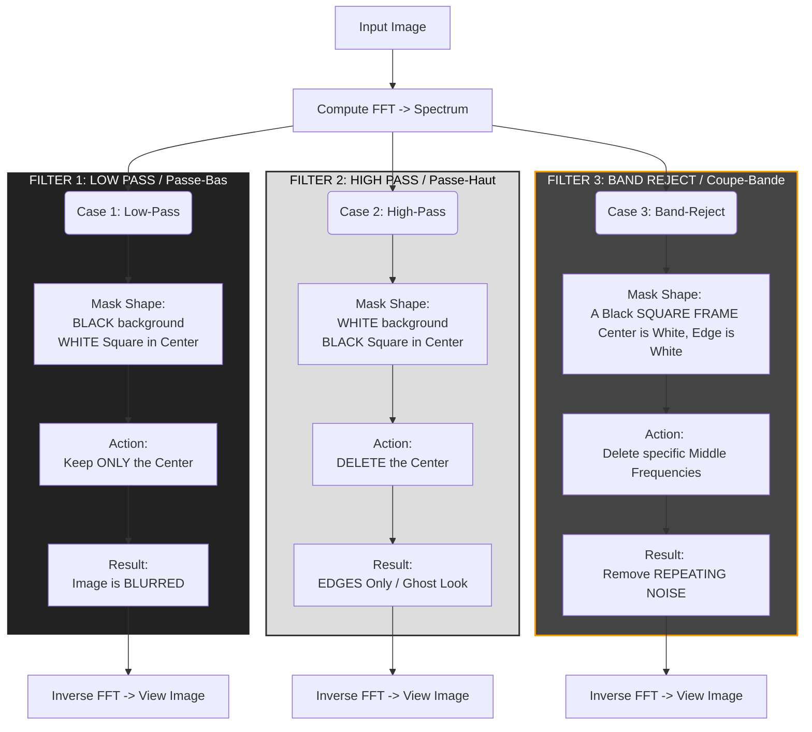