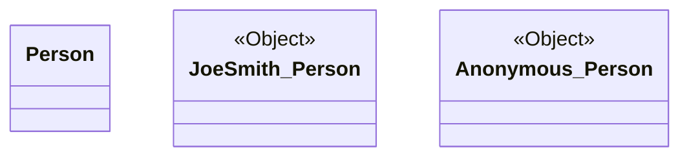
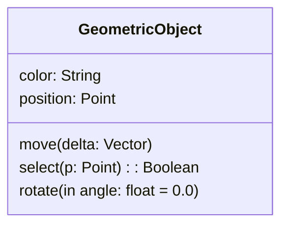
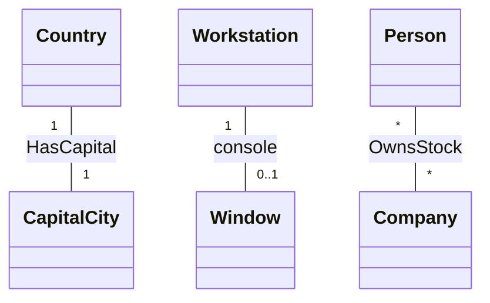
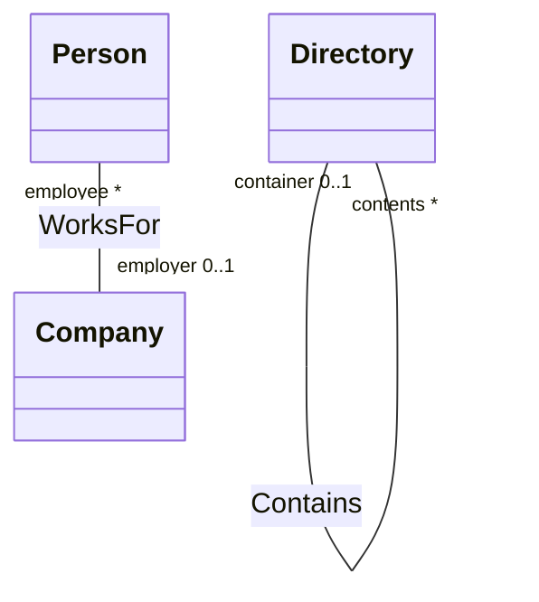
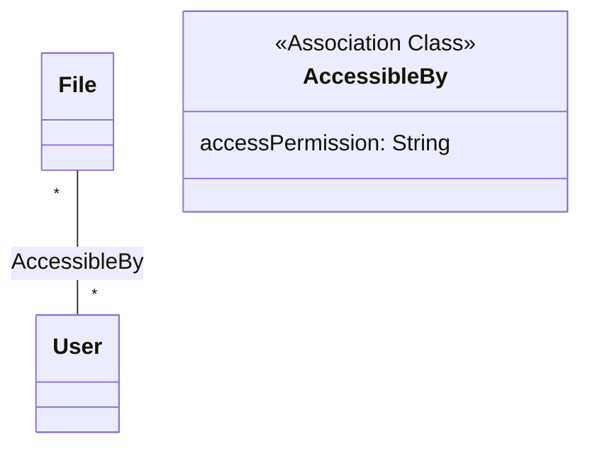
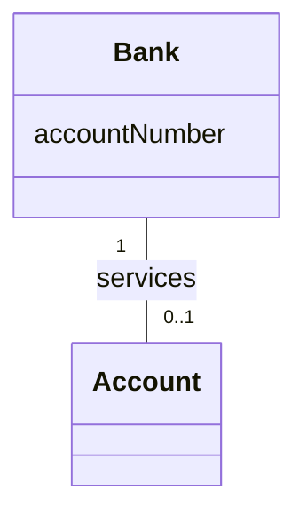
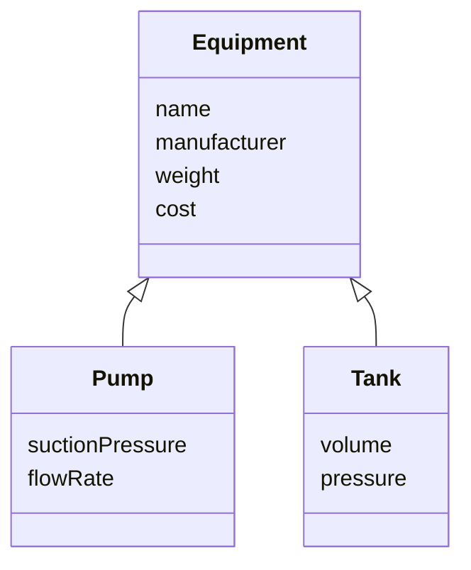
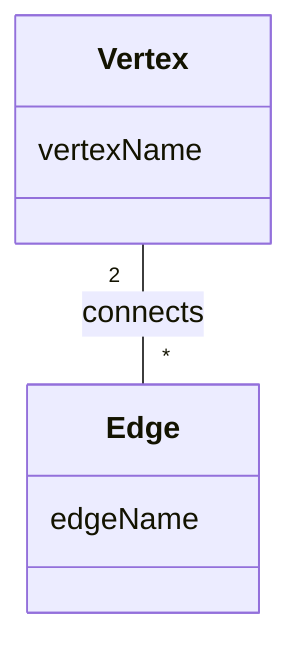
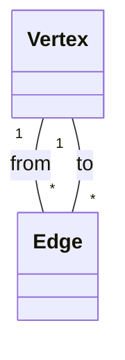

Here is the first major installment of your Obsidian vault dedicated entirely to **Class Diagrams**, extracted and expanded from the provided book. 

Because of the sheer volume of detailed information, this first installment covers the foundational structure, rules, principles, and the first set of exhaustive exercise breakdowns (Chapters 1 to 3 of the source material, heavily expanded). 

Every note is formatted specifically for Obsidian, utilizing callouts, Mermaid diagrams, and strict naming conventions.

***

# 1. Core Object-Oriented Principles

> [!info] Background Knowledge: The "Why" of Class Modeling
> Before drawing boxes and lines, it is crucial to understand *why* we model. A model is an abstraction of reality. It omits nonessential details so the human mind can grasp complex systems. The **Class Model** is the most fundamental of all models because it defines the static structure—the "universe of discourse." You must describe *what* is changing before you can describe *when* or *how* it changes.

Object-oriented (OO) modeling is fundamentally a way of thinking about problems using real-world concepts rather than computer concepts (like arrays, pointers, or linked lists).

### The Four Pillars of Object Orientation
To properly build and understand a class diagram, you must be intimately familiar with the four aspects that characterize an OO approach:

#### 1. Identity
**Identity** means that data is quantized into discrete, distinguishable entities called **objects**.
*   In the real world, two apples can have the exact same color, shape, and texture, but they are still two distinct apples. You can eat one, and the other remains.
*   In an OO system, two objects are distinct even if every single attribute value they hold is identical. 
*   **What students miss:** Do not confuse identity with a database primary key or an internal identifier. An object inherently "knows" it exists. When creating class diagrams, **never** add attributes like `objectID` or `personID` unless that ID explicitly exists in the real world (like a Social Security Number or a License Plate).

#### 2. Classification
**Classification** means that objects with the same data structure (attributes) and behavior (operations) are grouped into a **class**.
*   A class is an abstraction. Any choice of classes is arbitrary and depends entirely on the application's domain.
*   Every object is an **instance** of its class. An object contains an implicit reference to its class—it "knows what kind of thing it is."

#### 3. Inheritance
**Inheritance** is the sharing of attributes and operations among classes based on a hierarchical relationship.
*   A **superclass** holds general information.
*   A **subclass** refines and elaborates that information.
*   This factors out redundancy. Instead of redefining "draw" for every shape, a `GeometricFigure` superclass defines it, and `Circle` or `Polygon` inherit it.

#### 4. Polymorphism
**Polymorphism** means that the same operation may behave differently for different classes.
*   In a non-OO procedural program, you would use a massive `switch` or `if-else` statement to determine what code to run based on a shape's type.
*   In OO modeling, you simply invoke the `draw()` operation on the object. The object implicitly decides which specific **method** (implementation) to execute based on its class.

> [!tip] Synergy
> Each of these four concepts is powerful on its own, but together they complement each other synergistically. Emphasizing the essential properties of an object forces you to think deeply about what an object *is* rather than how it is currently *used*.

***

# 2. Basic Class Modeling Concepts

This note covers the atomic building blocks of a Class Diagram: Objects, Classes, Attributes, and Operations.

### 2.1 Objects and Classes

The purpose of class modeling is to describe objects. 
*   **Object:** A concept, abstraction, or thing with identity that has meaning for an application (e.g., *Joe Smith*, *Simplex Company*, *the top window*).
*   **Class:** A description of a group of objects with the same properties, behavior, and semantics (e.g., *Person*, *Company*, *Window*).

> [!warning] Semantic Purpose
> Objects in a class must share a common semantic purpose. A barn and a horse might both have an `age` and a `cost`, and if you are building an accounting system, they might both just be instances of `FinancialAsset`. However, in a farm management system, a person paints a barn and feeds a horse. Here, they must be distinct classes. Context is everything.

#### UML Notation for Classes and Objects
*   **Class:** Represented by a rectangle. The name is boldface, centered, and capitalized. We always use **singular nouns** (e.g., `Person`, not `People`).
*   **Object:** Represented by a rectangle. The name is underlined and follows the format `objectName:ClassName`. 

*(Note: In standard UML, object names are underlined like <u>JoeSmith:Person</u>. Mermaid handles instances slightly differently, often denoted with instance notation or stereotypes).*

### 2.2 Attributes and Values

*   **Value:** A piece of data (e.g., the string "Joe Smith", the integer 17). Values lack identity. All occurrences of the integer 17 are completely indistinguishable.
*   **Attribute:** A named property of a class that describes a value held by each object of the class (e.g., `name`, `birthdate`, `weight`).

**Object is to Class AS Value is to Attribute.**

#### Notation and Best Practices
Attributes are listed in the second compartment of the class box. 
*   **Syntax:** `attributeName : dataType = defaultValue`
*   **Naming:** Left-aligned, regular typeface, lower camelCase (e.g., `modelYear`).

> [!tip] Practical Tip: Omit Internal Identifiers
> Internal identifiers are an implementation convenience. Do not include them in your conceptual class models. 
> *Wrong:* `personID: ID`, `name: string`
> *Correct:* `name: string`
> *Exception:* If the identifier is a real-world concept (like `taxpayerNumber` or `licensePlate`), it is a legitimate attribute.

### 2.3 Operations and Methods

*   **Operation:** A function or procedure that may be applied to or by objects in a class (e.g., `hire`, `fire`, `draw`, `move`).
*   **Method:** The specific implementation of an operation for a given class. (Because of polymorphism, one operation can have many methods).

Operations are listed in the third compartment of the class box.
*   **Syntax:** `direction parameterName : type = defaultValue`
*   **Direction:** Can be `in` (input), `out` (output), or `inout` (input that can be modified).
*   **Signature:** The number and types of arguments, plus the return type.

> [!warning] Empty Compartments vs. Missing Compartments
> *   If an attribute or operation compartment is **missing** (not drawn), it means those features are *unspecified* (they exist, but aren't shown).
> *   If a compartment is drawn but left **empty**, it explicitly states that there are *no* attributes or operations for that class.

***

# 3. Links and Associations

Classes rarely exist in isolation; they interact and relate to one another. **Links** and **Associations** are the structural glue of the class model.

### 3.1 The Concept of Links and Associations
*   **Link:** A physical or conceptual connection among *objects*. It is an instance of an association. Mathematically, a link is a tuple (a list of objects).
*   **Association:** A description of a group of links with common structure and semantics. It connects *classes*.

> [!warning] Critical Concept: Associations are NOT Pointers
> The OO literature and early programmers often implement associations as "pointers" or "object references" inside a class. **Do not model them this way.**
> A link is a relationship among objects. Modeling it as an attribute (e.g., putting `employer: Company` inside the `Person` class) hides the fact that the link depends on *both* objects. It disguises the bidirectional nature of the relationship. Treat associations as first-class citizens in your diagrams.

### 3.2 Multiplicity
Multiplicity specifies the number of instances of one class that may relate to a single instance of an associated class. It is a constraint on the size of the collection.

*   `1`: Exactly one.
*   `0..1`: Zero or one (optional).
*   `*`: Zero or more (many).
*   `1..*`: One or more.
*   `3..5`: Three to five.

> [!tip] Multiplicity vs. Cardinality
> Students often confuse these. **Cardinality** is the actual count of elements in a specific collection at a specific moment in time (e.g., John owns 4 stocks). **Multiplicity** is the structural *constraint* on that cardinality defined by the model (e.g., A person can own `*` [zero or more] stocks).

### 3.3 Association End Names (Roles)
Associations have ends. You can assign a name to an association end to clarify its role. This is especially vital when a class has an association with itself, or when there are multiple associations between the same two classes.

*Tricks and Traps:* End names act as "pseudo-attributes". From the perspective of `Company`, it has a pseudo-attribute called `employee` that yields a set of `Person` objects. Therefore, an association end name must be unique within the source class.

### 3.4 Advanced Association Types

#### 3.4.1 Ordering
By default, the objects on a "many" (`*`) association end have no explicit order; they are a mathematical set. If the real world dictates an order (e.g., windows overlapping on a screen), annotate the end with `{ordered}`.

#### 3.4.2 Bags and Sequences
*   **Set:** Unordered, no duplicates (Default).
*   **Ordered Set:** Ordered, no duplicates (`{ordered}`).
*   **Bag:** Unordered, duplicates allowed (`{bag}`).
*   **Sequence:** Ordered, duplicates allowed (`{sequence}`).
*Example:* An itinerary is a `{sequence}` of airports, because you visit them in a specific order and you can visit the same airport more than once (layovers).

#### 3.4.3 Association Classes
Sometimes the link itself has data. For example, if a `Person` works for a `Company`, where does the `salary` go? 
*   It can't go in `Person` (they might have two jobs). 
*   It can't go in `Company` (every employee has a different salary).
*   It belongs to the *link between them*.

An **Association Class** is an association that is also a class. 

*(In standard UML, this is drawn as a dashed line dropping down from the association line into the `AccessibleBy` class box).*

#### 3.4.4 Qualified Associations
A **Qualifier** is an attribute that disambiguates the objects for a "many" association end. It reduces the effective multiplicity, often from "many" to "one".

*Example:* A Bank has many Accounts. But a Bank *plus an Account Number* yields exactly ONE Account. 
The Account Number is the qualifier. It acts as an index or a lookup key.

***

# 4. Generalization and Inheritance

### 4.1 Definition
**Generalization** is the relationship between a class (the superclass) and one or more variations of the class (the subclasses). It is the "is-a" relationship.

*   The superclass holds common attributes, operations, and associations.
*   The subclasses add specific attributes, operations, and associations.
*   Subclasses **inherit** all features of their ancestors.

### 4.2 Overriding Features
A subclass may **override** a superclass feature by defining a feature with the exact same name. 
*   **Why override?** To specify behavior that depends on the subclass (e.g., `Circle.draw()` vs `Polygon.draw()`), to tighten a specification, or to improve performance.
*   **The Golden Rule:** You may override *methods* and *default values*. You must **NEVER** override the *signature* (the number and types of arguments, or the return type). A subclass must be fully compatible with its superclass. 

> [!warning] The Frankenstein Subclass Anti-Pattern
> A common, terrible practice is "borrowing" an existing class that is *similar* to what you want, inheriting from it, and then changing/ignoring features to make it fit. If the new class is not truly a special case of the original class (the "is-a" test), do not use inheritance. Use delegation (associations) instead.

### 4.3 Abstract vs. Concrete Classes
*   **Abstract Class:** A class that has no direct instances. It exists solely to structure the model and provide inherited features to subclasses. (Usually drawn in *italics* or with an `{abstract}` tag).
*   **Concrete Class:** A class that is fully instantiable. 

**Best Practice Style:** Try to avoid concrete superclasses. Ideally, all superclasses should be abstract, and all leaf-node subclasses should be concrete. If you have a concrete superclass, create an `Other` subclass to hold the concrete instances, leaving the superclass purely abstract.

***

# 5. Foundational Exercises in Class Modeling

> [!info] Note to the Learner
> To achieve mastery, one must not just read the syntax but apply it to edge cases. The following are highly detailed breakdowns of exercises from the text, highlighting exactly how to apply the rules without ambiguity.

### Exercise Breakdown: The Polygon and Points Problem

**The Scenario:** A polygon is composed of an ordered set of points. Each point has an x and y coordinate. We need to model this.

#### Question 1: What is the smallest number of points required to construct a polygon?
**Answer & Reasoning:** Three. A polygon by mathematical definition requires at least 3 points to form a closed shape. This dictates the multiplicity on the `Point` side of the association: `3..*`.

#### Question 2: Does it make a difference whether or not a point may be shared between polygons?
**Answer & Reasoning:** Yes, a massive difference. It changes the fundamental identity of the objects and the multiplicity of the association.

**Case A: Points are NOT shared (A point belongs to exactly ONE polygon)**
*   **Model:** `Polygon "1" -- "3..*" Point {ordered}`
*   **Meaning:** If two triangles share a side, the points that make up that shared side must be duplicated in the system. There will be a `Point(x=0, y=1)` for Triangle A, and a completely separate object `Point(x=0, y=1)` for Triangle B. 
*   **Why?** Because the multiplicity on the Polygon side is `1`. A single point object cannot point back to two different polygons.

**Case B: Points ARE shared (A point belongs to ONE OR MORE polygons)**
*   **Model:** `Polygon "1..*" -- "3..*" Point {ordered}`
*   **Meaning:** The system creates exactly one `Point(x=0, y=1)` object. Both Triangle A and Triangle B have links to this exact same object. 
*   **Why?** The multiplicity on the Polygon side is `1..*` (or `*`), allowing the single point instance to link back to multiple polygon instances. 

> [!tip] Watch out for Ordering!
> The exercise explicitly notes that points in a polygon are ordered. Therefore, the association end at the `Point` class MUST have the `{ordered}` constraint. Without it, the polygon is just a chaotic cloud of points, not a drawable shape.

---

### Exercise Breakdown: Undirected vs. Directed Graphs

**The Scenario:** Model the structure of a graph containing Vertices (nodes) and Edges (lines). 

#### Part A: Undirected Graphs
In an undirected graph, an Edge simply connects two Vertices. There is no "start" or "end".

**Solution:**

**Reasoning:** 
*   An edge connects exactly `2` vertices.
*   A vertex can have `*` (zero or more) edges connected to it.
*   *Alternative Solution:* If an edge can connect a vertex to itself, is it two vertices or one? To perfectly represent the "Incidence" (the connection itself), we could promote the association to a class called `Incidence`. 
`Vertex "1" -- "*" Incidence` and `Edge "1" -- "2" Incidence`.

#### Part B: Directed Graphs
In a directed graph, edges have a direction. They go *from* one vertex *to* another.

**Solution using Roles:**

**Reasoning:** By splitting the connection into two separate associations (`from` and `to`), we perfectly capture the directionality. An edge has exactly one `from` vertex and exactly one `to` vertex. 

**Solution using Qualified Associations (Advanced):**
We can use a Qualifier called `end` (with enumerated values `from` and `to`).
`Edge` has a qualifier `[end]`. The combination of `Edge + end` yields exactly `1` `Vertex`.
**Reasoning:** This is highly efficient. Instead of querying two different associations, you query the single association with the qualifier `to` and instantly retrieve the target vertex.

> [!tip] When to use Associations vs. Ternary Associations
> Students often try to model graphs using a Ternary (3-way) association between `Graph`, `Vertex`, and `Edge`. **Avoid this.** Ternary associations are notoriously difficult to implement and understand. As shown above, breaking it down into binary associations (using explicit classes for the objects, and associations for the connections) is the mathematically correct and implementable approach.