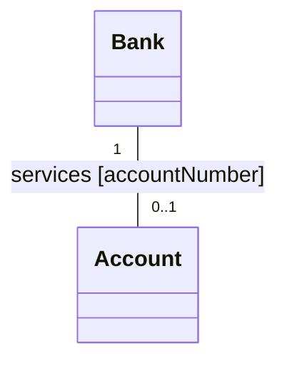

This note provides a comprehensive, exhaustive guide to **Class Diagrams** as detailed in the source material. It consolidates concepts from the basic chapters, advanced chapters, and implementation chapters into a structured reference for your vault.

***

# 1. Class Diagram Foundations

A class model captures the **static structure** of a system. It is the "universe of discourse." You must describe *what* is changing (the structural data) before you can describe *when* or *how* it changes (states and interactions).

### 1.1 The Class Box
A class is a group of objects with the same properties, behavior, and semantics. 
*   **Notation:** A rectangular box divided into up to three compartments:
    1.  **Top:** Class Name (singular noun, bold, capitalized).
    2.  **Middle:** Attributes (named properties, singular).
    3.  **Bottom:** Operations (functions or procedures applied to objects).

> [!important] Notation Rules
> *   **Attribute format:** `name: dataType [multiplicity] = defaultValue`
> *   **Operation format:** `name (argumentList) : resultType`
> *   **Visibility:** Use prefixes: `+` (public), `#` (protected), `-` (private), `~` (package).
> *   **Empty vs. Missing:** A *missing* compartment means the info is unspecified. An *empty* compartment means you have explicitly specified there are *no* attributes or operations.

### 1.2 Values and Attributes
Values lack identity. Attributes describe the values held by an object.
*   **Constraint Multiplicity:** You can specify attribute multiplicity in brackets: `[1]` (mandatory single), `[0..1]` (optional), `[*]` (many).
*   **Scope:** An underline indicates **class scope** (static). If a feature applies to the entire class rather than an individual instance, underline it.

---

# 2. Advanced Association Modeling

Associations are the structural connections between classes. They are NOT mere pointers; they are semantic links that can hold their own properties.

### 2.1 Multiplicity
Multiplicity specifies the number of instances of one class that can relate to a single instance of another.
*   **Notation:** `1` (exactly one), `0..1` (zero or one), `*` (zero or more), `1..*` (one or more), `3..5` (specific range).

### 2.2 Association End Names (Roles)
When a class participates in an association, it plays a specific role.
*   **Usage:** Naming an association end creates a "pseudo-attribute" on the source class, simplifying navigation.
*   **Self-Association:** If a class relates to itself, association end names are **mandatory** to distinguish the two ends of the association (e.g., `container` and `contents` in a `Directory`).

### 2.3 Qualified Associations
A **qualifier** is an attribute that disambiguates a "many" association end.
*   **How it works:** `SourceClass` + `Qualifier` = `TargetClass` (where multiplicity becomes `1` or `0..1`).
*   **Example:** `Bank` + `accountNumber` = `Account`. 
*   **Why use it:** It adds precision to the model and implies the search mechanism (e.g., a dictionary lookup) in the design phase.



### 2.4 Bags, Sequences, and Ordering
Ordinarily, a binary association allows at most one link between a pair of objects.
*   **`{ordered}`:** The "many" set is kept in a specific order (e.g., windows on a screen).
*   **`{bag}`:** Duplicates are allowed in the collection.
*   **`{sequence}`:** Ordered collection where duplicates are allowed.

### 2.5 Association Classes
If a link has its own attributes (not belonging to either class involved), promote the association to a class.
*   **Notation:** A class box connected to the association line by a dashed line.

---

# 3. Inheritance and Generalization

Generalization organizes classes into hierarchies. It is an "is-a" relationship.

### 3.1 Inheritance Rules
*   **Transitivity:** If `C` inherits from `B`, and `B` inherits from `A`, `C` inherits everything from both `A` and `B`.
*   **Overriding:** A subclass may redefine a feature from a superclass. 
    *   **Rule:** The **signature** (types and number of arguments) must remain the same. Only the implementation (method body) should change.
*   **Abstract vs. Concrete:**
    *   `Abstract`: Cannot be instantiated. Used to define common structure/behavior.
    *   `Concrete`: Can be instantiated.
*   **Recommendation:** Avoid concrete superclasses. If a superclass is concrete, it usually implies you should introduce an `Other` subclass to hold the concrete instances.

### 3.2 Multiple Inheritance
Permits a class to have more than one superclass.
*   **Disjoint:** Subclasses are mutually exclusive.
*   **Overlapping:** Instances can belong to more than one subclass simultaneously.
*   **Note:** If multiple paths lead to the same ancestor, the subclass only inherits that ancestor's features once.

---

# 4. Part-Whole Mechanisms: Aggregation and Composition

These are "strong" associations that represent an assembly structure.

*   **Aggregation (Hollow Diamond):** A loosely coupled assembly. The parts can exist without the whole. (e.g., `LawnMower` and `Blade`).
*   **Composition (Solid Diamond):** A tightly coupled assembly. If the whole is destroyed, the parts are destroyed. (e.g., `Company` and `Division`).

> [!tip] Propagation of Operations
> Operations often propagate across aggregations. Moving an aggregate usually implies moving all its constituent parts. This "triggering" is a hallmark of part-whole models.

---

# 5. Advanced Semantic Constructs

### 5.1 Metadata
Metadata is data that describes data. 
*   **Class Descriptor:** A class definition is metadata. Sometimes, you need to model these as objects in your own system (e.g., a GUI form designer that models "Fields" and "Buttons" as classes).
*   **Reification:** The promotion of something that is not an object (like an attribute or a process) into an object so that it can be manipulated as data.

### 5.2 Constraints
A **constraint** is a boolean condition that restricts the values an element can assume.
*   **Syntax:** Use `{...}` braces to define the constraint (e.g., `{salary <= boss.salary}`).
*   **Subset Constraints:** If `Association A` is a subset of `Association B`, use the `{subset}` keyword on the lines to enforce that all links in A are also in B.

### 5.3 Derived Elements
Elements calculated from other values. 
*   **Notation:** Prefixed with a slash `/` (e.g., `/age` derived from `birthdate`).
*   **Role:** Redundant information that should be kept out of the analysis model unless it is absolutely critical for performance or architectural clarity.

---

# 6. Implementation and Database Mapping

When moving from a class diagram to a physical system, you must follow specific RDBMS mapping rules.

### 6.1 Database Mapping Summary

| UML Concept | SQL/Database Rule |
| :--- | :--- |
| **Class** | Create a `Table`. Attributes are `Columns`. |
| **Object Identity** | Use a `Primary Key` (preferably an artificial ID). |
| **Many-to-Many** | Create a **Junction Table** (a new table with foreign keys to both parent tables). |
| **One-to-Many** | Bury the foreign key in the "Many" table. |
| **Generalization** | Create separate tables for superclass and subclasses. Use `FOREIGN KEY` + `ON DELETE CASCADE`. |
| **Qualified Association** | Treat as a standard association; the qualifier becomes part of the foreign key or index. |

### 6.2 Managing Inheritance in SQL
Since SQL does not support inheritance, you must enforce it:
1.  **Table Inheritance:** The subclass table has a column that is both its primary key and a foreign key to the superclass table.
2.  **Referential Integrity:** Always specify `ON DELETE CASCADE` on these foreign keys to ensure that deleting a superclass record cleans up all related subclass records.

```sql
-- Example: Mapping Generalization
ALTER TABLE Checking_Account ADD CONSTRAINT fk_chkacct1
FOREIGN KEY chk_acct_ID
REFERENCES Account ON DELETE CASCADE;
```

### 6.3 Optimization (Adding Redundancy)
During the "Implementation Modeling" phase, you can break pure analysis rules to gain performance:
*   **Add Redundant Associations:** If you constantly need to traverse `Company` -> `Person` for specific skills, create a derived `SpeaksLanguage` association, even if it is technically redundant. 
*   **Indexing:** Create an `INDEX` for any foreign key not covered by a primary key to prevent performance degradation.
*   **Views:** Use SQL `VIEW`s to consolidate fragmented inheritance hierarchies into a single, readable table structure.