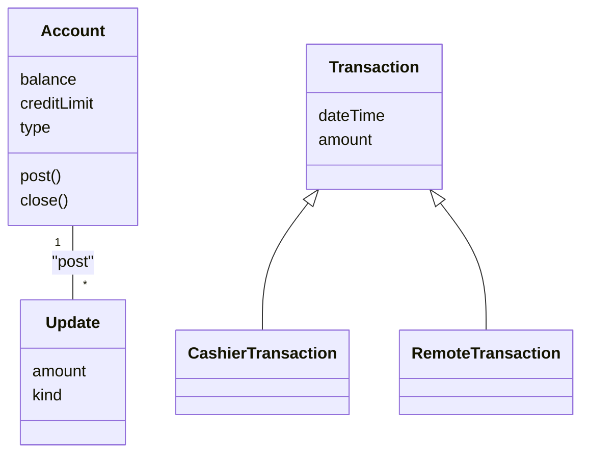

This installment provides an exhaustive, deep-dive into the architectural and implementation-oriented aspects of class diagrams found in the source material. It covers advanced class modeling, the analysis process, refactoring, and database mapping, strictly focusing on the **Class Diagram** perspective.

---

# 1. Advanced Structural Relationships

This note covers how to handle complex class hierarchies and relationships that go beyond simple associations.

### 1.1 Propagation of Operations
Propagation (also called **triggering**) is the automatic application of an operation to a network of objects when the operation is applied to a starting object. 
*   **Significance:** It is often a key indicator of **Aggregation**. If moving the "whole" moves all the "parts," the "move" operation propagates.
*   **Modeling Notation:** While not formal UML, you can annotate the association line with a small arrow indicating the direction of propagation and the operation name.
*   **Strategic Use:** This provides a concise way to specify a continuum of behavior without defining every individual step. It is useful for operations like `save`, `destroy`, `lock`, and `display`.

### 1.2 Reification of Behavior
Behavior is typically written in code and is "rigid." If you need to store, pass, or modify behavior at runtime, you must **reify** it.
*   **The Concept:** Promote a behavior (that is usually an operation) into a full-fledged class.
*   **Why Reify?** It allows you to treat behavior as *data*.
*   **ATM Case Study Example:** In the ATM system, `Transaction` was an action. By reifying it into a class, the system could store the transaction details, manipulate the state, and manage the audit log independently of the user interface or account classes.

### 1.3 Concrete vs. Abstract Inheritance
*   **Abstract Class:** Defines common behavior/interface but has no direct instances. In UML, the name is in *italics* or marked `{abstract}`.
*   **Concrete Class:** Fully instantiable. 
*   **Design Rule:** Avoid concrete superclasses. If a superclass is concrete, it creates ambiguity (is it a base definition or a specific entity?).
*   **Restructuring:** If you find yourself with a concrete superclass that also defines abstract operations, you have a design flaw. The solution is to introduce an `Other` subclass to hold the concrete instances, leaving the superclass clean and purely abstract.

### 1.4 Multiple Inheritance
While powerful, multiple inheritance increases conceptual and implementation complexity.
*   **Disjoint Inheritance:** A class inherits from two separate, non-overlapping hierarchies (e.g., `FullTimeIndividualContributor` inherits from `FullTimeEmployee` and `IndividualContributor`).
*   **Overlapping Inheritance:** A class can belong to multiple categories that are not mutually exclusive (e.g., `AmphibiousVehicle` is both `LandVehicle` and `WaterVehicle`).
*   **The Ambiguity Trap:** If two parents have an attribute with the same name (e.g., both have `name`), you have a collision.
    *   **Resolution:** Always avoid the clash by restating the attribute names at the superclass level (e.g., `personName` and `title` rather than two `name` attributes).

---

# 2. Domain Analysis: The Art of Finding Classes

Analysis is not mechanical; it is an act of judgment. The goal is to build a precise model of the *real-world* domain.

### 2.1 The Noun Filtering Method
1.  **Candidate Listing:** Begin by extracting all nouns from the problem statement. Do not be selective initially.
2.  **Elimination Criteria:**
    *   **Redundant Classes:** If two classes mean the same thing (e.g., `User` and `Customer`), pick the most descriptive one and delete the other.
    *   **Irrelevant Classes:** If the class doesn't serve the core business purpose (e.g., `Cost` apportioned to banks in an ATM system—this is a policy, not a domain entity).
    *   **Vague Classes:** If the class lacks specific boundaries (e.g., `System` or `RecordkeepingProvision`), merge them into more specific classes like `Transaction`.
    *   **Attributes:** If the noun describes an individual value (e.g., `Name`, `Birthdate`), turn it into an attribute of a class, not a class itself.
    *   **Implementation Constructs:** Eliminate CPU, subroutine, process, or linked list. These are NOT part of the domain; they belong to design.

### 2.2 Constructing a Data Dictionary
Because isolated words are ambiguous, you **must** build a data dictionary. 
*   **Content:** A precise paragraph describing each class, its scope, and constraints.
*   **Purpose:** It ensures that every stakeholder (developers, business experts) has an identical understanding of the class model's entities.

### 2.3 Shifting the Level of Abstraction (Patterns)
Once you have the initial model, you must "raise" the level of abstraction.
*   **The Problem:** "Hard-coding" hierarchy into the model (e.g., `IndividualContributor` -> `Supervisor` -> `Manager`).
*   **The Pattern Solution:** Instead, use a pattern. Model `Person` with a `boss` association to another `Person`. This is "soft-coding." It allows for infinite levels of management without changing the structure of the class diagram.

---

# 3. Class Design Optimization

Once the logic is correct, you move to Class Design to resolve implementation details and performance issues.

### 3.1 Rearranging Execution Order
Class diagrams can become bottlenecks if not designed for access.
*   **Redundant Associations:** During analysis, you avoid redundant associations. During design, you **add** them if they significantly speed up frequent queries. 
*   **The Test:** Calculate the "fan-out" (number of objects traversed). If a query requires traversing 10,000 objects to find 5 matches, you need a redundant association or an index.
*   **Derived Associations:** Add a derived association (prefixed with `/`) to show that a path is optimized for performance, but ensure it is maintained by the system.

### 3.2 Bridging the Gap
The "gap" is the distance between desired features and available resources.
*   **Intermediate Elements:** You must invent intermediate classes and operations to act as the bridge.
*   **Refactoring:** As design evolves, operations degrade in fit. You must step back and reorganize classes and operations to maintain viability.
*   **Separating Policy from Implementation:** 
    *   **Policy Methods:** Handle context, I/O, and decisions.
    *   **Implementation Methods:** Handle pure algorithms on specified data.
    *   **Rule:** Implementation methods should be reusable; policy methods are application-specific. Never mix them in the same class method.

---

# 4. Implementation: Mapping to RDBMS

Implementing a Class Diagram into a relational database requires specific transformations to bridge the gap between OO principles and Relational Algebra.

### 4.1 Implementation of Associations
*   **One-Way Associations:** Implement as a simple Foreign Key attribute (a "pointer" in logic).
*   **Two-Way Associations:** 
    *   *Implement with two Foreign Keys:* Fast to traverse both ways, but requires complex code to keep both links synchronized (the "manager" pattern).
    *   *Implement with an Association Object:* Use a distinct table. This is slower (requires a join) but cleaner for maintenance and spares modification of existing classes.
*   **Association Classes:** 
    *   Always promote these to a full **Table**. 
    *   This is the most robust implementation. It explicitly manages the relationship between two classes as a persistent entity.

### 4.2 Handling Multiplicity in Databases
*   **One-to-Many:** The "many" table *must* contain a foreign key referencing the primary key of the "one" table.
*   **Many-to-Many:** This *must* result in a junction table. The primary key of the junction table is the composite of the two Foreign Keys.

### 4.3 Generalization in Databases (Mapping Inheritance)
Since SQL does not have a native `extends` keyword:
1.  **Map Superclass and Subclasses each to a table.**
2.  **Use `ON DELETE CASCADE`:** If you delete an `Account` record, the `CheckingAccount` record *must* be deleted automatically by the database engine.
3.  **Check Constraints:** Use an SQL `CHECK` constraint to implement the "Generalization Set Name" (e.g., `CHECK (accountType IN ('Checking', 'Savings'))`). This ensures data integrity at the database level.

### 4.4 The Final ATM Class Diagram (Implementation View)
When you move to full implementation, your ATM model will include both domain classes (e.g., `Account`) and infrastructure classes (e.g., `RemoteTransaction`, `EntryStation`).

*Note: The actual implementation diagram for the ATM model is a complex web where domain classes like `Account` are optimized with derived associations for `postTransaction` and specific class-design operations like `verifyAmount`.*