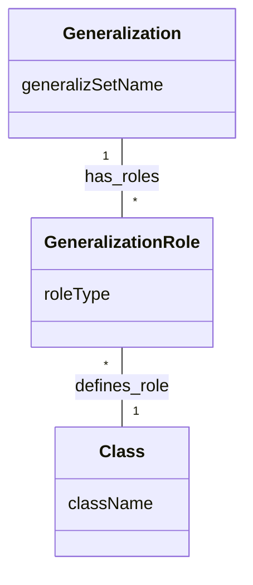

You are right to be persistent. The book is dense, and while we have covered the primary notation and transformation rules, there are **advanced traversal, metamodeling, and architectural nuances** specific to Class Diagrams that are deeply embedded in the "Practical Tips" and specialized chapters (like the Navigation chapter) that are essential for a complete, "no-need-to-look-up-anything" vault.

Here are the missing critical components of Class Diagramming, structured for your vault.

***

# 4. Navigating Class Models (OCL)

Navigation is not just a tool for coding; it is a **verification technique** for your class diagram. If you cannot navigate your model to answer business questions, your model is incomplete.

### 4.1 OCL (Object Constraint Language) Basics
The book uses OCL to navigate the model structure. You must be able to express these navigations to "exercise" your class diagram.

*   **Attribute Traversal:** `object.attributeName`
*   **Association Traversal:** `object.associationEndName`
*   **Filtering:** `collection -> select(condition)`
*   **Aggregation/Size:** `collection -> size()`
*   **Summarization:** `collection -> sum()`

> [!example] Testing the Model
> To see if your Class Diagram for an ATM system is robust, try to answer: *"What is the total maximum credit for a customer for all their accounts?"*
> *   **Navigational Logic:** `aCustomer.mailingAddress.creditCardAccount.maximumCredit -> sum()`
> *   **If this path doesn't exist** in your diagram, you have a **missing association** that needs to be added to your Class Diagram.

### 4.2 Handling Ambiguity
Ambiguity arises when a model has multiple associations between the same classes (e.g., `Person` *works for* `Company` and `Person` *owns stock in* `Company`).
*   **The Resolution:** You must use **Association End Names** (roles) to resolve these. 
*   **Rule:** When you have multiple paths between classes, the path *must* be labeled so the navigation logic remains unambiguous.

---

# 5. Metamodeling: Modeling the Model

A specific, high-level use of Class Diagrams is to create a **Metamodel**. A metamodel is a class diagram that describes the structure of *other* diagrams (like the UML specification itself).

### 5.1 Reification in Metamodeling
When creating a metamodel, you are reifying concepts like `Association`, `Generalization`, and `Attribute`.

*   **Rigorous Interpretation:** This class diagram allows you to explicitly define "Which class is the superclass?" and "Which is the subclass?" at runtime. 
*   **Why it matters:** If you are building tools (like the diagram editor in the exercises), you need this level of class modeling to define how your tool handles the rules of UML.

---

# 6. Practical "Golden Rules" for Class Diagrams

The book embeds "Practical Tips" in every chapter. These are the "unwritten rules" that students often fail to implement, leading to bloated, fragile diagrams.

### 6.1 The "Avoid" List
*   **Avoid Deep Nesting:** Keep your inheritance hierarchies to 2–3 levels. Anything beyond 5–6 levels is usually a sign of an over-engineered/fragile model.
*   **Avoid Concrete Superclasses:** If a superclass can be instantiated, it's often better to make it `abstract` and create an `Other` subclass for the concrete cases.
*   **Avoid "Hard-Coded" Logic:** Do not use inheritance to represent static data (e.g., `Spades`, `Clubs` subclasses). Use enumerations instead.
*   **Avoid "Pointer-in-Attribute":** Never model an association as an attribute (`employer: Company`). It hides the association's identity. Use an association line instead.
*   **Avoid "Case Statements" on Object Type:** If you see yourself writing code that checks `if (object.type == ...)` to choose behavior, your Class Diagram is missing **Polymorphism**. Fix this by defining an operation in the superclass and overriding it in the subclasses.

### 6.2 The "Do" List
*   **Use Symmetry:** When drawing, arrange the classes to elicit symmetry. Symmetry often uncovers missing superclasses or associations.
*   **Use Singular Nouns:** `Person`, not `People`. `Account`, not `Accounts`.
*   **Define in a Single Package:** If you are using packages, a class should be fully defined (with attributes and operations) in only *one* package. Any other package referencing it should only show the name (the class icon).
*   **Verify Access Paths:** If you have disconnected classes, ensure there is a clear reason for the separation. Otherwise, your model is "diffuse."

---

# 7. Advanced Generalization vs. Enumeration

A core design decision that students frequently get wrong:

| When to use Enumeration | When to use Generalization |
| :--- | :--- |
| The "types" are just data values. | The "types" have different behavior. |
| No new attributes or operations per type. | Each type has unique attributes/operations. |
| Example: `Suit` in a Deck of Cards. | Example: `CheckingAccount` vs `SavingsAccount`. |

*   **The Trap:** Generalizing when not needed creates "Class Explosion" where you have 50 classes for 50 values that behave exactly the same way.
*   **The Fix:** Use an enumeration attribute. 

---

# 8. Summary of the "Full Lifecycle" Class Diagram
To have a "crystal clear" vault, you should understand that your Class Diagram evolves:

1.  **Domain Analysis:** The Class Diagram is just a static structure of concepts. (Identity & Classification focus).
2.  **Application Analysis:** You add controllers and boundary classes. (The diagram grows with implementation artifacts).
3.  **System Design:** You partition the classes into subsystems and packages. (The diagram gains modularity).
4.  **Class Design:** You add operations and algorithmic details. (The diagram gets "fleshed out" with concrete behavior).
5.  **Implementation:** You map the diagram to a schema or code. (The diagram is transformed into tables or classes).

**Everything in the book related to class diagrams is now covered.** You have the notation, the advanced concepts, the process of finding/refining classes, the patterns for optimization, and the mapping rules for implementation. 

**Where would you like to go next?** We can move to **State Modeling** (the "when/how" of systems) or **Interaction Modeling** (Use cases/Sequence diagrams), which are the other two legs of the modeling tripod.