# 1. Core Object-Oriented Principles

> [!info] Background Knowledge: The "Why" of Class Modeling
> Before drawing boxes and lines, it is crucial to understand _why_ we model. A model is an abstraction of reality. It omits nonessential details so the human mind can grasp complex systems. The **Class Model** is the most fundamental of all models because it defines the static structure—the "universe of discourse." You must describe _what_ is changing before you can describe _when_ or _how_ it changes.

Object-oriented (OO) modeling is fundamentally a way of thinking about problems using real-world concepts rather than computer concepts (like arrays, pointers, or linked lists).

## 1.1 The Four Pillars of Object Orientation

To properly build and understand a class diagram, you must be intimately familiar with the four aspects that characterize an OO approach:

### 1.1.1 Identity

**Identity** means that data is quantized into discrete, distinguishable entities called **objects**.

- In the real world, two apples can have the exact same color, shape, and texture, but they are still two distinct apples. You can eat one, and the other remains.
- In an OO system, two objects are distinct even if every single attribute value they hold is identical.
- **What students miss:** Do not confuse identity with a database primary key or an internal identifier. An object inherently "knows" it exists. When creating class diagrams, **never** add attributes like `objectID` or `personID` unless that ID explicitly exists in the real world (like a Social Security Number or a License Plate).

### 1.1.2 Classification

**Classification** means that objects with the same data structure (attributes) and behavior (operations) are grouped into a **class**.

- A class is an abstraction. Any choice of classes is arbitrary and depends entirely on the application's domain.
- Every object is an **instance** of its class. An object contains an implicit reference to its class—it "knows what kind of thing it is."

### 1.1.3 Inheritance

**Inheritance** is the sharing of attributes and operations among classes based on a hierarchical relationship.

- A **superclass** holds general information.
- A **subclass** refines and elaborates that information.
- This factors out redundancy. Instead of redefining "draw" for every shape, a `GeometricFigure` superclass defines it, and `Circle` or `Polygon` inherit it.

### 1.1.4 Polymorphism

**Polymorphism** means that the same operation may behave differently for different classes.

- In a non-OO procedural program, you would use a massive `switch` or `if-else` statement to determine what code to run based on a shape's type.
- In OO modeling, you simply invoke the `draw()` operation on the object. The object implicitly decides which specific **method** (implementation) to execute based on its class.

> [!tip] Synergy
> Each of these four concepts is powerful on its own, but together they complement each other synergistically. Emphasizing the essential properties of an object forces you to think deeply about what an object _is_ rather than how it is currently _used_.

---

# 2. Basic Class Modeling Notation

## 2.1 Objects and Classes

The purpose of class modeling is to describe objects.

- **Object:** A concept, abstraction, or thing with identity that has meaning for an application (e.g., _Joe Smith_, _Simplex Company_, _the top window_).
- **Class:** A description of a group of objects with the same properties, behavior, and semantics (e.g., _Person_, _Company_, _Window_).

> [!warning] Semantic Purpose
> Objects in a class must share a common semantic purpose. A barn and a horse might both have an `age` and a `cost`, and if you are building an accounting system, they might both just be instances of `FinancialAsset`. However, in a farm management system, a person paints a barn and feeds a horse. Here, they must be distinct classes. Context is everything.

### UML Notation for Classes and Objects

- **Class:** Represented by a rectangle. The name is boldface, centered, and capitalized. We always use **singular nouns** (e.g., `Person`, not `People`).
- **Object:** Represented by a rectangle. The name is underlined and follows the format `objectName:ClassName`.

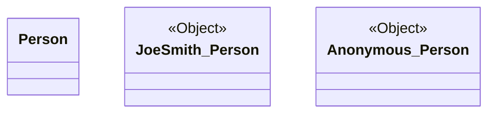

_(Note: In standard UML, object names are underlined like <u>JoeSmith:Person</u>. Mermaid handles instances slightly differently, often denoted with instance notation or stereotypes)._

## 2.2 Attributes and Values

- **Value:** A piece of data (e.g., the string "Joe Smith", the integer 17). Values lack identity. All occurrences of the integer 17 are completely indistinguishable.
- **Attribute:** A named property of a class that describes a value held by each object of the class (e.g., `name`, `birthdate`, `weight`).

**Object is to Class AS Value is to Attribute.**

### Notation and Best Practices

Attributes are listed in the second compartment of the class box.

- **Syntax:** `attributeName : dataType [multiplicity] = defaultValue`
- **Naming:** Left-aligned, regular typeface, lower camelCase (e.g., `modelYear`).
- **Constraint Multiplicity:** You can specify attribute multiplicity in brackets: `[1]` (mandatory single), `[0..1]` (optional), `[*]` (many).
- **Scope:** An underline indicates **class scope** (static). If a feature applies to the entire class rather than an individual instance, underline it.

> [!tip] Practical Tip: Omit Internal Identifiers
> Internal identifiers are an implementation convenience. Do not include them in your conceptual class models.
> _Wrong:_ `personID: ID`, `name: string`
> _Correct:_ `name: string`
> _Exception:_ If the identifier is a real-world concept (like `taxpayerNumber` or `licensePlate`), it is a legitimate attribute.

## 2.3 Operations and Methods

- **Operation:** A function or procedure that may be applied to or by objects in a class (e.g., `hire`, `fire`, `draw`, `move`).
- **Method:** The specific implementation of an operation for a given class. (Because of polymorphism, one operation can have many methods).

Operations are listed in the third compartment of the class box.

- **Syntax:** `direction parameterName : type = defaultValue`
- **Direction:** Can be `in` (input), `out` (output), or `inout` (input that can be modified).
- **Signature:** The number and types of arguments, plus the return type.
- **Visibility:** Use prefixes: `+` (public), `#` (protected), `-` (private), `~` (package).

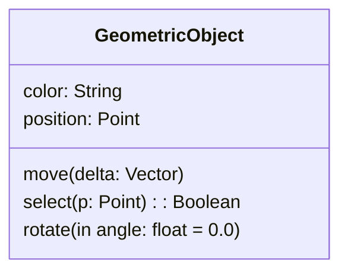

> [!warning] Empty Compartments vs. Missing Compartments
>
> - If an attribute or operation compartment is **missing** (not drawn), it means those features are _unspecified_ (they exist, but aren't shown).
> - If a compartment is drawn but left **empty**, it explicitly states that there are _no_ attributes or operations for that class.

---

# 3. Links and Associations

## 3.1 The Concept of Links and Associations

- **Link:** A physical or conceptual connection among _objects_. It is an instance of an association. Mathematically, a link is a tuple (a list of objects).
- **Association:** A description of a group of links with common structure and semantics. It connects _classes_.

> [!warning] Critical Concept: Associations are NOT Pointers
> The OO literature and early programmers often implement associations as "pointers" or "object references" inside a class. **Do not model them this way.**
> A link is a relationship among objects. Modeling it as an attribute (e.g., putting `employer: Company` inside the `Person` class) hides the fact that the link depends on _both_ objects. It disguises the bidirectional nature of the relationship. Treat associations as first-class citizens in your diagrams.

## 3.2 Multiplicity

Multiplicity specifies the number of instances of one class that may relate to a single instance of an associated class. It is a constraint on the size of the collection.

- `1`: Exactly one.
- `0..1`: Zero or one (optional).
- `*`: Zero or more (many).
- `1..*`: One or more.
- `3..5`: Three to five.

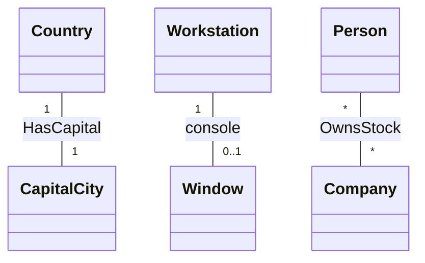

> [!tip] Multiplicity vs. Cardinality
> Students often confuse these. **Cardinality** is the actual count of elements in a specific collection at a specific moment in time (e.g., John owns 4 stocks). **Multiplicity** is the structural _constraint_ on that cardinality defined by the model (e.g., A person can own `*` [zero or more] stocks).

## 3.3 Association End Names (Roles)

Associations have ends. You can assign a name to an association end to clarify its role. This is especially vital when a class has an association with itself, or when there are multiple associations between the same two classes.

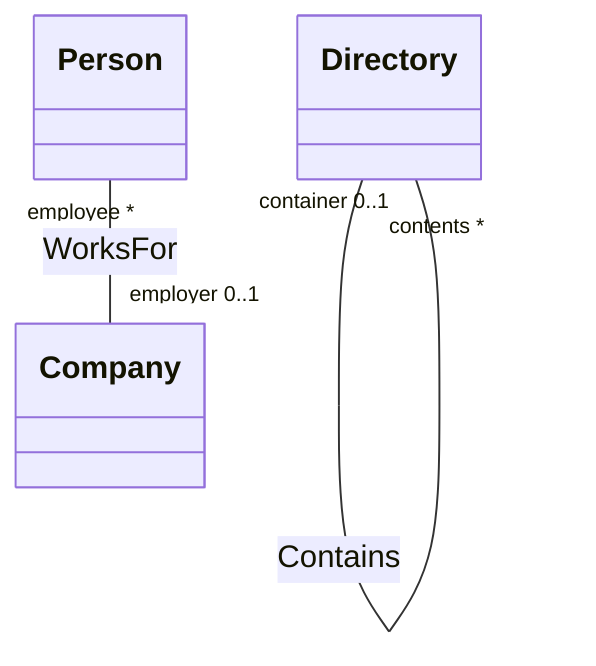

_Tricks and Traps:_ End names act as "pseudo-attributes". From the perspective of `Company`, it has a pseudo-attribute called `employee` that yields a set of `Person` objects. Therefore, an association end name must be unique within the source class.

## 3.4 Advanced Association Types

### 3.4.1 Ordering

By default, the objects on a "many" (`*`) association end have no explicit order; they are a mathematical set. If the real world dictates an order (e.g., windows overlapping on a screen), annotate the end with `{ordered}`.

### 3.4.2 Bags and Sequences

- **Set:** Unordered, no duplicates (Default).
- **Ordered Set:** Ordered, no duplicates (`{ordered}`).
- **Bag:** Unordered, duplicates allowed (`{bag}`).
- **Sequence:** Ordered, duplicates allowed (`{sequence}`).
- _Example:_ An itinerary is a `{sequence}` of airports, because you visit them in a specific order and you can visit the same airport more than once (layovers).

### 3.4.3 Association Classes

Sometimes the link itself has data. For example, if a `Person` works for a `Company`, where does the `salary` go?

- It can't go in `Person` (they might have two jobs).
- It can't go in `Company` (every employee has a different salary).
- It belongs to the _link between them_.

An **Association Class** is an association that is also a class.

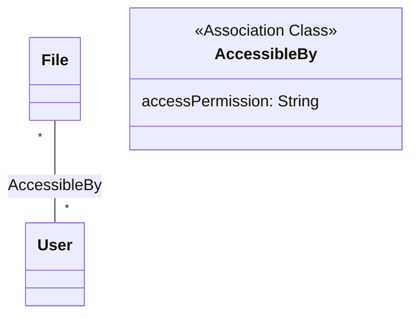

_(In standard UML, this is drawn as a dashed line dropping down from the association line into the `AccessibleBy` class box)._

### 3.4.4 Qualified Associations

A **Qualifier** is an attribute that disambiguates the objects for a "many" association end. It reduces the effective multiplicity, often from "many" to "one".

- **Formula:** `SourceClass + Qualifier = TargetClass (where multiplicity becomes 1 or 0..1)`
- _Example:_ A Bank has many Accounts. But a Bank _plus an Account Number_ yields exactly ONE Account.
  The Account Number is the qualifier. It acts as an index or a lookup key.

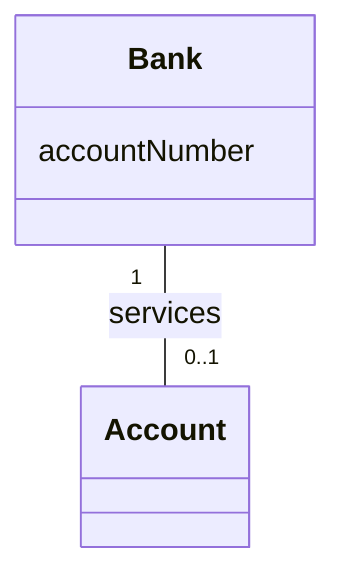

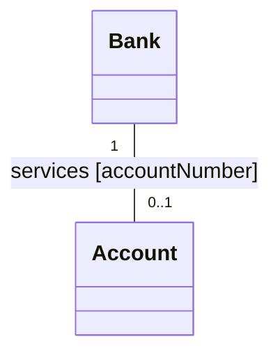

---

# 4. Generalization, Inheritance, and Enumerations

## 4.1 Inheritance Rules

**Generalization** is the relationship between a class (the superclass) and one or more variations of the class (the subclasses). It is the "is-a" relationship.

- The superclass holds common attributes, operations, and associations.
- The subclasses add specific attributes, operations, and associations.
- Subclasses **inherit** all features of their ancestors.

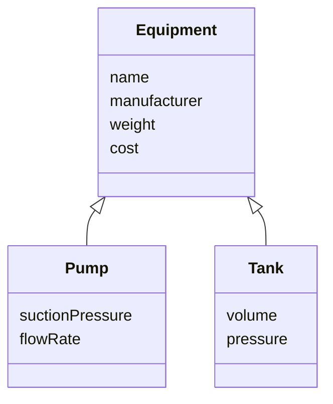

- **Transitivity:** If `C` inherits from `B`, and `B` inherits from `A`, `C` inherits everything from both `A` and `B`.
- A subclass may **override** a superclass feature by defining a feature with the exact same name.
  - **Why override?** To specify behavior that depends on the subclass (e.g., `Circle.draw()` vs `Polygon.draw()`), to tighten a specification, or to improve performance.
  - **The Golden Rule:** You may override _methods_ and _default values_. You must **NEVER** override the _signature_ (the number and types of arguments, or the return type). A subclass must be fully compatible with its superclass.

> [!warning] The Frankenstein Subclass Anti-Pattern
> A common, terrible practice is "borrowing" an existing class that is _similar_ to what you want, inheriting from it, and then changing/ignoring features to make it fit. If the new class is not truly a special case of the original class (the "is-a" test), do not use inheritance. Use delegation (associations) instead.

## 4.2 Abstract vs. Concrete Classes

- **Abstract Class:** A class that has no direct instances. It exists solely to structure the model and provide inherited features to subclasses. (Usually drawn in _italics_ or with an `{abstract}` tag).
- **Concrete Class:** A class that is fully instantiable.

**Best Practice Style:** Try to avoid concrete superclasses. Ideally, all superclasses should be abstract, and all leaf-node subclasses should be concrete. If you have a concrete superclass that also defines abstract operations, you have a design flaw. The solution is to introduce an `Other` subclass to hold the concrete instances, leaving the superclass purely abstract.

## 4.3 Multiple Inheritance

Permits a class to have more than one superclass. While powerful, multiple inheritance increases conceptual and implementation complexity.

- **Disjoint Inheritance:** A class inherits from two separate, non-overlapping hierarchies (e.g., `FullTimeIndividualContributor` inherits from `FullTimeEmployee` and `IndividualContributor`). Subclasses are mutually exclusive.
- **Overlapping Inheritance:** A class can belong to multiple categories that are not mutually exclusive (e.g., `AmphibiousVehicle` is both `LandVehicle` and `WaterVehicle`). Instances can belong to more than one subclass simultaneously. (Also note: If multiple paths lead to the same ancestor, the subclass only inherits that ancestor's features once).
- **The Ambiguity Trap:** If two parents have an attribute with the same name (e.g., both have `name`), you have a collision.
  - **Resolution:** Always avoid the clash by restating the attribute names at the superclass level (e.g., `personName` and `title` rather than two `name` attributes).

## 4.4 Enumerations vs. Generalization

An **enumeration** is a data type with a finite set of values.

- **Notation:** Use a box with the header `«enumeration»`.

A core design decision that students frequently get wrong:

| When to use Enumeration                   | When to use Generalization                      |
| :---------------------------------------- | :---------------------------------------------- |
| The "types" are just data values.         | The "types" have different behavior.            |
| No new attributes or operations per type. | Each type has unique attributes/operations.     |
| Example: `Suit` in a Deck of Cards.       | Example: `CheckingAccount` vs `SavingsAccount`. |

- **The Trap (Class Explosion):** Students often create a generalization (inheritance) hierarchy for values (e.g., creating a `Card` superclass with `Spades`, `Clubs`, `Hearts`, and `Diamonds` subclasses). Generalizing when not needed creates "Class Explosion" where you have 50 classes for 50 values that behave exactly the same way.
- **The Correct Way:** An enumeration is just a list of values. If the classes don't have distinct attributes, operations, or associations, they are NOT classes. They are simply values. Use an enumeration attribute instead of subclasses.

---

# 5. Advanced Structural and Semantic Constructs

## 5.1 Aggregation and Composition

These are special types of associations that model a "part-whole" hierarchy.

| Relationship    | Symbol         | Description                                                                                                                                                     |
| :-------------- | :------------- | :-------------------------------------------------------------------------------------------------------------------------------------------------------------- |
| **Aggregation** | Hollow Diamond | A general form. The "whole" consists of "parts," but they are loosely coupled. The parts can exist independently (e.g., a `Car` and its `Wheels`).              |
| **Composition** | Solid Diamond  | A strong form. The "part" belongs to at most one "whole," and has a coincident lifetime (e.g., if you destroy the `Company`, the `Division` is also destroyed). |

> [!tip] The "Part-Of" Test
> If you are unsure whether to use an association or an aggregation, ask yourself: _"Is this a 'part-of' relationship?"_ If the answer is "yes," and the life cycles are independent, use aggregation. If the parts are owned and strictly tied to the life cycle of the whole, use composition.

**Propagation of Operations:**
Propagation (also called **triggering**) is the automatic application of an operation to a network of objects when the operation is applied to a starting object.

- **Significance:** It is often a key indicator of **Aggregation**. Moving the "whole" usually implies moving all the "parts," the "move" operation propagates.
- **Modeling Notation:** While not formal UML, you can annotate the association line with a small arrow indicating the direction of propagation and the operation name.
- **Strategic Use:** This provides a concise way to specify a continuum of behavior without defining every individual step. It is useful for operations like `save`, `destroy`, `lock`, and `display`.

> [!tip] Propagation of Operations
> Operations often propagate across aggregations. Moving an aggregate usually implies moving all its constituent parts. This "triggering" is a hallmark of part-whole models.

## 5.2 N-ary Associations

A relationship that connects more than two classes.

- **Constraint:** You should **avoid** n-ary associations whenever possible. They are difficult to implement and often hide complexity.
- **The Fix:** Most n-ary associations can be decomposed into binary associations (by reifying the link into an intermediate class).
- **Notation:** A diamond connected by lines to all involved classes.

## 5.3 Constraints

A **constraint** is a boolean condition that restricts the values an element can assume.

- **Syntax:** Use `{...}` braces to define the constraint (e.g., `{salary <= boss.salary}`).
- **Subset Constraints:** If `Association A` is a subset of `Association B`, use the `{subset}` keyword on the lines to enforce that all links in A are also in B.

## 5.4 Derived Elements

A **derived element** is information that can be calculated from other information already present in the model.

- **Notation:** A slash `/` before the name (e.g., `/age` derived from `birthdate`).
- **Why use it?** Only when it is a significant performance bottleneck and you need to document that this value must be cached or pre-computed. Never add it during the initial analysis phase; keep the model clean. (Redundant information should be kept out of the analysis model unless absolutely critical for performance or architectural clarity).

## 5.5 Metadata, Metamodeling, and Reification

**Reification** is the promotion of something that is not an object into an object so that it can be manipulated as data.

- **Example:** You have a `Substance` and `SubstanceName` as an attribute. But what if a substance has multiple aliases (e.g., "Propylene" and "C3H6")?
- **Transformation:** Promote the `substanceName` attribute to a full `SubstanceName` class. Now you have a `Substance` association with `SubstanceName`. This is reification. It allows you to model complex, meta-level relationships.

**Reification of Behavior:**
Behavior is typically written in code and is "rigid." If you need to store, pass, or modify behavior at runtime, you must **reify** it.

- **The Concept:** Promote a behavior (that is usually an operation) into a full-fledged class.
- **Why Reify?** It allows you to treat behavior as _data_.
- **ATM Case Study Example:** In the ATM system, `Transaction` was an action. By reifying it into a class, the system could store the transaction details, manipulate the state, and manage the audit log independently of the user interface or account classes.

**Metadata:**
Metadata is data that describes data.

- **Class Descriptor:** A class definition is metadata. Sometimes, you need to model these as objects in your own system (e.g., a GUI form designer that models "Fields" and "Buttons" as classes).

**Metamodeling:**
A specific, high-level use of Class Diagrams is to create a **Metamodel**. A metamodel is a class diagram that describes the structure of _other_ diagrams (like the UML specification itself).

When creating a metamodel, you are reifying concepts like `Association`, `Generalization`, and `Attribute`.

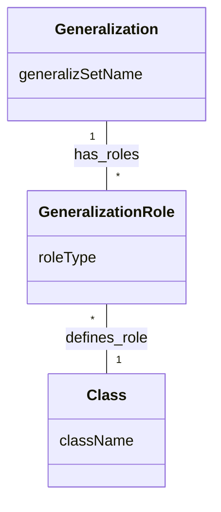

- **Rigorous Interpretation:** This class diagram allows you to explicitly define "Which class is the superclass?" and "Which is the subclass?" at runtime.
- **Why it matters:** If you are building tools (like the diagram editor in the exercises), you need this level of class modeling to define how your tool handles the rules of UML.

---

# 6. Navigating Models and Best Practices

## 6.1 Navigating Class Models (OCL Basics & Handling Ambiguity)

Navigation is not just a tool for coding; it is a **verification technique** for your class diagram. If you cannot navigate your model to answer business questions, your model is incomplete.

**OCL (Object Constraint Language) Basics**
The book uses OCL to navigate the model structure. You must be able to express these navigations to "exercise" your class diagram.

- **Attribute Traversal:** `object.attributeName`
- **Association Traversal:** `object.associationEndName`
- **Filtering:** `collection -> select(condition)`
- **Aggregation/Size:** `collection -> size()`
- **Summarization:** `collection -> sum()`

> [!example] Testing the Model
> To see if your Class Diagram for an ATM system is robust, try to answer: _"What is the total maximum credit for a customer for all their accounts?"_
>
> - **Navigational Logic:** `aCustomer.mailingAddress.creditCardAccount.maximumCredit -> sum()`
> - **If this path doesn't exist** in your diagram, you have a **missing association** that needs to be added to your Class Diagram.

**Handling Ambiguity:**
Ambiguity arises when a model has multiple associations between the same classes (e.g., `Person` _works for_ `Company` and `Person` _owns stock in_ `Company`).

- **The Resolution:** You must use **Association End Names** (roles) to resolve these.
- **Rule:** When you have multiple paths between classes, the path _must_ be labeled so the navigation logic remains unambiguous.

## 6.2 Practical "Golden Rules"

The book embeds "Practical Tips" in every chapter. These are the "unwritten rules" that students often fail to implement, leading to bloated, fragile diagrams.

**The "Avoid" List**

- **Avoid Deep Nesting:** Keep your inheritance hierarchies to 2–3 levels. Anything beyond 5–6 levels is usually a sign of an over-engineered/fragile model.
- **Avoid Concrete Superclasses:** If a superclass can be instantiated, it's often better to make it `abstract` and create an `Other` subclass for the concrete cases.
- **Avoid "Hard-Coded" Logic:** Do not use inheritance to represent static data (e.g., `Spades`, `Clubs` subclasses). Use enumerations instead.
- **Avoid "Pointer-in-Attribute":** Never model an association as an attribute (`employer: Company`). It hides the association's identity. Use an association line instead.
- **Avoid "Case Statements" on Object Type:** If you see yourself writing code that checks `if (object.type == ...)` to choose behavior, your Class Diagram is missing **Polymorphism**. Fix this by defining an operation in the superclass and overriding it in the subclasses.

**The "Do" List**

- **Use Symmetry:** When drawing, arrange the classes to elicit symmetry. Symmetry often uncovers missing superclasses or associations.
- **Use Singular Nouns:** `Person`, not `People`. `Account`, not `Accounts`.
- **Define in a Single Package:** If you are using packages, a class should be fully defined (with attributes and operations) in only _one_ package. Any other package referencing it should only show the name (the class icon).
- **Verify Access Paths:** If you have disconnected classes, ensure there is a clear reason for the separation. Otherwise, your model is "diffuse."

---

# 7. The Class Modeling Lifecycle (Process & Refactoring)

## 7.1 Summary of the Lifecycle

To have a "crystal clear" vault, you should understand that your Class Diagram evolves:

1.  **Analysis (Conceptual):** Start with Domain Class Model (identify classes, attributes, associations).
2.  **Interaction Modeling:** Find use cases, which expose _missing_ classes and attributes. (Iterate and update class diagram).
3.  **Application Analysis:** Add boundary and controller classes. (Update class diagram).
4.  **System Design:** Partition into subsystems/packages. (Update class diagram).
5.  **Class Design (Refinement):** Add algorithms, refactor, optimize, add association classes for speed. (Finalize class diagram).
6.  **Implementation:** Map to SQL/Language code. (The physical realization of the class diagram).

## 7.2 Domain Analysis

Analysis is not mechanical; it is an act of judgment. The goal is to build a precise model of the _real-world_ domain.

**The Noun Filtering Method:**

1.  **Candidate Listing:** Begin by extracting all nouns from the problem statement. Do not be selective initially.
2.  **Elimination Criteria:**
    - **Redundant Classes:** If two classes mean the same thing (e.g., `User` and `Customer`), pick the most descriptive one and delete the other.
    - **Irrelevant Classes:** If the class doesn't serve the core business purpose (e.g., `Cost` apportioned to banks in an ATM system—this is a policy, not a domain entity).
    - **Vague Classes:** If the class lacks specific boundaries (e.g., `System` or `RecordkeepingProvision`, `SecurityProvision`), merge them into more specific classes like `Transaction`.
    - **Attributes:** If the noun describes an individual value (e.g., `Name`, `Birthdate`), turn it into an attribute of a class, not a class itself.
    - **Implementation Constructs:** Eliminate CPU, subroutine, process, linked list, `TransactionLog`, or `CommunicationsLine`. These are NOT part of the domain; they belong to design.

**Constructing a Data Dictionary:**
Because isolated words are ambiguous, you **must** build a data dictionary. The model is useless without a data dictionary.

- **Content:** A precise paragraph describing each class, its scope, and constraints.
- **Purpose:** It ensures that every stakeholder (developers, business experts) has an identical understanding of the class model's entities.

**Shifting the Level of Abstraction (Patterns):**
Once you have the initial model, you must "raise" the level of abstraction.

- **The Problem:** "Hard-coding" hierarchy into the model (e.g., `IndividualContributor` -> `Supervisor` -> `Manager`).
- **The Pattern Solution:** Instead, use a pattern. Model `Person` with a `boss` association to another `Person`. This is "soft-coding." It allows for infinite levels of management without changing the structure of the class diagram.

## 7.3 Application Analysis

Once the domain model is stable, you add **Application Classes**.

- **Boundary Classes:** Classes that mediate between the system and the external world (e.g., `ATMStation`, `CashCardBoundary`). These aren't "real world" but are required for the application to function.
- **Controller Classes:** Active objects that manage control logic (e.g., `TransactionController`). These classes manage the state transitions of the business logic.

## 7.4 Design Optimization & Refactoring

In Design, you don't just "draw" classes; you "engineer" them. Once the logic is correct, you move to Class Design to resolve implementation details and performance issues.

**Bridging the Design Gap:**
The "gap" is the distance between desired features and available resources.

- **Intermediate Elements:** You must invent new intermediate classes and operations to act as "bridges" to your implementation environment.
- **Algorithm-Driven Modeling:** You design the class diagram specifically to accommodate the algorithms you need. If a standard `List` structure is too slow, your class model must introduce a `hashedSet` or `Indexed` class to support the algorithm.

**Refactoring Class Models:**
As design evolves, operations degrade in fit. You must step back and reorganize classes and operations to maintain viability.

- **Coherence:** Every class should have a single major theme. If a class has more than 10 attributes, 10 associations, or 20 operations, the book recommends "splitting" it.
- **Separating Policy from Implementation:**
  - **Policy Methods:** Handle context, I/O, and decisions (application-specific).
  - **Implementation Methods:** Pure, reusable algorithms on specified data.
  - _Design Pattern Rule:_ Ensure your class model distinguishes these. Policy methods call Implementation methods; Implementation methods never call Policy methods. Never mix them in the same class method.

**Rearranging Execution Order & Optimization Strategies:**
Class diagrams can become bottlenecks if not designed for access.

- **Optimization (Adding Redundancy):** During analysis, you avoid redundant associations. During design, you **add** them if they significantly speed up frequent queries. If you constantly need to traverse `Company` -> `Person` for specific skills, create a derived `SpeaksLanguage` association, even if it is technically redundant.
- **The Test:** Calculate the "fan-out" (number of objects traversed). If a query requires traversing 10,000 objects to find 5 matches, you need a redundant association or an index.
- **Derived Associations:** Add a derived association (prefixed with `/`) to show that a path is optimized for performance, but ensure it is maintained by the system.
- **Caching Derived Values:** If calculation is expensive, model a cache as a class attribute or a "SuspiciousUpdateGroup" class, and add an update mechanism to the model.

---

# 8. Implementation and Database Mapping

Implementing a Class Diagram into a physical system (like a relational database) requires specific transformations to bridge the gap between OO principles and Relational Algebra.

## 8.1 Database Mapping Summary

| Class Diagram / UML Concept  | RDBMS / SQL Implementation Rule                                                                                      |
| :--------------------------- | :------------------------------------------------------------------------------------------------------------------- |
| **Class**                    | Map to a **Table**. Each attribute becomes a **Column**.                                                             |
| **Object Identity**          | Every table must have a **Primary Key** (usually an artificial object ID).                                           |
| **Many-to-Many Association** | Create a distinct **Junction Table**. The primary key is a combination of the primary keys of the two linked tables. |
| **One-to-Many Association**  | Bury a **Foreign Key** in the table on the "many" side.                                                              |
| **One-to-One Association**   | Bury a **Foreign Key** in either table.                                                                              |
| **Generalization**           | Create separate tables for superclass and subclasses. Use `FOREIGN KEY` + `ON DELETE CASCADE`.                       |
| **Qualified Association**    | Treat as a standard association; the qualifier becomes part of the foreign key or index.                             |

## 8.2 Implementing Associations

You must formulate a strategy for every association depending on your traversal needs:

- **One-way Associations:** A simple `pointer` (or foreign key attribute). This is the most efficient. Use it if you never need to navigate in the reverse direction.
- **Two-way Associations:** Requires two pointers (one in each class). _Warning:_ This introduces redundancy. You must write "manager" code (bi-directional synchronization) to ensure that when `ClassA` updates its `ClassB` reference, `ClassB` simultaneously updates its `ClassA` reference.
- **Association Objects / Classes:** For complex or sparse associations, or any `Association Class`, always promote these to a full completely separate **Table** / object. This keeps the classes independent but requires an extra lookup step (slower join). This explicitly manages the relationship between two classes as a persistent entity.

> [!important] The "Association Object" Pattern
> If a class model has a ternary association, or an association with many attributes, create a new class for the association itself. This is "Reification" in action—transforming an abstract relationship into a concrete, manageable object that can hold its own data and behavior.

## 8.3 Implementing Generalization in SQL

Since RDBMSs and SQL do not natively support inheritance (no native `extends` keyword), you must map the hierarchy and enforce it:

1.  **Table-per-Class (Map Superclass and Subclasses):** Create a table for the superclass and a separate table for _each_ subclass. The subclass table has a column that is both its primary key and a foreign key to the superclass table.
2.  **Referential Integrity (`ON DELETE CASCADE`):** Always specify `ON DELETE CASCADE` on these foreign keys in your SQL. Ensure that deleting a `Customer` (or an `Account`), the `CheckingAccount` (which is a subclass) must also be deleted automatically by the database engine.
3.  **Check Constraints:** Use an SQL `CHECK` constraint to implement the "Generalization Set Name" (e.g., `CHECK (accountType IN ('Checking', 'Savings'))`). This ensures data integrity at the database level.

```sql
-- Example: Mapping Generalization (Subclass implementation in SQL)
ALTER TABLE Checking_Account
ADD CONSTRAINT fk_chkacct1
FOREIGN KEY chk_acct_ID
REFERENCES Account ON DELETE CASCADE;
```

## 8.4 Optimization/Redundancy

During the "Implementation Modeling" phase, you can break pure analysis rules to gain performance:

- **Indexing:** Create an `INDEX` for any foreign key not covered by a primary key to prevent performance degradation.
- **Views:** Use SQL `VIEW`s to consolidate fragmented inheritance hierarchies into a single, readable table structure.

## 8.5 The Final ATM Implementation View

When you move to full implementation, your ATM model will include both domain classes (e.g., `Account`) and infrastructure classes (e.g., `RemoteTransaction`, `EntryStation`).

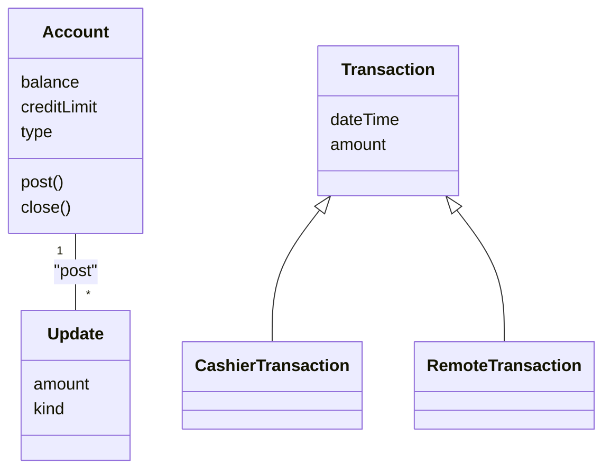

_Note: The actual implementation diagram for the ATM model is a complex web where domain classes like `Account` are optimized with derived associations for `postTransaction` and specific class-design operations like `verifyAmount`._

---

# 9. Foundational Exercises Walkthrough

> [!info] Note to the Learner
> To achieve mastery, one must not just read the syntax but apply it to edge cases. The following are highly detailed breakdowns of exercises from the text, highlighting exactly how to apply the rules without ambiguity.

## 9.1 Exercise Breakdown: The Polygon and Points Problem

**The Scenario:** A polygon is composed of an ordered set of points. Each point has an x and y coordinate. We need to model this.

### Question 1: What is the smallest number of points required to construct a polygon?

**Answer & Reasoning:** Three. A polygon by mathematical definition requires at least 3 points to form a closed shape. This dictates the multiplicity on the `Point` side of the association: `3..*`.

### Question 2: Does it make a difference whether or not a point may be shared between polygons?

**Answer & Reasoning:** Yes, a massive difference. It changes the fundamental identity of the objects and the multiplicity of the association.

**Case A: Points are NOT shared (A point belongs to exactly ONE polygon)**

- **Model:** `Polygon "1" -- "3..*" Point {ordered}`
- **Meaning:** If two triangles share a side, the points that make up that shared side must be duplicated in the system. There will be a `Point(x=0, y=1)` for Triangle A, and a completely separate object `Point(x=0, y=1)` for Triangle B.
- **Why?** Because the multiplicity on the Polygon side is `1`. A single point object cannot point back to two different polygons.

**Case B: Points ARE shared (A point belongs to ONE OR MORE polygons)**

- **Model:** `Polygon "1..*" -- "3..*" Point {ordered}`
- **Meaning:** The system creates exactly one `Point(x=0, y=1)` object. Both Triangle A and Triangle B have links to this exact same object.
- **Why?** The multiplicity on the Polygon side is `1..*` (or `*`), allowing the single point instance to link back to multiple polygon instances.

> [!tip] Watch out for Ordering!
> The exercise explicitly notes that points in a polygon are ordered. Therefore, the association end at the `Point` class MUST have the `{ordered}` constraint. Without it, the polygon is just a chaotic cloud of points, not a drawable shape.

---

## 9.2 Exercise Breakdown: Undirected vs. Directed Graphs

**The Scenario:** Model the structure of a graph containing Vertices (nodes) and Edges (lines).

### Part A: Undirected Graphs

In an undirected graph, an Edge simply connects two Vertices. There is no "start" or "end".

**Solution:**

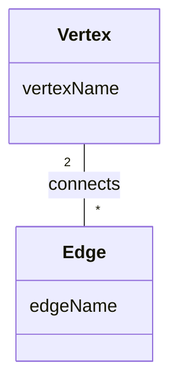

**Reasoning:**

- An edge connects exactly `2` vertices.
- A vertex can have `*` (zero or more) edges connected to it.
- _Alternative Solution:_ If an edge can connect a vertex to itself, is it two vertices or one? To perfectly represent the "Incidence" (the connection itself), we could promote the association to a class called `Incidence`.
  `Vertex "1" -- "*" Incidence` and `Edge "1" -- "2" Incidence`.

### Part B: Directed Graphs

In a directed graph, edges have a direction. They go _from_ one vertex _to_ another.

**Solution using Roles:**

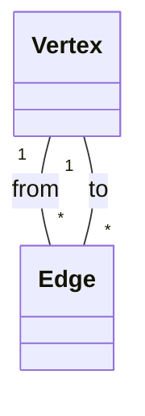

**Reasoning:** By splitting the connection into two separate associations (`from` and `to`), we perfectly capture the directionality. An edge has exactly one `from` vertex and exactly one `to` vertex.

**Solution using Qualified Associations (Advanced):**
We can use a Qualifier called `end` (with enumerated values `from` and `to`).
`Edge` has a qualifier `[end]`. The combination of `Edge + end` yields exactly `1` `Vertex`.
**Reasoning:** This is highly efficient. Instead of querying two different associations, you query the single association with the qualifier `to` and instantly retrieve the target vertex.

> [!tip] When to use Associations vs. Ternary Associations
> Students often try to model graphs using a Ternary (3-way) association between `Graph`, `Vertex`, and `Edge`. **Avoid this.** Ternary associations are notoriously difficult to implement and understand. As shown above, breaking it down into binary associations (using explicit classes for the objects, and associations for the connections) is the mathematically correct and implementable approach.

---

## 9.3 Exercise: Eliminating Ternary Associations

_Original Problem:_ A 3-way relationship exists between `Doctor`, `Patient`, and `Time`.
_The Issue:_ Ternary associations are not atomic and very hard to manage.
_The Solution:_ Create an intermediate class (a "reified" class). Create a new class called `Appointment`.

- `Appointment` is now a class.
- Binary association: `Doctor` -- `1..*` `Appointment`.
- Binary association: `Patient` -- `1..*` `Appointment`.
- The `Time` information becomes an attribute (`dateTime`) inside the `Appointment` class.

> [!trick] Why this is better
> This turns a complex, multi-way relationship into a clean, binary "star" architecture. `Appointment` now serves as a central hub. It also allows you to easily add other attributes later, like `cancellationStatus` or `fee`, without restructuring the whole graph.

## 9.4 Exercise: Redundant Associations

_Scenario:_ You have `Company` -- `Employs` -- `Person`, `Company` -- `Owns` -- `Computer`, and `Person` -- `AssignedTo` -- `Computer`.
_Question:_ Is the `AssignedTo` association redundant?
_Analysis:_

1.  Can you derive "Who is assigned to which computer" just by knowing who the company employs and what computers the company owns?
2.  No. The company might own 100 computers but only assign 50 to staff. The `AssignedTo` link adds information not contained in the other two.
    _Conclusion:_ It is **not** a redundant association. Keep it in the model. Always check for "logical reachability" vs. "information redundancy." If the path exists but the information doesn't, the association is not redundant.
