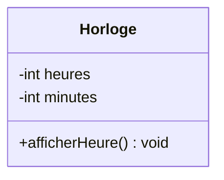
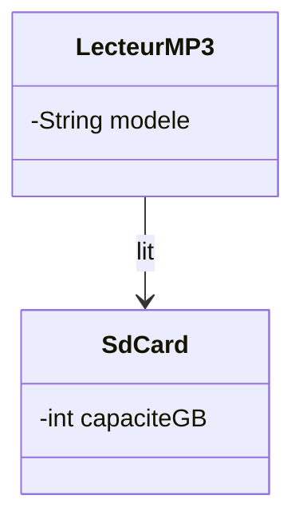

# 1. The Fundamentals of UML Attributes Explicit vs Implicit

When transitioning from basic programming to Object-Oriented Design (OOD) and System Architecture, one of the most significant conceptual leaps is understanding how to read a Unified Modeling Language (UML) Class Diagram. A UML diagram is not merely a sketch; it is a strict blueprint. Every single visual element—every box, every line, and every arrow—translates into explicit lines of code.

This note covers the foundational rule of UML Class Diagrams: **Not all attributes (parameters) of a class are explicitly written inside the class box.** 

To read a class diagram correctly, you must understand the distinction between Explicit Attributes and Implicit (Relational) Attributes.

## 1. 1. Explicit Attributes The Obvious Parameters
Explicit attributes are the easiest to understand because they are written directly on the diagram. In standard UML notation, a Class is represented by a rectangle divided into three compartments:
1.  **Top Compartment:** The Class Name (e.g., `Horloge`, `Vol`).
2.  **Middle Compartment:** The Attributes (Properties, Variables, or Parameters).
3.  **Bottom Compartment:** The Methods (Functions, Operations).

The parameters written in the middle compartment are usually **primitive data types** or simple standard objects. 
*   *Primitive examples:* Integers (`int`), booleans (`bool`), floating-point numbers (`float`).
*   *Simple object examples:* Strings (`String`), Dates (`Date`).

### Example of Explicit Attributes
If we look at a clock class (`Horloge`), the diagram might list `heures : int` and `minutes : int` in the middle compartment. 



In your code, this translates directly to exactly what you see:
```java
public class Horloge {
    private int heures;
    private int minutes;
}
```

**Common Pitfall for Students:** Many students believe that *only* the attributes written in this middle compartment exist in the final code. This is a fatal misunderstanding of UML. The middle compartment is only for properties that inherently belong to the object itself (like a person's name, or a clock's hour). Complex parameters—specifically, relationships to other classes—are deliberately left out of this box.

## 1. 2. Implicit Attributes The Hidden Parameters
If complex attributes are left out of the box, where do they go? **They become the lines connecting the boxes.**

Whenever you see a line connecting two classes in UML, it almost always means that **one class contains the other as an attribute in the computer's memory**. This concept has several formal names depending on the context:
*   **In Standard UML:** Association End Property (Propriété d'extrémité d'association) or Navigable Property.
*   **In Object-Oriented Programming (OOP):** Reference Variable, Object Reference, or Pointer.

### The Underlying Computer Science Concept
To understand *why* this happens, we must look at how computer memory works. Objects in memory do not magically know about each other just because they are drawn next to each other on a whiteboard. 

If a `LecteurMP3` (MP3 Player) object needs to read data from an `SdCard` object, the MP3 Player object must hold the physical memory address (a pointer/reference) of that specific SD Card. Therefore, the association line on the diagram represents a variable inside the `LecteurMP3` class whose data type is `SdCard`.



Even though the `LecteurMP3` box only explicitly says `modele : String`, the line dictates that the final code **must** look like this:

```java
public class LecteurMP3 {
    // Explicit attribute
    private String modele; 
    
    // Implicit attribute created by the association line
    private SdCard carte; 
}
```

## 1. 3. Summary How to Read a Class in Your Mind
Whenever you are tasked with writing code based on a UML diagram, you must systematically process each class by asking yourself four specific questions:
1.  **What is written inside the middle compartment?** -> Translate these directly into primitive/simple variables.
2.  **What lines point OUT from this class?** -> Create complex variables (Reference Variables) for the classes those lines point to.
3.  **What are the numbers (multiplicity) on the other end of those lines?** -> Decide if the variable is a single object (e.g., `SdCard`) or a Collection (e.g., `List<SdCard>`).
4.  **Does the class have a parent (inheritance)?** -> Ensure the class inherits all explicit and implicit variables from the parent class above it.
