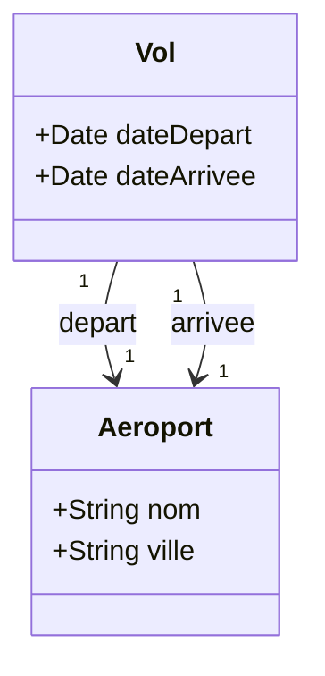

# 2. UML Associations Navigability Roles and Multiplicity

Building upon the concept of Implicit Attributes (Reference Variables), we must now define the exact rules for translating a UML association line into code. A simple line carries a massive amount of structural data. 

To properly translate a line into a variable, we need to determine three things:
1.  **Navigability:** Which class gets the variable?
2.  **The Role:** What is the exact name of the variable?
3.  **Multiplicity:** Is the variable a single object or an array/list?

## 2. 1. Navigability Who knows about whom
Navigability is indicated by the presence or absence of arrows on the association lines. It defines the direction of data flow and memory referencing.

### Unidirectional Association (Arrow)
If there is an arrow pointing from `Class A` to `Class B` (`A -> B`), it means `Class A` has an attribute of type `Class B`, but `Class B` is completely blind to `Class A`.
*   **Example:** A `LecteurMP3` has an arrow pointing to `SdCard`. The MP3 player needs to know which SD card is inserted to play music. However, an SD Card is a dumb storage device; it does not know or care if it is plugged into an MP3 player, a camera, or a laptop. Thus, the `SdCard` class gets no MP3-related parameters.

### Bidirectional Association (No Arrow)
If it is just a solid line (`A - B`), it implies a bidirectional relationship. **Both** classes receive a hidden parameter pointing to each other. 
*   **Example:** A `Personne` works for an `Entreprise`. The Person needs to know who their employer is, and the Company needs a list of all its employees. Both classes will contain reference variables.

## 2. 2. The Role Determining the Variable Name
When an association line becomes a parameter, we need to know what to name that parameter in our code. This is where the **Role** comes in.

The Role is the text written at the end of the association line, right next to the target class. 
*   **The Rule:** The text of the Role becomes the *exact name* of the hidden parameter. 
*   **Fallback Rule:** If no role is explicitly written on the diagram, convention dictates that you use the name of the target class, starting with a lowercase letter (e.g., an association to `Voiture` becomes `private Voiture voiture;`).

## 2. 3. Multiplicity Determining the Variable Container
Multiplicity (or Cardinality) refers to the numbers written at the ends of the lines (e.g., `0..1`, `1`, `0..*`, `1..*`). This dictates the "container" type of our variable.

*   **Single Object (`1` or `0..1`):** The attribute is a standard, single reference variable. 
    *   *Code:* `Aéroport depart;`
*   **Collection (`*`, `0..*`, or `1..*`):** The attribute must hold multiple objects. In programming, this translates to an Array, a `List`, a `Set`, or a `Vector`.
    *   *Code:* `List<Voiture> mesVoitures;`

## 2. 4. Case Study The Flight and Airport (Multiple Lines)
Let us apply these rules to a highly complex, yet incredibly common scenario: **Two classes connected by multiple lines.**

In standard aviation systems, a `Vol` (Flight) needs to be associated with an `Aéroport` (Airport). However, a flight doesn't just have "an" airport; it inherently requires a Departure airport and an Arrival airport. 

In UML, this is represented by drawing **two separate lines** between the `Vol` and `Aéroport` classes.



### Breaking Down the Diagram
Let us evaluate the lines pointing *out* of `Vol` toward `Aéroport`:

**Line 1:**
*   *Target Class:* `Aéroport` (This becomes the variable's Data Type).
*   *Multiplicity:* `1` (This means it is a single object, not a List).
*   *Role:* `depart` (This becomes the variable's Name).
*   *Resulting Code:* `Aéroport depart;`

**Line 2:**
*   *Target Class:* `Aéroport` (Data Type).
*   *Multiplicity:* `1` (Single object).
*   *Role:* `arrivee` (Variable Name).
*   *Resulting Code:* `Aéroport arrivee;`

### The Final Code Implementation
When a software engineer reads this UML diagram, the resulting Java code must incorporate both the explicit and implicit parameters seamlessly:

```java
public class Vol {
    // 1. Explicit Parameters (Written inside the Vol box)
    private Date dateDepart;
    private Date dateArrivee;

    // 2. Implicit Parameters (Generated by the two association lines)
    private Aeroport depart;   
    private Aeroport arrivee;  
}
```

**Tips and Tricks for Students:**
Students frequently panic when they see two lines connecting the same boxes, thinking it is a mistake or a redundancy. It is not! Think of a UML diagram geographically: if there are two roads between two cities, you have two distinct paths. If there are two lines between two classes, you have two distinct variables of the exact same type, serving different purposes (Roles).