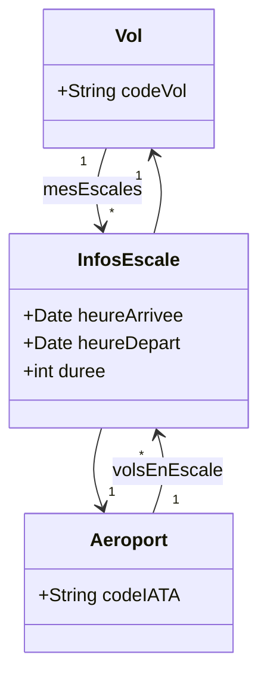

We have established how basic lines translate into single variables or lists. However, system design frequently encounters a scenario where a basic relationship line is not enough. This happens when **the relationship itself contains data**. 

When a relationship has its own properties, standard UML introduces an advanced concept called the **Association Class** (Classe d'association). 

## 3. 1. The Core Problem When the Link holds Data
Let us look at a different relationship between a `Vol` (Flight) and an `Aéroport` (Airport): **Layovers (Escales)**.
*   A single `Vol` can have layovers at multiple `Aéroports` (`0..*`).
*   A single `Aéroport` hosts layovers for multiple `Vols` (`0..*`).

This is a classic **Many-to-Many (N:M)** relationship. 

During a layover, important events happen. We need to record the **Arrival Time** (`heureArrivee`), **Departure Time** (`heureDepart`), and the **Duration** (`duree`) of the layover. 

**The Philosophical Dilemma:** Where do we store the variable `duree`?
*   *Can we put it in the `Vol` class?* No. A flight from Paris to Tokyo might lay over in Dubai for 2 hours and in Mumbai for 4 hours. If the `Vol` class only has one `duree` variable, which layover is it referring to? The data would be overwritten.
*   *Can we put it in the `Aéroport` class?* Absolutely not. An airport hosts thousands of flights a day, all with different layover durations. boook

**The Solution:** The parameters `heureArrivee` and `duree` do not belong to the Flight, nor do they belong to the Airport. They belong strictly to the *event of the flight stopping at the airport*. The data belongs to the link.

## 3. 2. UML Visual Representation
In UML, we solve this by drawing a dashed line stemming out from the middle of the main association line, connecting it to a brand new class box. This new box is the Association Class (in our example, `InfosEscale`).

*(Note: In structural representation, this acts as a middleman. The diagram below represents how the architecture fundamentally shifts to accommodate the new class).*



## 3. 3. Translating to Object-Oriented Code (Java/C++)
An Association Class completely changes how you write the original two classes. Because a Many-to-Many relationship is impossible to implement directly without losing data, the Association Class acts as a structural bridge. 

Instead of `Vol` pointing directly to `Aéroport`, they both point to the new middleman `InfosEscale`.

```java
// 1. The Association Class itself
public class InfosEscale {
    // It contains references pointing to BOTH original classes
    private Vol leVol;
    private Aeroport lAeroport;
    
    // It explicitly holds the properties of the relationship
    private Date heureArrivee;
    private Date heureDepart;
    private int duree;
}

// 2. The Original Classes
public class Vol {
    private String codeVol;
    
    // Hidden Parameter: It now holds a list of the middleman class!
    private List<InfosEscale> mesEscales; 
}

public class Aeroport {
    private String codeIATA;
    
    // Hidden Parameter: It also holds a list of the middleman class!
    private List<InfosEscale> volsEnEscale;
}
```

## 3. 4. Translating to Database Design (SQL)
UML is not just used for Java and C++; it is the primary blueprint for Relational Databases (SQL). 
Relational databases fundamentally cannot handle Many-to-Many relationships. If you try to link a `Flights` table and an `Airports` table directly via Foreign Keys, the database architecture will collapse under duplication.

When a Database Administrator sees an Association Class in UML, they immediately create a **Join Table** (Table de jointure).

The database schema will look like this:

1.  **Table 1: Flights**
    *   `id` (Primary Key)
    *   `codeVol`
2.  **Table 2: Airports**
    *   `id` (Primary Key)
    *   `codeIATA`
3.  **Table 3: Layovers (The Association Class / Join Table)**
    *   `id` (Primary Key)
    *   `flight_id` (Foreign Key -> Flights)
    *   `airport_id` (Foreign Key -> Airports)
    *   `heureArrivee`
    *   `duree`

**Essential Reminder:** Whenever you see a dashed line connecting an association to a class box, it is an Association Class. You must immediately recognize that this is a Many-to-Many relationship requiring a "middleman" in code and a "Join Table" in your database. Other classic examples include a `Student` and a `Course` linked by an `Enrollment` class (holding the Grade), or a `Person` and a `Company` linked by an `Employment` class (holding the Salary).
