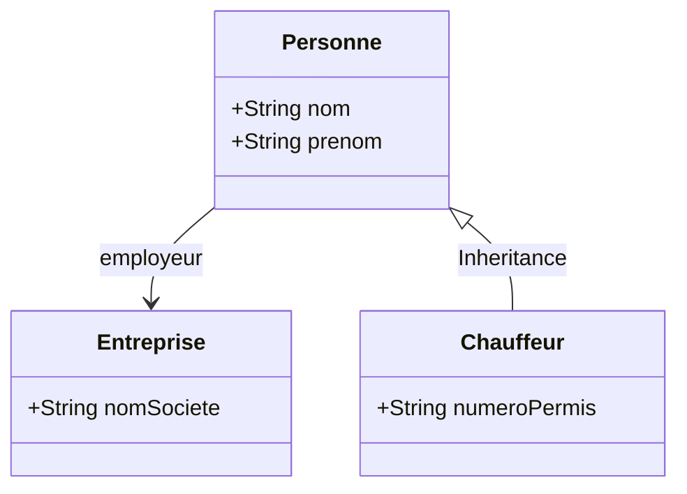
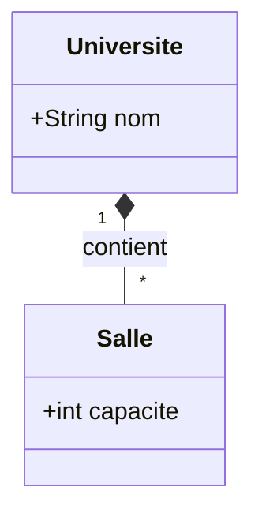

Beyond standard associations and association classes, UML provides symbols for highly specific types of object relationships. The two most important to master are Inheritance (Generalization) and Whole-Part relationships (Aggregation and Composition). These dramatically affect how implicit attributes are managed in computer memory.

## 4. 1. Inheritance (Generalization) The Hollow Triangle
Inheritance represents an "Is-A" relationship. It is denoted by a solid line ending in a hollow, closed triangle pointing toward the "Parent" (Superclass). 

When a "Child" (Subclass) inherits from a Parent, it magically absorbs **everything** from the parent class—both explicit and implicit attributes.



### Analyzing the Child Class
If we look at the `Chauffeur` box, we only explicitly see `numeroPermis`. However, because of the inheritance triangle pointing to `Personne`, the `Chauffeur` class is significantly larger in code than it appears on the diagram.

**What `Chauffeur` actually contains:**
1.  `numeroPermis` (Explicitly its own).
2.  `nom` and `prenom` (Inherited explicit attributes from `Personne`).
3.  `employeur` of type `Entreprise` (Inherited implicit reference variable from `Personne`).

**Tip for Students:** When writing code from a UML diagram, always trace the inheritance tree all the way to the top before finalizing your class structure. You do not need to rewrite the parent's variables in the child class; using the `extends` keyword (in Java) automatically handles the memory allocation.

## 4. 2. Aggregation and Composition The Diamonds
Standard associations (plain lines) represent a "Uses-A" or "Knows-A" relationship. However, when objects are physically or logically built out of other objects, we use a "Has-A" relationship, represented by diamonds. This dictates the **Lifecycle** of the variables in memory.

### Aggregation (Hollow Diamond)
Aggregation means "Has-A", but the child object can exist independently of the parent object. 
*   **Symbol:** A hollow diamond next to the parent class.
*   **Example:** A `Voiture` (Car) has `Pneus` (Tires). 
*   **Lifecycle Logic:** If the car is destroyed (e.g., sent to the scrapyard), the tires can be removed and sold. They continue to exist in memory even if the parent object is deleted. 

### Composition (Solid Black Diamond)
Composition is a strict, vital "Has-A" relationship. The child object **cannot** exist without the parent.
*   **Symbol:** A solid black diamond next to the parent class.
*   **Example:** An `Université` is composed of `Salles` (Rooms).
*   **Lifecycle Logic:** A room cannot float in the void. If the University is demolished (deleted from memory), every single room inside it must be completely destroyed as well.



### Code Implementation of Composition
In code, a solid diamond tells the programmer that the parent class is strictly responsible for the creation and destruction of the child objects. You do not pass the objects in from the outside; the parent builds them internally.

```java
public class Universite {
    private String nom;
    
    // Implicit parameter created by the association line
    private List<Salle> lesSalles;
    
    // Because of the SOLID DIAMOND (Composition), the University 
    // must construct the list and the rooms itself.
    public Universite(String nom) {
        this.nom = nom;
        this.lesSalles = new ArrayList<>();
        
        // Creating the rooms internally, tightly coupling their lifecycles.
        this.lesSalles.add(new Salle(30));
        this.lesSalles.add(new Salle(50));
    }
    
    // If this Universite object is set to null (deleted), 
    // the 'lesSalles' list and all rooms inside it are 
    // garbage-collected and destroyed with it.
}
```

**Common Pitfall:** During exams or system design interviews, confusing a hollow diamond (Aggregation) with a solid diamond (Composition) is a critical error. It shows a lack of understanding of memory management and database cascading deletions. If you see a solid black diamond, always ensure that destroying the parent triggers a "Cascade Delete" on the children.


# Coding Aggregation vs Composition

Aggregation and composition are both **whole–part relationships**, but the difference is not a syntax keyword in most programming languages.  
The distinction comes from **how objects are created, owned, and destroyed**.

There is **no `aggregation` or `composition` keyword** in Java, C++, Python, etc.  
You implement them by controlling **object ownership and lifecycle**.

---

# 1. Aggregation (Weak Ownership)

## Concept

Aggregation means:

- A class **has references to other objects**
    
- But those objects **exist independently**
    
- They are usually **created outside** and **passed in**
    

If the parent object disappears, the child objects **still exist**.

Typical real examples:

- `Team` has `Player`
    
- `Library` has `Book`
    
- `Company` has `Employee`
    

A player still exists if a team object is deleted.

---

## UML

```
Team ◇──── Player
```

Hollow diamond on the **Team** side.

---

## Java Implementation

```java
class Player {
    String name;

    Player(String name) {
        this.name = name;
    }
}

class Team {

    private List<Player> players;

    // Players are passed from outside
    public Team(List<Player> players) {
        this.players = players;
    }

    public void addPlayer(Player player) {
        players.add(player);
    }
}
```

## Usage

```java
Player p1 = new Player("Alice");
Player p2 = new Player("Bob");

List<Player> players = new ArrayList<>();
players.add(p1);
players.add(p2);

Team team = new Team(players);
```

Key observation:

```
Player objects exist BEFORE the Team.
```

If `team = null`, the `Player` objects still exist.

That is **aggregation**.

---

# 2. Composition (Strong Ownership)

## Concept

Composition means:

- The **parent owns the child**
    
- The child **cannot exist without the parent**
    
- The parent **creates and manages the child objects**
    

If the parent dies, the children **must die with it**.

Examples:

- `House` contains `Room`
    
- `Human` contains `Heart`
    
- `Car` contains `Engine`
    

A heart cannot logically exist without a human.

---

## UML

```
House ◆──── Room
```

Solid diamond on the **House** side.

---

## Java Implementation

```java
class Room {

    private int size;

    Room(int size) {
        this.size = size;
    }
}

class House {

    private List<Room> rooms;

    public House() {

        rooms = new ArrayList<>();

        // Rooms are created INSIDE the house
        rooms.add(new Room(20));
        rooms.add(new Room(30));
        rooms.add(new Room(15));
    }
}
```

## Usage

```
House house = new House();
```

You **cannot create a Room independently** in the design.

Rooms only exist because the **House created them**.

That is **composition**.

---

# 3. The Real Difference in Code

The difference is **ownership**.

|Feature|Aggregation|Composition|
|---|---|---|
|Object creation|Outside|Inside parent|
|Ownership|Weak|Strong|
|Lifecycle|Independent|Dependent|
|UML symbol|Hollow diamond|Solid diamond|
|Parent deletion|Children survive|Children destroyed|

---

# 4. Visual Mental Model

Aggregation:

```
Library
  └── Book (can move to another library)
```

Composition:

```
Human
  └── Heart (cannot exist alone)
```

---

# 5. What Examiners Actually Look For

In UML exams, teachers check **three signals** in your code:

### Aggregation

You **pass objects into the constructor**

```
class A {
    B b;
    A(B b) { this.b = b; }
}
```

### Composition

The class **creates the objects itself**

```
class A {
    B b;
    A() { b = new B(); }
}
```

That single design decision signals **aggregation vs composition**.

---
