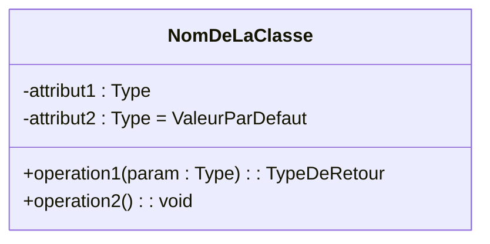

# 2. Anatomy of a Class

A Class is the fundamental pivot of Object-Oriented Modeling. From your course slides: A class describes a group of objects that share the same **properties (attributes)**, the same **behavior (operations/methods)**, and a common semantics.

### Graphical Representation
A class is represented by a rectangle divided into **three primary compartments**. 

#### 1. The Name Compartment (Top)
* **Rules:** Must start with a **Capital letter**. It represents the type of object instantiated.
* If the class name is written in **Italic**, the class is an **Abstract Class** (Impossible to instantiate directly).
* Center-aligned and bolded.

#### 2. The Attributes Compartment (Middle)
* **Rules:** Starts with a lowercase letter. Represents the data/state the class holds.
* **Syntax:** `[visibilité] nom : type [ = valeur_par_defaut ]`

#### 3. The Operations Compartment (Bottom)
* **Rules:** Starts with a lowercase letter, followed by parentheses `()`. Represents the behavior.
* **Syntax:** `[visibilité] nom(paramètres) : type_de_retour`

### Advanced Compartments (Optional)
Sometimes, you may add a fourth or fifth compartment at the bottom to indicate:
* **Responsibilities:** Textual descriptions of what the class must do.
* **Exceptions:** Errors the class handles.

### 💡 Exam Tip & Common Pitfall
> **Missing Types:** A common mistake in exams is writing `nom` instead of `-nom : string` in the attribute compartment. In university grading rubrics (as seen in the provided correction keys), missing the type (`: string`, `: int`, `: double`) or the visibility symbol immediately docks 0.25 points per class. **Always type your attributes!**
