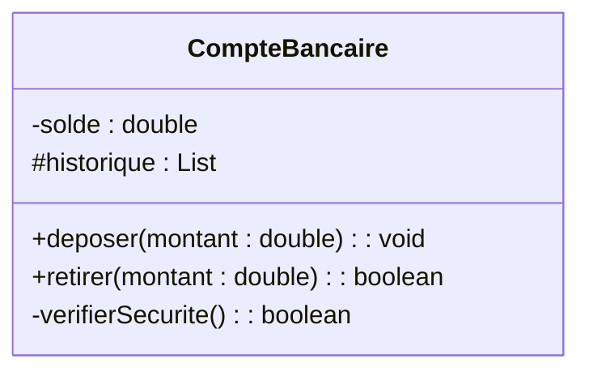

# 3. Visibility and Encapsulation

Encapsulation is a core concept of Object-Oriented design. It hides the internal state of a class and requires all interaction to be performed through an object's methods. UML defines four levels of visibility, represented by specific symbols placed right before an attribute or operation name.

### The 4 Visibility Levels

| Symbol | Visibility | Definition | Exam Context |
| :---: | :--- | :--- | :--- |
| **+** | **Public** | Element is visible to all other classes. | Use for most **methods/operations**, unless it's an internal helper function. |
| **-** | **Private** | Element is visible **only** inside the class itself. | Use for **ALL attributes** by default! (Unless specifically requested otherwise). This is strict encapsulation. |
| **#** | **Protected** | Visible to the class itself AND to its **sub-classes** (inheritance). | Use when you have a parent class (e.g., `Personne`) and a child class (e.g., `Etudiant`) that needs direct access to parent attributes. |
| **~** | **Package** | Visible to all classes residing within the **same package**. | Rarely tested explicitly in DCL exams, but good for theoretical MCQs. |

### Example

*Notice how the sensitive data (`-solde`) is private, the interface the user uses (`+deposer`) is public, and internal mechanisms (`-verifierSecurite`) remain private.*

### 💡 Exam Tip & Common Pitfall
> **The Getter/Setter Trap:** If an exam text says "The system must allow a user to read the total amount", do NOT make the total amount attribute `+public`. Keep it `-private` and add a `+getTotal() : double` (getter) method in the operations compartment. Strict adherence to encapsulation demonstrates mastery to the grader.