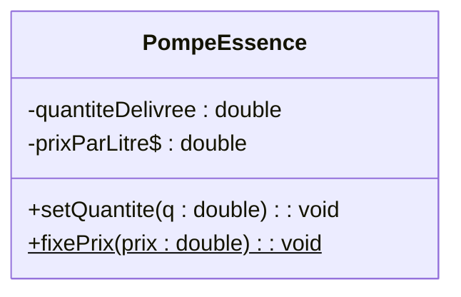
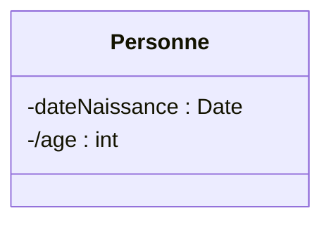

# 4. Advanced Attribute and Method Properties

Beyond basic names and types, UML provides specific notations for complex properties. These are heavily tested in "reverse-engineering" scenarios where you are given Java code and asked to draw the UML, or given a complex text and asked to model it accurately.

### 1. Static Attributes and Methods (Class-level)
* **Concept:** A static element belongs to the **Class itself**, not to a specific instance (object). All objects share this exact same piece of data.
* **UML Notation:** **Underline** the attribute or method.
* **Example:** In a `GasStation` class, the `prixParLitre` is the same for every pump.

### 2. Derived Attributes
* **Concept:** An attribute whose value is **calculated** based on other attributes, rather than being stored independently.
* **UML Notation:** Place a slash `/` before the attribute name.
* **Example:** If you store `dateDeNaissance` (Date of Birth), the `age` is derived. You don't store the age; you calculate it.

### 3. Multiplicity on Attributes
* **Concept:** An attribute might be an array or a list containing multiple values.
* **UML Notation:** Add `[min..max]` after the attribute name.
* **Example:** A weather station storing 100 temperature readings.
  * `- temperatures : double[100]`
  * `- emails : string[1..*]`

### 💡 Exam Tip & Common Pitfall
> **Static Method Missing Link:** In one of your exams (PDF 11), you are asked to implement the *Abstract Factory* or *Composite* pattern. In Design Patterns, things like the `getInstance()` method in a Singleton MUST be underlined because they are static. Forgetting the underline on a static method costs points!
