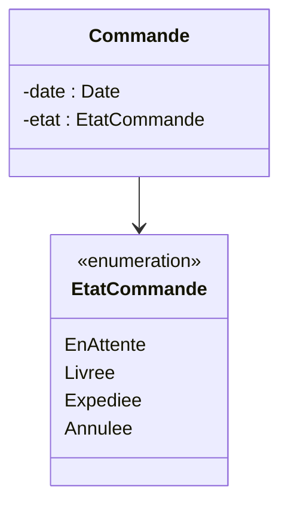

# 5. Parameter Directions and Enumerations

### 1. Direction of Method Parameters
When defining an operation, parameters aren't always just inputs. UML allows you to specify the data flow direction.

* **`in` (Default):** The parameter is passed to the method to be read. It cannot be modified (like a constant or passed by value).
* **`out`:** The parameter is passed to receive a value. Its initial value doesn't matter, it is used to return multiple values from a method.
* **`inout`:** The parameter is passed in, modified inside the method, and passed back out (passed by reference).

**Syntax:** 
`+ operationName(direction name : Type) : ReturnType`

**Example:**
`+ getTime(out heures : int, out minutes : int) : void`
*(Here, the method returns nothing `void`, but populates the `heures` and `minutes` variables passed to it).*

### 2. Enumerations
* **Concept:** An enumeration is a user-defined type consisting of a finite, named set of values. It's used to strictly type variables that can only have specific states (e.g., Days of the week, Status of a command).
* **UML Notation:** A class box with the stereotype `<<enumeration>>` at the top. The compartments don't have types, just the literal values.

### 💡 Exam Tip & Common Pitfall
> **Textual clues for Enumerations:** In your E-commerce exam (Test N°2 - Design pattern), a command has states: `"En Cours"`, `"En attente de payement"`, `"Expédiée"`. While that specific exam wanted the State Design Pattern, in a standard Class Diagram exercise, whenever a text gives you a strict, finite list of text values (like "A gender can be Male or Female" or "A vehicle is either a Car or a Bicycle"), you should **create an enumeration**. It shows advanced understanding of type safety.