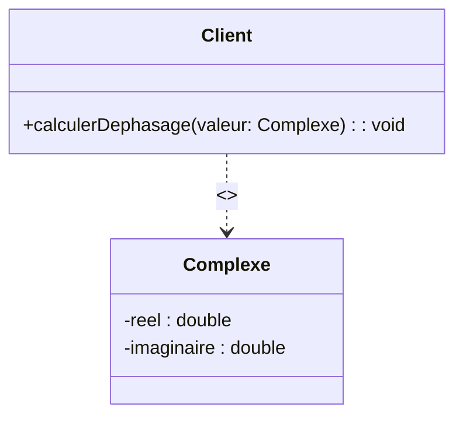

# 1. Introduction to Class Relationships and Dependencies

Classes in an Object-Oriented system do not exist in a vacuum; they interact, contain one another, and depend on one another to achieve the system's goals. Understanding how to connect classes is the most critical skill for a 20/20 in UML modeling.

There are several types of relationships in UML, ranging from the weakest to the strongest:
1. **Dependency** (Dépendance) - *Weakest*
2. **Association** (Association) - *Standard structural link*
3. **Aggregation / Composition** (Agrégation / Composition) - *Strong "Whole-Part" structural link (Covered in Chapter 3)*
4. **Generalization / Inheritance** (Généralisation / Héritage) - *Taxonomic "Is-A" link (Covered in Chapter 3)*

### 1. The Dependency Relationship (Relation de dépendance)

> [!INFO] Essential Background Knowledge
> A dependency is the weakest form of relationship. It means that **Class A uses Class B**, but Class A does not structurally "own" or keep a permanent reference to Class B. 

If Class B is modified, Class A might need to be updated. However, the lifecycle of Class A is independent of Class B.

#### Graphical Representation
In UML, a dependency is drawn as a **dashed line with an open arrow** pointing from the dependent class (the client) to the independent class (the supplier).

#### When do you use a Dependency instead of an Association?
Students often lose points by drawing a solid Association line when a dashed Dependency line is required. Here is the absolute rule:

You use a **Dependency** if Class B acts as:
1. A **parameter** in one of Class A's methods (e.g., `calculer(Complexe c)`).
2. A **return type** for one of Class A's methods.
3. A **local variable** instantiated temporarily inside a method of Class A.

You use an **Association** if:
1. Class A keeps Class B as a permanent **attribute** (e.g., an Employee *has* a permanent Company).

#### Stereotypes
Dependencies often include a word enclosed in guillemets `<< >>` called a stereotype. This clarifies the nature of the dependency:
* `<<use>>`: The default. Class A uses Class B.
* `<<create>>` or `<<instanciate>>`: Class A is responsible for creating instances of Class B (You will see this heavily in the **Abstract Factory** design pattern exam!).
* `<<include>>` / `<<extend>>`: Used in Use Case diagrams, but structurally they are dependencies!

> [!WARNING] Common Pitfall
> Do not put multiplicity (like `1..*`) on a Dependency line! Multiplicity only exists for Associations, Aggregations, and Compositions. A dependency simply says "A knows about B"; you do not count *how many* B's A knows about on a dependency line.