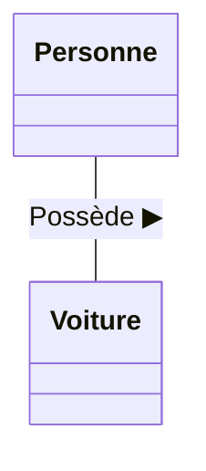
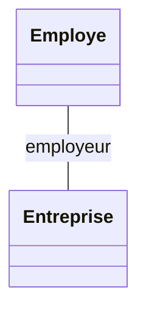
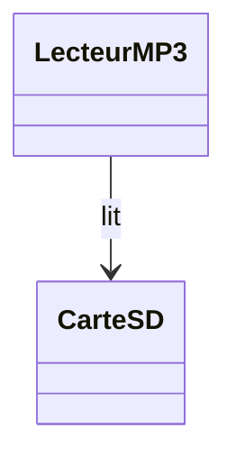

# 2. Associations, Roles, and Navigability

> [!INFO] Essential Background Knowledge
> An Association is a **structural relationship**. It means two classes are linked over a certain period of time. In programming terms, an association means that one class holds a reference (pointer) to the other class as an **attribute**.

### 1. Graphical Representation & Name
An association is represented by a **solid continuous line** connecting two classes. 

To make the diagram readable, you can (and often should) name the association. To indicate how to read the name, we use a small black triangle `▶`. 


*Read as: "Personne possède Voiture" (Person owns Car).*

### 2. Roles (Extremities of the Association)
Instead of naming the association itself, it is often much more accurate to name the **Roles**. 
A role defines *what purpose* a class serves in the context of the association. The role is written at the extremity of the line, right next to the class it describes.


*In this example, the `Entreprise` plays the role of `employeur` (employer) for the `Employe`.*

> [!TIP] Exam Trick & Java Generation
> Why do professors care about Roles? Because **the Role name becomes the attribute name in the code!** 
> If you are asked to generate Java code from a diagram, and the role near `Entreprise` is `employeur`, the code for `Employe` MUST look like this:
> ```java
> class Employe {
>     private Entreprise employeur; // The role name became the variable name!
> }
> ```
> If the exam text explicitly names variables, use those exact names as Roles in your diagram.

### 3. Navigability (Navigabilité)
Navigability dictates the **direction of access** at runtime. 

* **Bidirectional (Default):** A simple solid line with no arrows means both classes know about each other. `Person` has a list of `Cars`, and `Car` has a reference to its `Person`.
* **Unidirectional:** A solid line with an **open arrow** at one end. It means Class A knows about Class B, but Class B is completely unaware of Class A.

#### Example of Unidirectional Navigability:
Imagine a `LecteurMP3` and a `CarteSD`. The MP3 Player reads the SD card, but the SD card has no idea what an MP3 Player is (you can put it in a camera, a computer, etc.).



> [!WARNING] Important Reminder on Arrows
> Do NOT confuse the **Association Navigability arrow** (an open arrowhead `>`) with the **Inheritance arrow** (a closed, hollow triangle `▷`). Drawing the wrong arrow on an exam will completely change the meaning of your diagram and cost you all the points for that relation.
