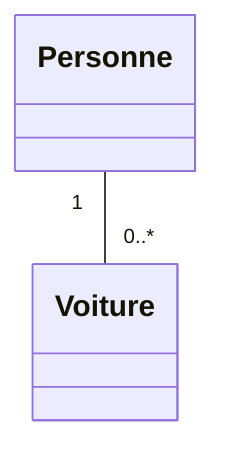

# 3. Multiplicity and Cardinality in Depth

Multiplicity (or Cardinality) defines **how many instances** of one class can be associated with a single instance of another class. This is where most logic errors occur in exams.

### 1. The Standard Notations
You must memorize these exactly as written:
* `0..1` : Zero or one (Optional).
* `1` (or `1..1`) : Exactly one (Mandatory).
* `0..*` (or `*`) : Zero to many (Any number, including zero).
* `1..*` : One to many (At least one is required!).
* `m..n` : A specific range (e.g., `2..4` means exactly 2, 3, or 4).

### 2. How to Read Multiplicities (The Golden Rule)
Students constantly put the multiplicity on the wrong side of the line. 
**The Golden Rule of Reading UML:** You place yourself in Class A, you look across the line towards Class B, and you ask: *"One single instance of A is linked to HOW MANY instances of B?"* The answer goes next to Class B.

Let's dissect an example: `Personne` and `Voiture`.

**Step-by-step reading:**
1. Start at `Personne` (One specific person, say, John). Look across to `Voiture`. How many cars can John own? He might not own a car (`0`), or he might own many cars (`*`). So we put **`0..*`** next to `Voiture`.
2. Start at `Voiture` (One specific car, say, license plate ABC-123). Look across to `Personne`. How many people officially own this exact car? Exactly one person. So we put **`1`** next to `Personne`.

### 3. Translation into Code
Professors test multiplicity heavily in coding questions. 
* If the multiplicity is `1` or `0..1`, the attribute is a **single object**: `private Voiture maVoiture;`
* If the multiplicity is `*` or `1..*`, the attribute MUST be a **Collection / List / Array**: `private ArrayList<Voiture> mesVoitures;`

> [!TIP] Exam Trick from the "Restaurant" Exam (M1-S2)
> In your restaurant exam: "Chaque plat est composé de plusieurs ingrédients... un ingrédient peut être utilisé dans différents plats."
> This explicitly states a `*` to `*` (Many-to-Many) relationship. 
> * One Plat has `1..*` Ingrédients.
> * One Ingrédient is in `0..*` Plats.
> Whenever you read "plusieurs" in both directions, immediately draw a `*` to `*` association. However, many-to-many associations almost always require an **Association Class** to hold the specific quantities (See note 6).