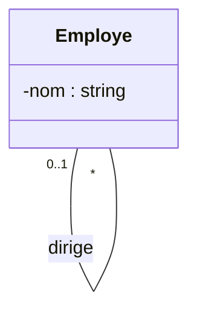
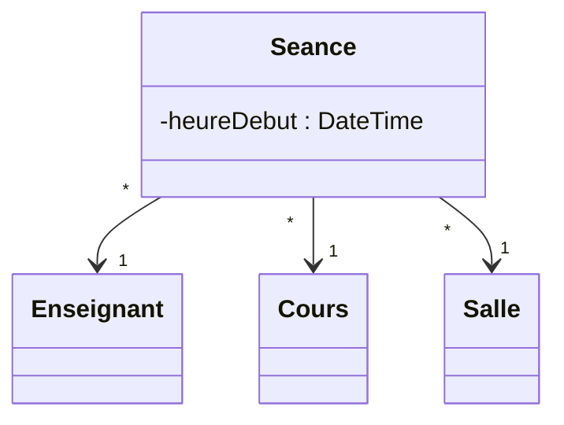

# 4. Advanced Associations: Reflexive and N-ary

### 1. Reflexive (Recursive) Associations
A reflexive association occurs when **a class is associated with itself**. 

> [!INFO] Background Knowledge
> In reality, an object isn't linking to the *exact same object* (though it could), but rather to *another instance of the same Class*. 

**Crucial Exam Rule:** For reflexive associations, **Roles are strictly mandatory.** Without roles, the relationship is completely ambiguous.

#### Classic Example: Employees and Managers
An `Employe` can manage other `Employes`.

*How to read this:*
* An employee has `0..1` **superior** (superieur).
* An employee manages `0..*` **subordinates** (subalternes).

> [!TIP] Exam Connection: The Composite Pattern
> In your "Société de vente de véhicules" exam (SocieteMere / SocieteSansFiliale), the Composite pattern inherently uses a reflexive relationship. The base component (Societe) has a 1-to-many relationship with itself because a parent company holds a list of child companies (which are also of type Societe).

### 2. N-ary (Ternary) Associations
Sometimes, connecting two classes isn't enough to capture a truth; you need three or more classes interacting simultaneously. 

* **UML Representation:** A large diamond connecting 3 or more classes. 
* *Note: Mermaid does not currently support N-ary diamond diagrams natively, so I will explain the conceptual transformation which is exactly what you need for exams anyway.*

#### Example of a Ternary Association:
Imagine a University system. We have `Enseignant` (Teacher), `Cours` (Course), and `Salle` (Room).
If you just link Teacher to Course, and Course to Room, you lose information. You can't answer: *"Which teacher taught which course in which room at a specific time?"* The event requires all three to exist at once.

#### The "Conversion" Trick (Exam Goldmine)
Professors love to ask you to "convert" or "resolve" an N-ary association. 
**Rule:** An association linking 3 classes can always be converted into a new, central intermediate class with 3 binary associations pointing outward.

**How to transform it:**
1. Create a new class (e.g., `Seance` or `Planning`).
2. Draw a line from this new class to each of the 3 original classes.
3. The multiplicity on the outside (next to Teacher, Course, Room) becomes `1`.
4. The multiplicity on the inside (next to the new central class) becomes `0..*` or `1..*`.

*This is the exact logical step you must take if a database or Java generatio