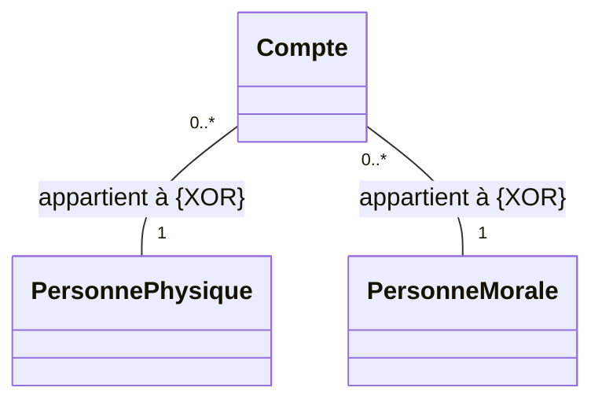

# 5. Association Constraints (XOR, Subset, Total)

To add precise business logic to class diagrams, UML uses Constraints. These are written inside curly braces `{}`. Missing these in a complex textual description will cost you points.

### 1. The `{XOR}` Constraint (Exclusive OR)
> [!INFO] Definition
> Placed between two or more associations attached to a single class. It means an instance of that class can participate in **only one** of those associations at a given time.

**Exam Scenario:**
"A bank account belongs either to a physical Person or a Moral entity (Company), but never both."

*On paper, you must draw a dashed line connecting the two association lines, with `{XOR}` written on the dashed line.*

### 2. The `{sous-ensemble}` or `{inclus}` Constraint (Subset)
> [!INFO] Definition
> Indicates that the collection of objects in one association is a strict subset of the objects in another association.

**Exam Scenario:**
"A Committee is made up of several Members. One of these Members is the President."
You draw two associations from `Committee` to `Member`: one for the general members (`1..*`), and one for the president (`1..1`). You then draw a dashed arrow from the "President" association to the "Member" association labeled `{inclus}`. This mathematically guarantees the President is chosen from the existing Members.

### 3. The `{frozen}` Constraint
Once the link is established, it cannot be modified, deleted, or transferred. 
**Example:** A `Date` object assigned to a `Person` as their birth date cannot be reassigned to a different date after initialization.

### 4. The `{totalité}` Constraint
Indicates that every instance of a superclass must participate in at least one of the listed associations. 

> [!WARNING] Common Pitfall
> Do not confuse `{XOR}` with inheritance. Sometimes it is better to solve an XOR by creating a superclass (e.g., `Client`) and having `PersonnePhysique` and `PersonneMorale` inherit from it. The bank account then just has one association to `Client`. Use XOR only when inheritance doesn't make logical sense or the professor explicitly forces flat associations.