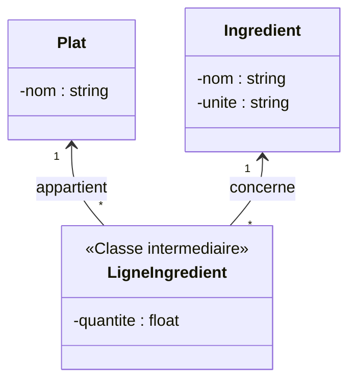

# 6. Association Classes and Qualification

This is arguably the most tested concept in M1-level Class Diagram exams. You must master Association Classes.

### 1. What is an Association Class? (Classe d'association)

> [!INFO] Core Concept
> Sometimes, an attribute does not belong to Class A, nor does it belong to Class B. **It belongs to the link between them.** 

**Let's look at your "Restaurant" Exam (Exercise 3, 7.5 pts):**
* You have a `Plat` (Meal) and an `Ingredient`.
* An Ingredient has a name and a unit of measure.
* A Meal is composed of Ingredients.
* **The trap:** "Each Meal is composed of several ingredients *in a certain quantity*."

Where do you put the attribute `quantite`?
* If you put it in `Ingredient` (e.g., Tomato: 500g), then Tomato is 500g for *every* meal. False. A salad might use 200g, a pizza might use 50g.
* If you put it in `Plat`, a Pizza has a "quantity". Quantity of what? False.
* **The Solution:** The `quantite` belongs to the *association* between Pizza and Tomato.

#### UML Representation
On paper, you draw a standard line between `Plat` and `Ingredient`. Then, you drop a dashed line from the middle of that association down to a new class box called `Composition` (or similar), containing the attribute `quantite`.

#### Resolution (Conversion to standard classes)
Because most programming languages (like Java) do not support Association Classes natively, you must know how to resolve them. 

**The Rule for Resolution:**
1. The Association Class becomes a normal intermediate Class.
2. The `*` to `*` relationship is broken.
3. The new intermediate class has a `*` to `1` relationship pointing to both original classes.

*This is exactly the correct answer for the Restaurant exam. A Plat contains many LigneIngredients. Each LigneIngredient specifies exactly 1 Ingredient and holds the quantity.*

### 2. Qualified Associations (Qualification)
> [!INFO] Definition
> A qualifier acts like a dictionary key or index. It is used to select a specific object (or a smaller subset) from a larger set of objects. 

**Visual:** A small rectangle placed at the end of the association, flush against the class that does the "searching".

**Classic Example:**
Normally, a `Banque` has `0..*` `Comptes` (Accounts). 
If you want to find a specific account, you use the `numeroDeCompte` (Account Number). 

By placing `numeroDeCompte` in a qualifier box next to `Banque`, the multiplicity on the `Compte` side reduces from `0..*` to `0..1`. 
*Meaning:* "Given a Bank, AND a specific Account Number, I will find exactly 0 or 1 Account."

> [!TIP] Exam Trick
> If an exam text explicitly says "A user is identified within the system by a unique matricule", or "A flight is found in the catalog using its flight number", this is a massive hint to use a **Qualified Association**. It proves to the grader that you understand how to optimize data retrieval in OOA (Object-Oriented Analysis).