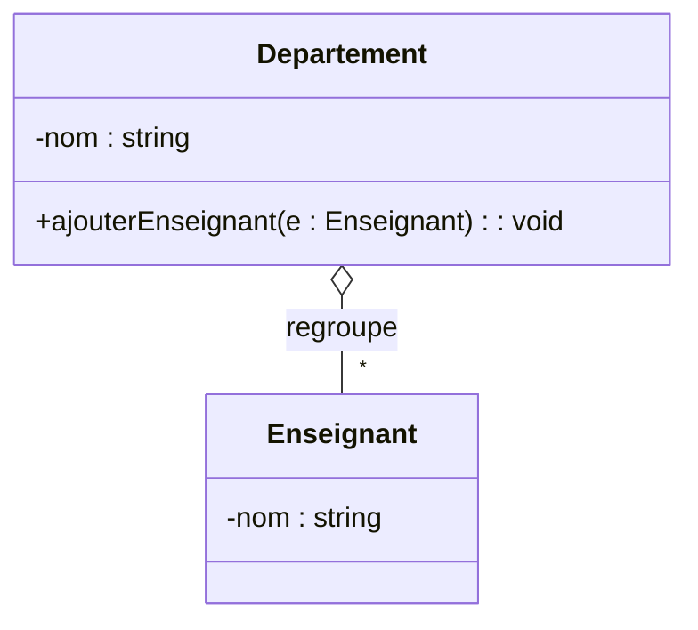
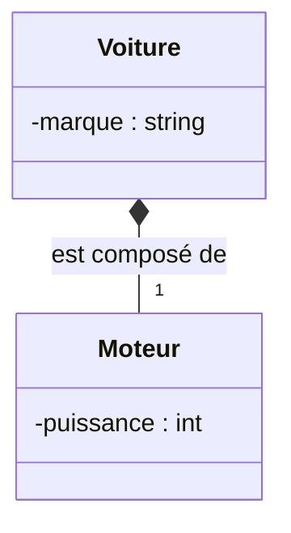

# 1. Aggregation vs Composition (The Whole-Part Relationships)

> [!INFO] Essential Background Knowledge
> Both Aggregation and Composition are special types of Associations. They represent a **"Whole-Part" (Tout-Partie)** relationship. Instead of saying "Class A uses Class B" or "Class A is linked to Class B", we are explicitly stating **"Class A is made up of Class B"** or **"Class B is a part of Class A"**.

The difference between the two lies entirely in the **lifecycle dependency** and **exclusivity** of the parts. Misunderstanding this difference will result in significant point deductions, especially in Java code-generation questions.

### 1. Aggregation (Agrégation)
* **Concept:** A "weak" whole-part relationship. The part can exist independently of the whole. If the whole is destroyed, the part **survives**. The part can also be shared among multiple wholes.
* **UML Representation:** A solid line with an **empty (hollow) diamond** at the side of the "Whole" (the container).
* **Keywords to look for in exams:** "utilise", "regroupe", "peut être partagé", "existe indépendamment".

#### Example & Code Translation
Imagine a `Departement` (Whole) and `Enseignant` (Part). If a university department closes, the teachers are not executed; they still exist and can be transferred to another department.


*(The empty diamond `o--` is on the side of Departement).*

> [!TIP] Exam Trick - Java Code Generation for Aggregation
> If the exam asks you to generate Java code for an **Aggregation**, the "Part" is usually passed to the "Whole" from the outside, often via a method or constructor parameter.
> ```java
> public class Departement {
>     private ArrayList<Enseignant> enseignants = new ArrayList<>();
>     
>     // The part is passed from the outside. The Department does NOT create it.
>     public void ajouterEnseignant(Enseignant e) {
>         this.enseignants.add(e);
>     }
> }
> ```

### 2. Composition (Composition)
* **Concept:** A "strong" whole-part relationship. The part's lifecycle is **strictly bound** to the whole. If the whole is destroyed, the part is automatically destroyed. The part **cannot** be shared with other wholes; it is exclusive.
* **UML Representation:** A solid line with a **filled (black) diamond** at the side of the "Whole".
* **Keywords to look for in exams:** "est composé de", "détruit", "contient de façon exclusive".

#### Example & Code Translation
Imagine a `Voiture` (Whole) and a `Moteur` (Part). In a strict modeling sense, this specific engine belongs to this specific car. If you scrap the car entirely, the engine goes with it. More explicitly: A `Fichier` (File) and a `Repertoire` (Folder) - if you delete the folder, the files inside are deleted (cascading delete).


*(The filled diamond `*--` is on the side of Voiture).*

> [!WARNING] The Multiplicity Trap
> On the side of the filled diamond (the Whole), the multiplicity is **always strictly `1`** (or `0..1` if it's being built). It can never be `*`. Why? Because a part in a Composition is exclusive; it cannot belong to multiple wholes at the same time!

> [!TIP] Exam Trick - Java Code Generation for Composition
> For a **Composition**, the Whole must instantiate the Part **itself**, usually inside its constructor. It is *not* passed from the outside.
> ```java
> public class Voiture {
>     private Moteur monMoteur;
>     
>     public Voiture() {
>         // The Whole creates the Part! If the Whole dies, the Part dies.
>         this.monMoteur = new Moteur(150); 
>     }
> }
> ```
