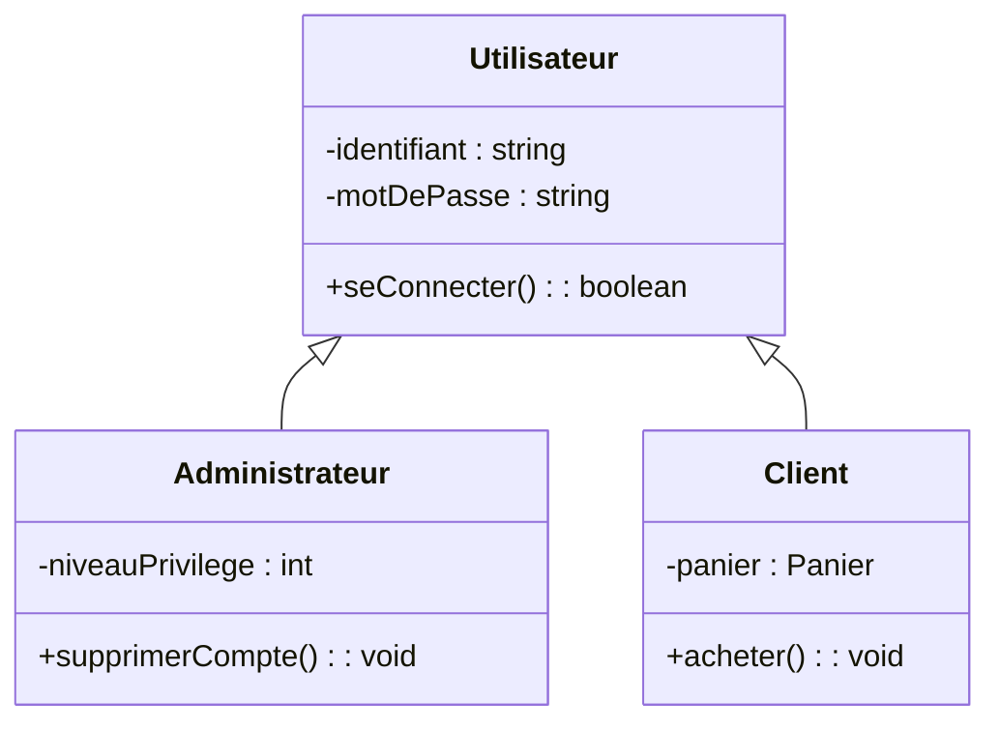

# 2. Inheritance and Generalization (Is-A Relationship)

> [!INFO] Essential Background Knowledge
> While Associations, Aggregations, and Compositions represent **"Has-A"** or **"Uses-A"** relationships, Inheritance represents an **"Is-A" (est un)** relationship. 
> It is a taxonomic relationship where a specialized class (Subclass / Child) inherits all the attributes, methods, and associations of a general class (Superclass / Parent).

### 1. Graphical Representation
Inheritance is represented by a solid line with a **hollow, closed triangle** pointing towards the Superclass.

### 2. The Golden Rules of Inheritance in Exams
Students lose massive points by making structural mistakes with inheritance. Memorize these rules:

1. **Rule of Factorization:** If you find yourself writing the exact same attribute (e.g., `nom`, `prenom`, `dateNaissance`) in three different classes, you must extract them, create a Superclass (e.g., `Personne`), and have the three classes inherit from it.
2. **Never Repeat Inherited Elements:** If `Utilisateur` has `-identifiant : string`, do **NOT** rewrite `-identifiant : string` in the `Administrateur` box. It is implicitly there. Writing it again is considered a severe conceptual error (it implies variable shadowing, which breaks polymorphism).
3. **Inheritance of Associations:** Subclasses inherit associations. If `Utilisateur` is associated with `Session`, then `Administrateur` automatically has a `Session`. You do not need to draw a new line from `Administrateur` to `Session`.

### 3. Exam Application: Identifying Inheritance vs Association
In **Test N°1 (MCA)**, you are given this text:
*"Une équipe ... est composée de développeurs ... Un développeur peut être un programmeur spécialisé ... ou un concepteur expert..."*

How do you translate this?
* "équipe est composée de développeurs" ➔ **Composition / Aggregation** (Has-A).
* "Un développeur peut être un programmeur ou un concepteur" ➔ **Inheritance** (Is-A). The Superclass is `Developpeur`, and the Subclasses are `Programmeur` and `Concepteur`.