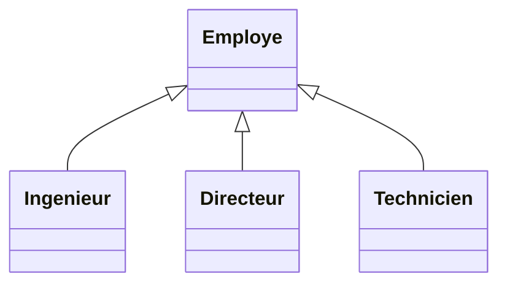

# 3. Advanced Inheritance Constraints (Disjoint, Overlapping, Complete)

In advanced modeling, simply drawing an inheritance arrow is not enough. You must specify the **mathematical constraints** governing how instances are distributed among the subclasses. 

These constraints are written in `{ }` near the inheritance arrows. They are formed by combining two independent criteria: **Overlapping vs Disjoint**, and **Complete vs Incomplete**.

### 1. The Mutually Exclusive Criterion
* **`{disjoint}` (Disjoint):** An object can belong to **only one** subclass at a time. It cannot be both.
  * *Example:* A `Compte` (Account) is inherited by `CompteEpargne` (Savings) and `CompteCourant` (Checking). An account cannot be both simultaneously.
* **`{chevauché}` or `{overlapping}`:** An object can belong to **multiple** subclasses at the same time (Multiple classification).
  * *Example:* A `Personne` is inherited by `Etudiant` and `Salarie`. A person can be a student and an employee at the same time.

### 2. The Exhaustive Criterion
* **`{complet}` (Complete):** The list of subclasses shown in the diagram covers **every possible type** of the superclass. No other subclasses can exist.
  * *Example:* A `Vehicule` inherited by `VehiculeMoteur` and `VehiculeSansMoteur`. There is no third option in physics.
* **`{incomplet}` (Incomplete):** The subclasses shown are just examples or a partial list. Other subclasses might exist in reality or be added later.
  * *Example:* `Produit` inherited by `Livre` and `DVD`. A store obviously sells other things, so the inheritance is incomplete.

### How to Model it
Place the constraint text near the junction where the inheritance lines meet.

> [!TIP] Exam Trick
> If an exam asks: *"A person can be either a Victim, a Witness, or BOTH"*, this explicitly demands the `{chevauché}` constraint! (This exact scenario is from your **Rapports Quotidiens de Vol (RQV)** exam!). If you just draw standard inheritance without `{chevauché}`, you will miss points because standard UML inheritance implies `{disjoint}` by default in many standard tools.