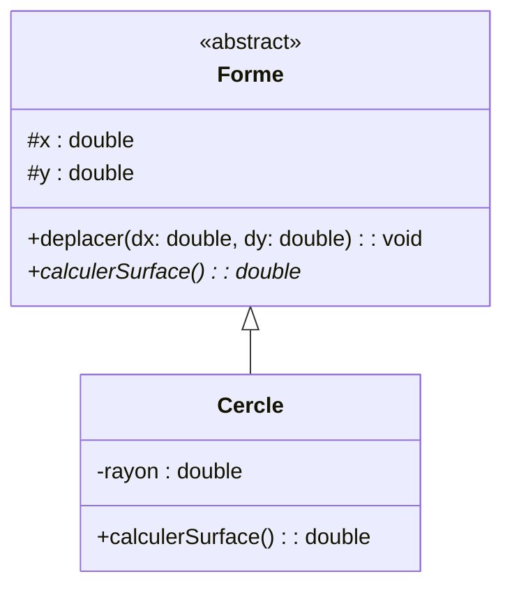
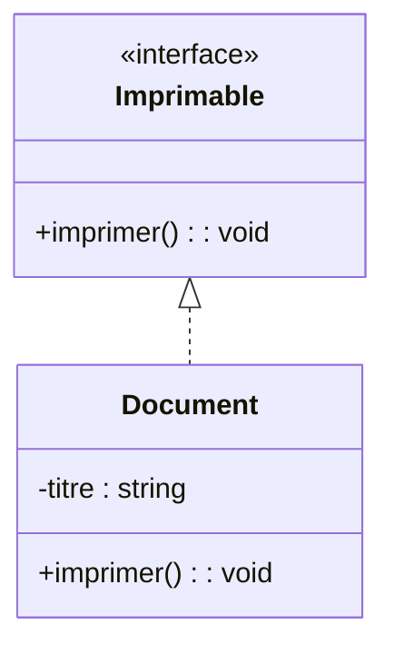

# 4. Abstract Classes, Interfaces, and Realization

To master Design Patterns (which are heavily tested via the RUP/UML exams like the Abstract Factory and Composite exams), you must understand the difference between Abstract Classes and Interfaces.

### 1. Abstract Classes (Classes Abstraites)
* **Concept:** A class that is too generic to be instantiated directly. It serves purely as a template for subclasses. It can contain fully implemented methods AND abstract methods (methods with no body, just a signature, that subclasses *must* implement).
* **UML Representation:** The name of the class and the names of any abstract methods must be written in ***Italics***. Alternatively, you can write `{abstract}` below the class name.

*(Here, `calculerSurface` is abstract in `Forme`, meaning every specific shape must provide its own formula).*

### 2. Interfaces
* **Concept:** An interface is a strict contract. In traditional UML/Java, an interface has **no attributes** (state) and **no implemented methods**. It only contains method signatures. Any class that "realizes" (implements) the interface guarantees it will provide the code for those methods.
* **UML Representation:** A class box with the stereotype `<<interface>>` at the top. 

### 3. Realization (Implémentation)
How do we connect a concrete class to an Interface? We use a **Realization** relationship.
* **UML Representation:** A **dashed line** with a **hollow closed triangle** pointing to the interface. (It looks like a mix between Dependency and Inheritance).

> [!WARNING] Common Pitfall: Abstract Factory Exam
> In your **TD4 (Exercice 7 & 8) / Exam on Abstract Factory**, you are asked to model a system with `FabriqueVehiculeInterface`. You MUST draw a dashed line with a hollow arrow from `FabriqueScooter` up to `FabriqueVehiculeInterface`. Drawing a solid inheritance line will cost you points because you cannot "inherit" from an interface; you "realize" it.
