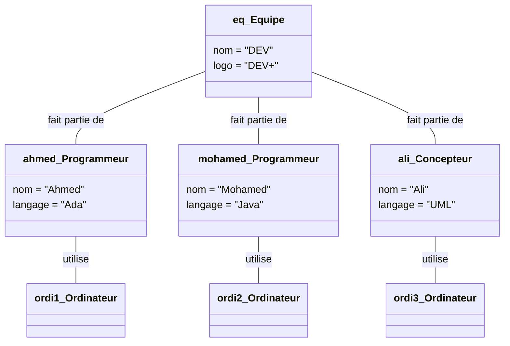

# 5. From Class Diagrams to Object Diagrams (DOB)

An **Object Diagram (Diagramme d'Objets - DOB)** is the logical continuation of a Class Diagram. 
While a Class Diagram shows the generic rules (the blueprint), an Object Diagram shows a **snapshot of the system in action at a specific millisecond in time**.

### 1. Key Differences from Class Diagrams

| Feature | Class Diagram (DCL) | Object Diagram (DOB) |
| :--- | :--- | :--- |
| **Title Format** | `ClassName` | `objectName : ClassName` **(Always Underlined!)** |
| **Compartments** | 3 (Name, Attributes, Methods) | 2 (Name, Attributes). **No methods!** Objects don't change behaviors. |
| **Attributes** | Shows types (e.g., `-age : int`) | Shows **values** (e.g., `age = 25`). No types needed. |
| **Relationships** | Associations with Multiplicity (`1..*`) | **Links** (Instances of associations). **No Multiplicity!** You literally draw the exact number of links. |

### 2. How to Draw an Object (Instance)
The title compartment must be **underlined**. There are three ways to write it:
1. **Named Instance:** `monVoiture : Voiture` (Underlined) - We know the variable name and the class.
2. **Anonymous Instance:** `: Voiture` (Underlined) - We don't care about the variable name, just that it's an instance of Car.
3. **Orphan Instance:** `monVoiture` (Underlined) - We know the name, but the class is implied. (Rarely used, avoid in exams).

### 3. Solving an Exam Question (Test N°1 - Q2)
Let's look at your actual exam:
* **Context from Q1:** `Developpeur` uses `Ordinateur`. `Developpeur` belongs to `Equipe`. `Developpeur` has a `nom`.
* **The Text for Q2:** *"Ahmed et Mohamed sont des programmeurs... Ali est un concepteur UML. Ils font partie de l'équipe 'DEV'... Chaque développeur utilise un ordinateur."*
* **The Task:** Create the Object Diagram.

**Step-by-step Execution:**
1. Draw the Team object: `eq : Equipe` (Underlined). Attribute: `nom = "DEV"`, `logo = "DEV+"`.
2. Draw Ahmed: `ahmed : Programmeur` (Underlined). Attribute: `nom = "Ahmed"`, `langage = "Ada"`.
3. Draw Mohamed: `mohamed : Programmeur` (Underlined). Attribute: `nom = "Mohamed"`, `langage = "Java"`.
4. Draw Ali: `ali : Concepteur` (Underlined). Attribute: `nom = "Ali"`, `langage = "UML"`.
5. Draw three anonymous Computer objects: `: Ordinateur` (Underlined).
6. **Connect them with Links (Solid lines, NO multiplicities):**
   * Draw a line from `eq` to `ahmed`, another from `eq` to `mohamed`, another from `eq` to `ali`.
   * Draw a line from `ahmed` to one `: Ordinateur`, `mohamed` to another `: Ordinateur`, and `ali` to the last `: Ordinateur`.

> [!WARNING] The Fatal Flaw in Object Diagrams
> The number one reason students fail Object Diagram questions is because they leave the Methods compartment in the boxes, or they add `1..*` multiplicities on the lines between objects. 
> **An Object Diagram is a photograph.** In a photograph, you don't see "1 to many" cars; you just see 3 actual cars. Draw exactly what is listed in the text, no more, no less.