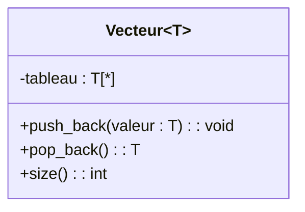

# 1. Generic and Parametrized Classes (Templates)

> [!INFO] Essential Background Knowledge
> In modern programming (Java, C++), we frequently use collections like `ArrayList<String>` or `List<Vehicule>`. These are called **Generic** or **Parametrized** classes. The class defines a structure, but the *type of data* it holds is left as a parameter (usually `T` or `E`). 

In your exams, if you need to model a highly reusable system (like a custom List, a Vector, or a generic Data Manager), you must know how to draw a Parametrized Class. Missing this notation when a generic type is implied costs valuable points.

### 1. Graphical Representation (On Paper)
UML has a very specific notation for this, which is completely different from a normal attribute.
* You draw a standard Class box.
* In the **top-right corner** of the class box, you draw a smaller, **dashed-line rectangle**.
* Inside this dashed box, you write the generic parameter (e.g., `Type`, `T`, or `E`).

*Note: Since standard Mermaid does not natively support dashed boxes in the corner, we represent it in text/code formats by adding the generic type next to the class name or using stereotypes.*

### 2. Binding (Liaison) / Instantiating a Template
A generic class cannot be used directly; it must be "bound" to a real type (like `Integer`, `String`, or `Personne`). 
There are two ways to show this on an exam:
1. **Implicit Binding:** You just write `Vecteur<Double>` as the type of an attribute in another class.
2. **Explicit Binding (Dependency):** You draw a new class box named `Vecteur<Double>`, and draw a dependency arrow (dashed line, open arrow) pointing to the original generic `Vecteur` class. You label the arrow with `<<bind>> <T -> Double>`.

> [!TIP] Exam Trick
> When you are given Java code like `private ArrayList<Societe> filiales = new ArrayList<>();` (as seen in your *Société Mère* exam correction), you have two choices:
> 1. Draw an association line with a `*` multiplicity. (This is the preferred, cleanest way).
> 2. If forced to model the ArrayList itself, use the Parametrized Class notation. Never just write `ArrayList` without specifying what it contains!
