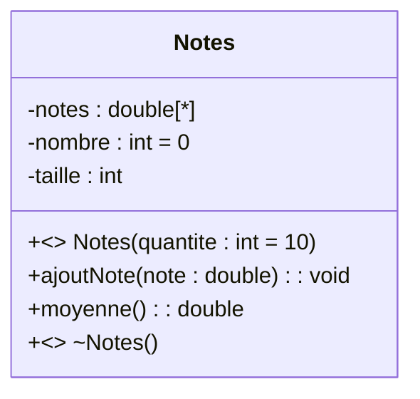

# 2. Constructors, Destructors, and Method Stereotypes

In introductory UML, students just write methods like `+ calculer()`. However, at the Master level (M1), you must explicitly identify the **lifecycle methods** of an object using Stereotypes.

### 1. The `<<create>>` Stereotype (Constructors)
When a method is responsible for instantiating the object, it is a constructor. In Java, the constructor has the same name as the class. In UML, you must annotate it so the reader knows it is not a normal operation.

* **Syntax:** `+ <<create>> NomDeLaClasse(parametres)`
* **Return Type:** A constructor *never* has a return type in UML, not even `void`.

### 2. The `<<destroy>>` Stereotype (Destructors)
Used to indicate a method that cleans up or deletes the object (like `finalize` in Java or `~ClassName()` in C++).

### 3. Default Values in Method Parameters
Look closely at the constructor above: `quantite : int = 10`.
UML allows you to specify **default values for method parameters**. If the caller does not provide an argument, the default is used. 
* **Exam Rule:** If a text says "By default, a new session lasts 30 minutes unless specified otherwise", you must write `+ <<create>> Session(duree : int = 30)`.

> [!WARNING] The Singleton Pattern Trap
> In **TD4 Ex 6**, you are asked to create a system with a "base de données unique" (Single Database Instance). This is the **Singleton Pattern**. 
> To model a Singleton correctly in UML, the constructor MUST be private! 
> `- <<create>> BaseDeDonnees()`
> If you make the constructor public `+`, the grader will instantly mark it wrong because a public constructor allows infinite instantiation, breaking the Singleton rule.